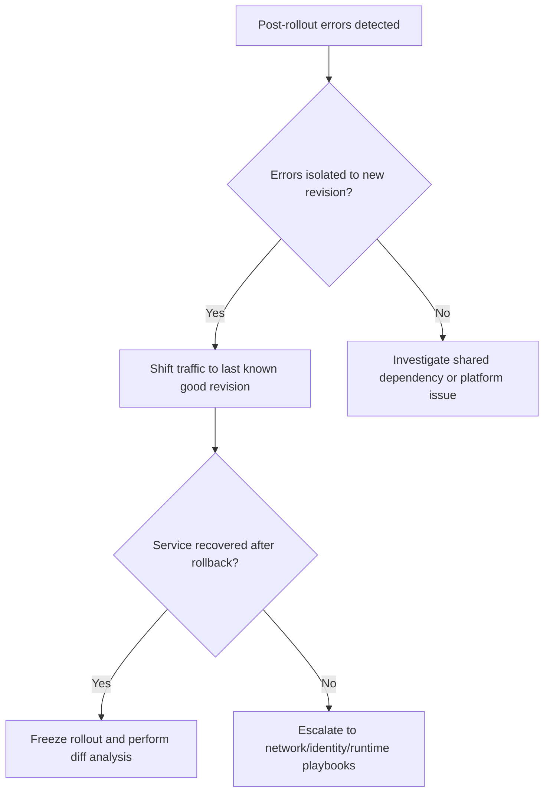

---
hide:
  - toc
content_sources:
  diagrams:
    - id: troubleshooting-decision-flow
      type: flowchart
      source: mslearn-adapted
      based_on:
        - https://learn.microsoft.com/azure/container-apps/revisions
        - https://learn.microsoft.com/azure/container-apps/traffic-splitting
        - https://learn.microsoft.com/azure/container-apps/troubleshooting
---

# Bad Revision Rollout and Rollback

## 1. Summary

### Symptom

- Error rate spikes immediately after traffic shifts to new revision.
- New revision healthy on startup, but business flows fail.
- Partial traffic split causes intermittent failures.

### Why this scenario is confusing

Revision health, replica readiness, and business correctness are not the same thing. A rollout can look healthy at the platform level while still breaking application behavior, and partial traffic splits can make the incident appear intermittent rather than rollout-driven.

### Troubleshooting decision flow

<!-- diagram-id: troubleshooting-decision-flow -->


## 2. Common Misreadings

- "Health is green, so rollout is good." Health probes may not reflect real business success.
- "Roll back everything." Controlled rollback to last known good revision is usually sufficient.

## 3. Competing Hypotheses

| Hypothesis | Typical Evidence For | Typical Evidence Against |
|---|---|---|
| **H1: Code or configuration regression in new revision** | Failures correlate exactly with traffic shift | Same errors existed before rollout |
| **H2: Secret or dependency drift between revisions** | Old revision succeeds with same traffic | Both revisions fail similarly |
| **H3: Incomplete canary analysis** | Errors only in subset of requests/routes | Full health and business checks passed pre-rollout |

## 4. What to Check First

### Metrics

- Error rate by revision and request latency after traffic movement.

### Logs

```kusto
let AppName = "ca-myapp";
ContainerAppConsoleLogs_CL
| where ContainerAppName_s == AppName
| where Log_s has_any ("error", "exception", "timeout", "failed")
| summarize errors=count() by RevisionName_s, bin(TimeGenerated, 5m)
| order by TimeGenerated desc
```

### Platform Signals

```bash
az containerapp revision list --name "$APP_NAME" --resource-group "$RG" --query "[].{name:name,active:properties.active,traffic:properties.trafficWeight,health:properties.healthState}" --output table
az containerapp show --name "$APP_NAME" --resource-group "$RG" --query "properties.configuration.ingress.traffic" --output json
```

## 5. Evidence to Collect

### Required Evidence

| Evidence | Command/Query | Purpose |
|---|---|---|
| Revision list | `az containerapp revision list --name "$APP_NAME" --resource-group "$RG" --output table` | Compare active revisions, traffic, and health state |
| Traffic config | `az containerapp show --name "$APP_NAME" --resource-group "$RG" --query "properties.configuration.ingress.traffic" --output json` | Confirm current traffic split |
| Error-by-revision KQL | KQL on `ContainerAppConsoleLogs_CL` | Verify whether failures align with the new revision |
| Console logs | `az containerapp logs show --name "$APP_NAME" --resource-group "$RG" --type console` | Capture business or runtime failures during rollout |
| Rollback command result | `az containerapp ingress traffic set --name "$APP_NAME" --resource-group "$RG" --revision-weight "<stable-revision>=100"` | Test whether service recovers after rollback |

### Useful Context

- Time of the traffic shift
- Canary percentage and duration
- Revision-level differences in image, env, secret refs, and scale settings
- Whether both revisions depend on the same external services

Observed revision status output used during rollback decisions:

```text
Name               Active    TrafficWeight    Replicas    HealthState    RunningState
-----------------  --------  ---------------  ----------  -------------  ------------
ca-myapp--0000001  True      100              1           Healthy        Running
```

## 6. Validation and Disproof by Hypothesis

### H1: Code or configuration regression in new revision

**Signals that support:**

- Failures correlate exactly with traffic shift.
- Errors are concentrated in the new revision.
- Rollback to the previous revision restores service.

**Signals that weaken:**

- Same errors existed before rollout.
- Both revisions fail similarly under the same traffic.
- No recovery occurs after rollback.

**What to verify:**

```bash
az containerapp revision list --name "$APP_NAME" --resource-group "$RG" --query "[].{name:name,active:properties.active,traffic:properties.trafficWeight,health:properties.healthState}" --output table
az containerapp show --name "$APP_NAME" --resource-group "$RG" --query "properties.configuration.ingress.traffic" --output json
az containerapp logs show --name "$APP_NAME" --resource-group "$RG" --type console
```

```kusto
let AppName = "ca-myapp";
ContainerAppConsoleLogs_CL
| where ContainerAppName_s == AppName
| where Log_s has_any ("error", "exception", "timeout", "failed")
| summarize errors=count() by RevisionName_s, bin(TimeGenerated, 5m)
| order by TimeGenerated desc
```

**Disproof logic:** If the error pattern predates the rollout or persists after moving traffic back to the stable revision, the new revision alone is not the full explanation.

### H2: Secret or dependency drift between revisions

**Signals that support:**

- Old revision succeeds with the same traffic.
- New revision depends on changed secret references or downstream settings.
- Failures appear only when the new revision exercises a changed dependency path.

**Signals that weaken:**

- Both revisions fail similarly.
- Rollback does not change the failure rate.
- No meaningful configuration drift exists between revisions.

**What to verify:**

```bash
az containerapp revision list --name "$APP_NAME" --resource-group "$RG" --output table
az containerapp logs show --name "$APP_NAME" --resource-group "$RG" --type console
```

**Disproof logic:** If the stable revision also fails under the same dependency path, focus on shared infrastructure or dependency health instead of revision-specific drift.

### H3: Incomplete canary analysis

**Signals that support:**

- Errors only affect a subset of requests or routes.
- Partial traffic split causes intermittent failures.
- Platform health checks passed, but business flows were not fully validated.

**Signals that weaken:**

- Full health and business checks passed pre-rollout.
- Failures are uniform across all traffic paths.
- The issue is reproducible even with 100% traffic on the stable revision.

**What to verify:**

```bash
az containerapp show --name "$APP_NAME" --resource-group "$RG" --query "properties.configuration.ingress.traffic" --output json
az containerapp ingress traffic set --name "$APP_NAME" --resource-group "$RG" --revision-weight "<stable-revision>=100"
az containerapp revision list --name "$APP_NAME" --resource-group "$RG" --output table
```

**Disproof logic:** If controlled rollback does not improve service or if failures are not isolated to canary traffic, canary analysis gaps are secondary, not primary.

## 7. Likely Root Cause Patterns

| Pattern | Frequency | First Signal | Typical Resolution |
|---|---|---|---|
| New revision regression | Very common | Errors start immediately after traffic shift | Roll back and diff code/config |
| Secret or dependency drift | Common | Old revision succeeds, new one fails | Align secret refs and dependency settings |
| Canary too narrow | Common | Failures only in subset of routes/flows | Expand validation before wider rollout |
| Shared dependency outage | Occasional | Both revisions fail similarly | Fix dependency, not rollout |
| Traffic split misread as random instability | Occasional | Intermittent failures during partial rollout | Correlate errors by revision and traffic weight |

## 8. Immediate Mitigations

1. Compare error trends by revision and confirm regression scope.
2. Shift traffic to stable revision and verify recovery.
3. Diff image, env, secret refs, and scale settings between revisions.
4. Fix regression and run controlled canary before full rollout.

## 9. Prevention

- Use gradual traffic shifting with rollback guardrails.
- Define release gates on business metrics, not only health probes.
- Keep automated revision comparison artifacts in CI/CD.

## See Also

- [Revision Provisioning Failure](../startup-and-provisioning/revision-provisioning-failure.md)
- [Container Start Failure](../startup-and-provisioning/container-start-failure.md)
- [Errors by Revision KQL](../../kql/correlation/errors-by-revision.md)

## Sources

- [Revisions in Azure Container Apps](https://learn.microsoft.com/azure/container-apps/revisions)
- [Traffic splitting in Azure Container Apps](https://learn.microsoft.com/azure/container-apps/traffic-splitting)
- [Troubleshoot Azure Container Apps](https://learn.microsoft.com/azure/container-apps/troubleshooting)
