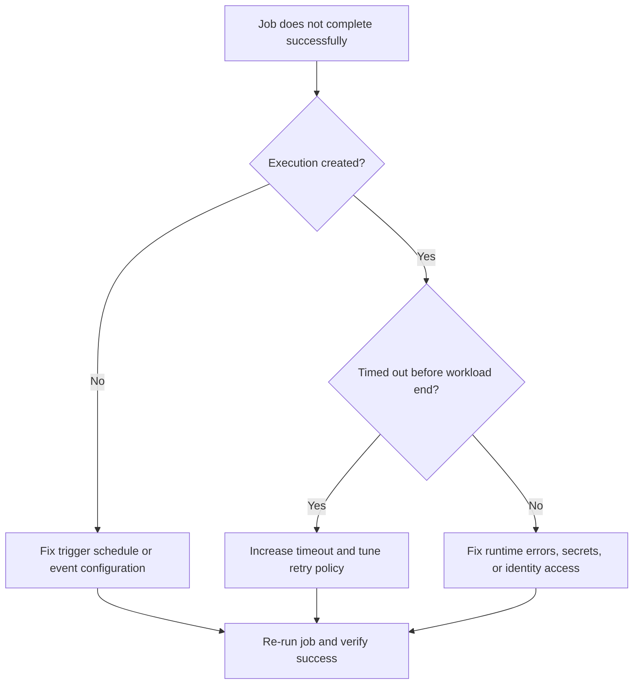

# Container App Job Execution Failure

Use this playbook when Container Apps Jobs do not execute, fail quickly, or keep retrying without completing expected work.

## Symptoms

- Job execution state is `Failed` or `TimedOut`.
- Scheduled jobs skip expected run windows.
- Console logs are empty or show startup/auth errors.

## Common Misreadings

!!! warning "Common Misreadings"
    - Misreading: "Cron trigger is broken." Invalid schedule timezone or overlapping run constraints are common.
    - Misreading: "Retries mean eventual success." Repeated retries can amplify downstream failures.

## Competing Hypotheses

| Hypothesis | Evidence For | Evidence Against |
|---|---|---|
| Trigger configuration incorrect | No executions for expected schedule/event | Manual execution succeeds with same image |
| Timeout too low | Execution stops near timeout boundary | Runtime completes within configured timeout |
| Missing secret/env dependency | Job logs show auth/config failures | All env and secret checks pass |

## What to Check First

### Metrics

- Job execution success ratio and retry count over time.

### Logs

```kusto
let AppName = "my-container-job";
ContainerAppSystemLogs_CL
| where ContainerAppName_s == AppName
| where Log_s has_any ("job", "execution", "timeout", "retry", "failed")
| project TimeGenerated, RevisionName_s, Log_s
| order by TimeGenerated desc
```

### Platform Signals

```bash
az containerapp job execution list --name "$APP_NAME" --resource-group "$RG" --output table
az containerapp job show --name "$APP_NAME" --resource-group "$RG" --output json
```

## Evidence Collection

```bash
az containerapp job execution show --name "$APP_NAME" --resource-group "$RG" --job-execution-name "<execution-name>" --output json
az containerapp logs show --name "$APP_NAME" --resource-group "$RG" --type system
az containerapp logs show --name "$APP_NAME" --resource-group "$RG" --type console
```

## Decision Flow



## Resolution Steps

1. Validate trigger type (manual, schedule, event) and metadata.
2. Increase timeout and set retry policy for expected runtime.
3. Correct missing configuration, secret references, and identity permissions.
4. Re-run execution and verify completion with expected output.

## Prevention

- Add dry-run validation for job inputs and trigger config.
- Track job SLOs and alert on retry bursts.
- Make job handlers idempotent for safe retries.

## See Also

- [Event Scaler Mismatch](../scaling-and-runtime/event-scaler-mismatch.md)
- [Managed Identity Auth Failure](../identity-and-configuration/managed-identity-auth-failure.md)
- [Job Execution History KQL](../../kql/dapr-and-jobs/job-execution-history.md)
