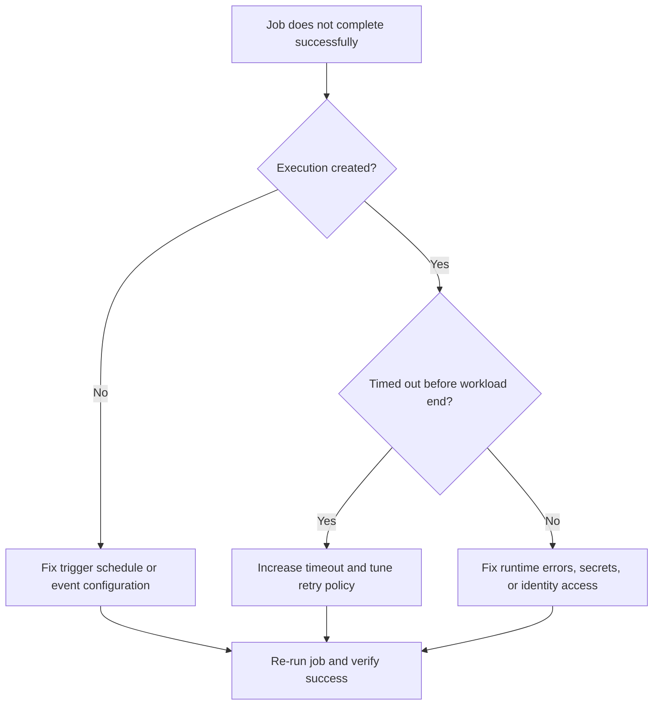

---
content_sources:
  diagrams:
    - id: troubleshooting-decision-flow
      type: flowchart
      source: mslearn-adapted
      based_on:
        - https://learn.microsoft.com/azure/container-apps/jobs
        - https://learn.microsoft.com/azure/container-apps/scale-app#jobs
        - https://learn.microsoft.com/azure/container-apps/troubleshooting
content_validation:
  status: verified
  last_reviewed: "2026-04-12"
  reviewer: ai-agent
  core_claims:
    - claim: "Azure Container Apps jobs support manual, schedule, and event triggers."
      source: "https://learn.microsoft.com/azure/container-apps/jobs"
      verified: true
    - claim: "A job execution in Azure Container Apps runs one or more replicas of a job template."
      source: "https://learn.microsoft.com/azure/container-apps/jobs"
      verified: true
---

# Container App Job Execution Failure

## 1. Summary

### Symptom

- Job execution state is `Failed` or `TimedOut`.
- Scheduled jobs skip expected run windows.
- Console logs are empty or show startup/auth errors.

### Why this scenario is confusing

Container Apps Jobs can fail before the workload does useful work, fail near the timeout boundary, or retry without ever fixing the real dependency problem. It is easy to blame the cron trigger or the job platform when the actual issue is trigger metadata, timeout policy, or missing configuration.

### Troubleshooting decision flow

<!-- diagram-id: troubleshooting-decision-flow -->


## 2. Common Misreadings

- "Cron trigger is broken." Invalid schedule timezone or overlapping run constraints are common.
- "Retries mean eventual success." Repeated retries can amplify downstream failures.

## 3. Competing Hypotheses

| Hypothesis | Typical Evidence For | Typical Evidence Against |
|---|---|---|
| **H1: Trigger configuration incorrect** | No executions for expected schedule/event | Manual execution succeeds with same image |
| **H2: Timeout too low** | Execution stops near timeout boundary | Runtime completes within configured timeout |
| **H3: Missing secret or environment dependency** | Job logs show auth/config failures | All env and secret checks pass |

## 4. What to Check First

### Metrics

- Job execution success ratio and retry count over time.

### Logs

```kusto
let AppName = "job-myapp";
ContainerAppSystemLogs_CL
| where ContainerAppName_s == AppName
| where Log_s has_any ("job", "execution", "timeout", "retry", "failed")
| project TimeGenerated, RevisionName_s, Log_s
| order by TimeGenerated desc
```

### Platform Signals

```bash
az containerapp job execution list --name "$APP_NAME" --resource-group "$RG" --output table
az containerapp job show --name "$APP_NAME" --resource-group "$RG" --output json
```

## 5. Evidence to Collect

### Required Evidence

| Evidence | Command/Query | Purpose |
|---|---|---|
| Execution list | `az containerapp job execution list --name "$APP_NAME" --resource-group "$RG" --output table` | Confirm whether executions are being created and how they end |
| Job definition | `az containerapp job show --name "$APP_NAME" --resource-group "$RG" --output json` | Inspect trigger type, timeout, retry, and configuration |
| Execution details | `az containerapp job execution show --name "$APP_NAME" --resource-group "$RG" --job-execution-name "<execution-name>" --output json` | Capture detailed state for a failed or timed out run |
| System logs | `az containerapp logs show --name "$APP_NAME" --resource-group "$RG" --type system` | Check platform-side execution, timeout, and retry signals |
| Console logs | `az containerapp logs show --name "$APP_NAME" --resource-group "$RG" --type console` | Check workload-side startup, auth, or configuration failures |
| Job lifecycle KQL | KQL on `ContainerAppSystemLogs_CL` | Correlate execution events and failures over time |

### Useful Context

- Trigger type (manual, schedule, event)
- Expected runtime versus configured timeout
- Retry policy and downstream side effects
- Recent changes to secret references, identity permissions, or trigger metadata

Observed successful job lifecycle sequence (baseline):

```text
SuccessfulCreate    → Successfully created pod for Job Execution
AssigningReplica    → Replica scheduled to run on a node
PullingImage        → Pulling image '<acr-name>.azurecr.io/myapp-job:v1.0.0'
PulledImage         → Successfully pulled image in 2.42s (58720256 bytes)
ContainerCreated    → Created container 'job-container'
ContainerStarted    → Started container 'job-container'
ContainerTerminated → Container terminated with exit code '0'
Completed           → Execution has successfully completed
PodDeletion         → Pod exited with status Succeeded
```

## 6. Validation and Disproof by Hypothesis

### H1: Trigger configuration incorrect

**Signals that support:**

- No executions for the expected schedule or event.
- Manual execution succeeds with the same image.
- Trigger schedule or event metadata does not align with the expected run window.

**Signals that weaken:**

- Executions are created on schedule.
- The same trigger metadata has been stable and successful.
- Failures occur after the execution starts rather than before creation.

**What to verify:**

```bash
az containerapp job execution list --name "$APP_NAME" --resource-group "$RG" --output table
az containerapp job show --name "$APP_NAME" --resource-group "$RG" --output json
```

**Disproof logic:** If executions are being created at the expected times and the same workload still fails after startup, the trigger configuration is not the primary fault domain.

### H2: Timeout too low

**Signals that support:**

- Execution stops near the timeout boundary.
- Workload consistently needs longer than the configured timeout.
- Retries restart the same long-running work without completion.

**Signals that weaken:**

- Runtime completes well within the configured timeout.
- Failures happen immediately at startup.
- Logs show configuration or authentication errors before useful work begins.

**What to verify:**

```bash
az containerapp job execution show --name "$APP_NAME" --resource-group "$RG" --job-execution-name "<execution-name>" --output json
az containerapp job show --name "$APP_NAME" --resource-group "$RG" --output json
```

```kusto
let AppName = "job-myapp";
ContainerAppSystemLogs_CL
| where ContainerAppName_s == AppName
| where Log_s has_any ("job", "execution", "timeout", "retry", "failed")
| project TimeGenerated, RevisionName_s, Log_s
| order by TimeGenerated desc
```

**Disproof logic:** If failed executions terminate far earlier than the timeout or fail for a clear runtime reason, increasing timeout will not resolve the incident.

### H3: Missing secret or environment dependency

**Signals that support:**

- Job logs show auth or configuration failures.
- Console logs are empty or fail immediately after container startup.
- Secret references, env values, or identity access changed recently.

**Signals that weaken:**

- All env and secret checks pass.
- Manual and scheduled executions succeed with the same configuration.
- No auth or config failures appear in logs.

**What to verify:**

```bash
az containerapp logs show --name "$APP_NAME" --resource-group "$RG" --type system
az containerapp logs show --name "$APP_NAME" --resource-group "$RG" --type console
az containerapp job show --name "$APP_NAME" --resource-group "$RG" --output json
```

**Disproof logic:** If secrets, environment values, and identity permissions are correct and the workload still fails only near the timeout boundary, focus on timeout or trigger behavior instead.

## 7. Likely Root Cause Patterns

| Pattern | Frequency | First Signal | Typical Resolution |
|---|---|---|---|
| Trigger metadata drift | Common | No execution created when expected | Fix schedule, event configuration, or run constraints |
| Timeout set below real runtime | Common | Execution ends near timeout boundary | Increase timeout and tune retry policy |
| Missing secret or env reference | Common | Console logs show auth/config failure | Correct secret references and configuration |
| Identity permission issue | Occasional | Startup/auth failure in job logs | Fix managed identity access |
| Retry storm against broken dependency | Occasional | Repeated retries without useful work | Repair dependency and make retries safer |

## 8. Immediate Mitigations

1. Validate trigger type (manual, schedule, event) and metadata.
2. Increase timeout and set retry policy for expected runtime.
3. Correct missing configuration, secret references, and identity permissions.
4. Re-run execution and verify completion with expected output.

## 9. Prevention

- Add dry-run validation for job inputs and trigger config.
- Track job SLOs and alert on retry bursts.
- Make job handlers idempotent for safe retries.

## See Also

- [Event Scaler Mismatch](../scaling-and-runtime/event-scaler-mismatch.md)
- [Managed Identity Auth Failure](../identity-and-configuration/managed-identity-auth-failure.md)
- [Job Execution History KQL](../../kql/dapr-and-jobs/job-execution-history.md)

## Sources

- [Jobs in Azure Container Apps](https://learn.microsoft.com/azure/container-apps/jobs)
- [Scale jobs in Azure Container Apps](https://learn.microsoft.com/azure/container-apps/scale-app#jobs)
- [Troubleshoot Azure Container Apps](https://learn.microsoft.com/azure/container-apps/troubleshooting)
