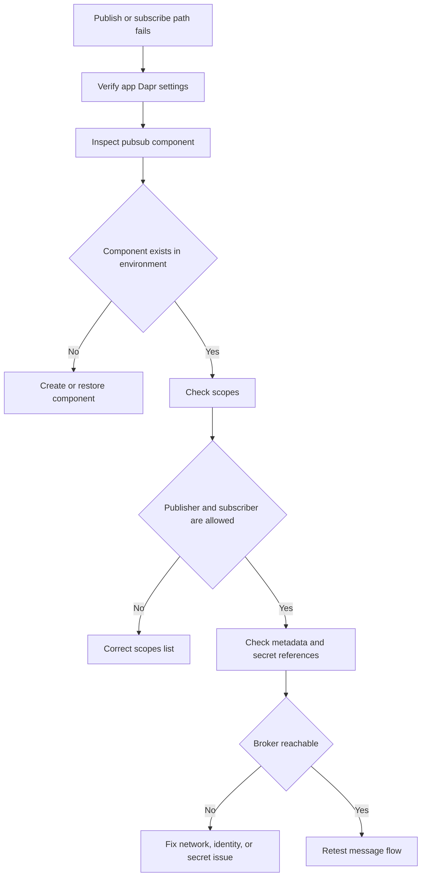

---
content_sources:
  - type: mslearn-adapted
    url: https://learn.microsoft.com/en-us/azure/container-apps/dapr-components
diagrams:
  - id: dapr-pubsub-failure-flow
    type: flowchart
    source: mslearn-adapted
    based_on:
      - https://learn.microsoft.com/en-us/azure/container-apps/dapr-components
      - https://learn.microsoft.com/en-us/azure/container-apps/dapr-overview
content_validation:
  status: pending_review
  last_reviewed: 2026-04-29
  reviewer: agent
  core_claims:
    - claim: "Azure Container Apps can use Dapr building blocks, including pub/sub components."
      source: https://learn.microsoft.com/en-us/azure/container-apps/dapr-overview
      verified: false
    - claim: "Dapr components are applied at the environment scope and can be constrained with scopes."
      source: https://learn.microsoft.com/en-us/azure/container-apps/dapr-components
      verified: false
---

# Dapr Pub/Sub Failure

Use this playbook when publish or subscribe paths fail, messages disappear, or only some apps can see the topic traffic.

## Symptom

- Publishers return errors when sending to the Dapr pub/sub component.
- Subscribers never receive events even though publishers report success.
- Only some apps consume messages in the same environment.
- The incident begins after a component edit, secret rotation, or app rename.

<!-- diagram-id: dapr-pubsub-failure-flow -->


## Possible Causes

- The pub/sub component is missing or misnamed.
- The component type or broker metadata is wrong.
- Publisher or subscriber apps are excluded by `scopes`.
- Secret or managed identity configuration for the broker is invalid.
- The application points to the wrong pub/sub component or topic name.

## Diagnosis Steps

1. Check the publisher and subscriber Dapr settings.
2. Inspect the environment-level pub/sub component definition.
3. Compare the component name in the app code or sidecar call with the actual component name.
4. Verify that all intended apps are allowed by `scopes`.

```bash
az containerapp show \
    --name "$APP_NAME" \
    --resource-group "$RG" \
    --query "properties.configuration.dapr" \
    --output json

az containerapp env dapr-component list \
    --name "$CONTAINER_ENV" \
    --resource-group "$RG" \
    --output table

az containerapp env dapr-component show \
    --name "$CONTAINER_ENV" \
    --resource-group "$RG" \
    --dapr-component-name "pubsub" \
    --output yaml
```

| Command | Why it is used |
|---|---|
| `az containerapp show --name "$APP_NAME" --resource-group "$RG" --query "properties.configuration.dapr" --output json` | Confirms that the app is using Dapr and exposes the app ID context for pub/sub routing checks. |
| `az containerapp env dapr-component list --name "$CONTAINER_ENV" --resource-group "$RG" --output table` | Verifies that the intended pub/sub component exists in the environment. |
| `az containerapp env dapr-component show --name "$CONTAINER_ENV" --resource-group "$RG" --dapr-component-name "pubsub" --output yaml` | Shows the component type, metadata, secret references, and scopes that control message flow. |

KQL for symptom capture:

```kusto
let AppName = "ca-myapp";
ContainerAppConsoleLogs_CL
| where TimeGenerated > ago(4h)
| where ContainerAppName_s == AppName
| where Log_s has_any ("dapr", "pubsub", "publish", "subscribe", "topic", "error", "failed")
| project TimeGenerated, RevisionName_s, Log_s
| order by TimeGenerated desc
```

## Resolution

1. Reconcile the component name used by the application with the deployed component name.
2. Fix `scopes` so both the publisher and subscriber apps can load the component.
3. Correct broker metadata, credentials, or network reachability.
4. Reapply the component and test a single known topic end to end.

```bash
az containerapp env dapr-component set \
    --name "$CONTAINER_ENV" \
    --resource-group "$RG" \
    --dapr-component-name "pubsub" \
    --yaml "./pubsub.yaml"
```

| Command | Why it is used |
|---|---|
| `az containerapp env dapr-component set --name "$CONTAINER_ENV" --resource-group "$RG" --dapr-component-name "pubsub" --yaml "./pubsub.yaml"` | Reapplies the corrected pub/sub component definition after fixing name, metadata, scopes, or credentials. |

## Prevention

- Version-control Dapr component YAML alongside app configuration.
- Use explicit component names and topic names across environments.
- Include pub/sub smoke tests in deployment validation.
- Review `scopes` whenever an app is renamed or newly added to the environment.

## See Also

- [Dapr State Store Failure](./dapr-state-store-failure.md)
- [Dapr Sidecar or Component Failure](./dapr-sidecar-or-component-failure.md)
- [Dapr Pub/Sub Failure Lab](../../lab-guides/dapr-pubsub-failure.md)

## Sources

- [Dapr components in Azure Container Apps](https://learn.microsoft.com/en-us/azure/container-apps/dapr-components)
- [Dapr overview for Azure Container Apps](https://learn.microsoft.com/en-us/azure/container-apps/dapr-overview)
- [Azure CLI `az containerapp env dapr-component` reference](https://learn.microsoft.com/en-us/cli/azure/containerapp/env/dapr-component)
