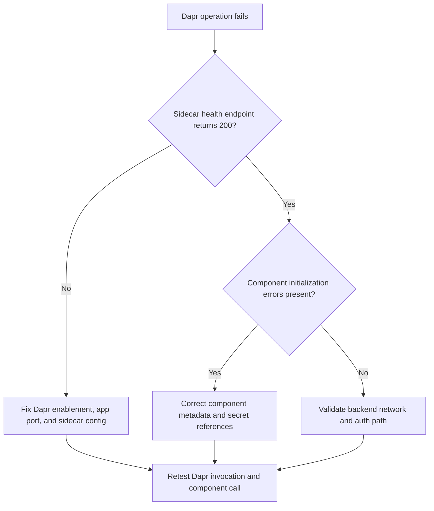

# Dapr Sidecar or Component Failure

Use this playbook when Dapr-enabled applications fail service invocation, pub/sub, state operations, or sidecar startup.

## Symptoms

- Sidecar logs show component init failures.
- Service invocation returns 500/503 despite app readiness.
- Pub/Sub or state store operations fail with timeouts or auth errors.

## Common Misreadings

!!! warning "Common Misreadings"
    - Misreading: "Application endpoint is broken." Sidecar/component misconfiguration can fail requests before app handler logic.
    - Misreading: "Dapr disabled itself." Failures usually come from bad component metadata or secret references.

## Competing Hypotheses

| Hypothesis | Evidence For | Evidence Against |
|---|---|---|
| Dapr sidecar not healthy | Sidecar startup errors and missing Dapr ports | Sidecar starts and reports healthy |
| Component metadata or secret invalid | Component init errors with missing key/auth details | Components load successfully |
| Network/auth path to component backend blocked | Timeouts to broker/state service | Backend reachable from same environment |

## What to Check First

### Metrics

- Dapr request failure count and backend dependency latency.

### Logs

```kusto
let AppName = "ca-myapp";
ContainerAppConsoleLogs_CL
| where ContainerAppName_s == AppName
| where Log_s has_any ("dapr", "component", "pubsub", "state", "sidecar")
| project TimeGenerated, RevisionName_s, ReplicaName_s, Log_s
| order by TimeGenerated desc
```

### Platform Signals

```bash
az containerapp show --name "$APP_NAME" --resource-group "$RG" --query "properties.configuration.dapr" --output json
az containerapp logs show --name "$APP_NAME" --resource-group "$RG" --type console
```

## Evidence Collection

```bash
az containerapp revision list --name "$APP_NAME" --resource-group "$RG" --output table
az containerapp secret list --name "$APP_NAME" --resource-group "$RG"
az containerapp exec --name "$APP_NAME" --resource-group "$RG" --command "python -c 'import urllib.request; print(urllib.request.urlopen("http://127.0.0.1:3500/v1.0/healthz", timeout=5).status)'"
```

Observed app baseline before isolating Dapr failures:

```text
ContainerStarted    → Started container 'ca-myapp'
RevisionReady       → Revision ready
ContainerAppReady   → Running state reached
```

## Decision Flow



## Resolution Steps

1. Confirm Dapr is enabled with correct app ID and app port.
2. Validate component metadata and referenced secrets.
3. Ensure managed identity/credentials allow backend access.
4. Re-test service invocation and state/pubsub operations.

## Prevention

- Store Dapr component manifests in version control.
- Add sidecar health and component smoke tests.
- Keep Dapr config changes coupled with app release notes.

## See Also

- [Service-to-Service Connectivity Failure](../ingress-and-networking/service-to-service-connectivity-failure.md)
- [Secret and Key Vault Reference Failure](../identity-and-configuration/secret-and-key-vault-reference-failure.md)
- [Dapr Sidecar Logs KQL](../../kql/dapr-and-jobs/dapr-sidecar-logs.md)
