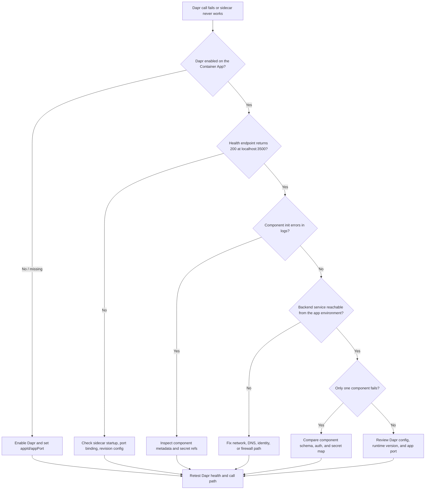

# Dapr Sidecar or Component Failure

## 1. Summary

### Symptom

Dapr-enabled Container Apps fail service invocation, pub/sub, or state operations, or the Dapr sidecar never becomes usable. The app container may be healthy and reachable while Dapr calls return 500, 503, or timeouts.

Failures often surface in sidecar logs first, but the user-visible breakage can appear in application logs, broker logs, or secret resolution errors. The key question is whether the problem is Dapr enablement, app binding, component definition, secret access, or backend connectivity.

### Why this scenario is confusing

The workload can look “healthy” at the platform layer because the revision is ready and the app container is running. That makes it easy to misread a Dapr failure as an app bug, when the actual break is in the sidecar or its dependent component path.

The same symptom also appears for multiple root causes: wrong `dapr.appPort`, invalid component YAML, missing secrets, and blocked backend traffic. You need evidence that separates sidecar startup from component initialization and then from backend reachability.

### Troubleshooting decision flow



## 2. Common Misreadings

- “The application endpoint is broken.” — Dapr can reject or hang requests before they reach the app handler.
- “The revision is ready, so Dapr is fine.” — Revision readiness does not guarantee Dapr sidecar health or component loading.
- “The broker or state store is down.” — The backend may be reachable, but the component YAML or secret reference is invalid.
- “Managed identity failed everywhere.” — Often only the component path fails because one secret or resource ID is wrong.
- “Dapr disabled itself after deployment.” — In practice, the app spec often omits `dapr.enabled` or points at the wrong port.

## 3. Competing Hypotheses

| Hypothesis | Typical Evidence For | Typical Evidence Against |
|---|---|---|
| H1: Dapr not enabled on the Container App | `properties.configuration.dapr` is empty; no sidecar logs; port 3500 health check fails | `dapr.enabled` present and sidecar responds on `http://localhost:3500/v1.0/healthz` |
| H2: App port mismatch | Sidecar starts, but calls fail; logs show app health or connection errors; `dapr.appPort` differs from the app listener | App listens on the declared port and local app endpoint responds inside the container |
| H3: Component metadata invalid | Component init logs mention missing fields, unsupported metadata, or schema errors | Component loads successfully and Dapr lists it as initialized |
| H4: Component secret reference failure | Logs mention secret resolution, Key Vault access, or missing secret names | Secret exists, identity can read it, and component resolves credentials cleanly |
| H5: Backend service unreachable | Timeouts, DNS failures, TLS failures, firewall errors, or 403/401 from the backend | Backend is reachable from the same environment and the same credential path works |

## 4. What to Check First

### Metrics

- Dapr request failure count by operation type (`invoke`, `state`, `publish`).
- Sidecar startup duration and revision provisioning time.
- Backend dependency latency and timeout rate.
- App container restarts that coincide with Dapr failures.

### Logs (with KQL)

```kusto
let AppName = "ca-myapp";
ContainerAppConsoleLogs_CL
| where ContainerAppName_s == AppName
| where Log_s has_any ("dapr", "component", "pubsub", "state", "sidecar", "healthz")
| project TimeGenerated, ContainerAppName_s, RevisionName_s, ReplicaName_s, Log_s
| order by TimeGenerated desc
```

```kusto
let AppName = "ca-myapp";
ContainerAppSystemLogs_CL
| where ContainerAppName_s == AppName
| where Log_s has_any ("dapr", "component", "secret", "init", "health")
| project TimeGenerated, ContainerAppName_s, RevisionName_s, Log_s
| order by TimeGenerated desc
```

### Platform Signals (with CLI)

```bash
az containerapp show --name "$APP_NAME" --resource-group "$RG" --query "properties.configuration.dapr" --output json
az containerapp show --name "$APP_NAME" --resource-group "$RG" --query "properties.template.containers" --output json
az containerapp logs show --name "$APP_NAME" --resource-group "$RG" --type console
az containerapp revision list --name "$APP_NAME" --resource-group "$RG" --output table
```

## 5. Evidence to Collect

### Required Evidence

| Evidence | Command/Query | Purpose |
|---|---|---|
| Dapr config on the app | `az containerapp show --name "$APP_NAME" --resource-group "$RG" --query "properties.configuration.dapr" --output json` | Confirms whether Dapr is enabled and which app ID/port is configured |
| Revision and container state | `az containerapp revision list --name "$APP_NAME" --resource-group "$RG" --output table` | Shows whether the bad behavior is tied to a revision rollout |
| Sidecar health | `az containerapp exec --name "$APP_NAME" --resource-group "$RG" --command "curl -fsS http://127.0.0.1:3500/v1.0/healthz"` | Confirms the Dapr sidecar is listening and healthy |
| App listener check | `az containerapp exec --name "$APP_NAME" --resource-group "$RG" --command "curl -fsS http://127.0.0.1:${CONTAINER_PORT}/"` | Confirms the app is listening on the port Dapr expects |
| Console logs | `az containerapp logs show --name "$APP_NAME" --resource-group "$RG" --type console` | Captures app-side and sidecar-side failure messages |
| Secrets metadata | `az containerapp secret list --name "$APP_NAME" --resource-group "$RG"` | Verifies whether referenced secrets exist |

### Useful Context

- Note the first bad revision and whether the symptom started immediately after deploy.
- Capture the exact Dapr operation: service invocation, state read/write, pub/sub publish/subscribe.
- Compare failures across replicas; a single replica may indicate rollout drift.
- Record whether the backend is public, private, or behind an identity boundary.
- Save the component manifest name, type, and secret names exactly as deployed.

## 6. Validation and Disproof by Hypothesis

### H1: Dapr not enabled on the Container App

**Signals that support:**

- `properties.configuration.dapr` is null, empty, or missing `enabled: true`.
- Sidecar health check fails at `http://127.0.0.1:3500/v1.0/healthz`.
- No Dapr startup lines appear in console logs.

**Signals that weaken:**

- Dapr health returns 200 and component logs appear normally.
- The app can invoke other Dapr services from the same revision.

**What to verify:**

```bash
az containerapp show --name "$APP_NAME" --resource-group "$RG" --query "properties.configuration.dapr" --output yaml
az containerapp exec --name "$APP_NAME" --resource-group "$RG" --command "curl -i http://127.0.0.1:3500/v1.0/healthz"
```

### H2: App port mismatch

**Signals that support:**

- `dapr.appPort` differs from the container process port.
- Logs show connection refused, timeout, or readiness mismatch against the app port.
- The app responds on one port locally but Dapr targets another.

**Signals that weaken:**

- The app responds correctly on the declared port and Dapr calls reach it.
- The failure happens before any app connection attempt.

**What to verify:**

```bash
az containerapp show --name "$APP_NAME" --resource-group "$RG" --query "properties.configuration.dapr.appPort" --output tsv
az containerapp exec --name "$APP_NAME" --resource-group "$RG" --command "sh -c 'printenv | sort | grep -E \"^(PORT|CONTAINER_APP_PORT|DAPR_)\"'"
```

### H3: Component metadata invalid

**Signals that support:**

- Logs mention missing required metadata, invalid schema, unsupported type, or malformed YAML.
- Only one component fails while others load.
- The failure starts immediately after a component manifest change.

**Signals that weaken:**

- The component loads cleanly and the backend path is the only failing step.
- The same manifest works in another environment.

**What to verify:**

```kusto
let AppName = "ca-myapp";
ContainerAppConsoleLogs_CL
| where ContainerAppName_s == AppName
| where Log_s has_any ("metadata", "schema", "yaml", "component", "invalid")
| project TimeGenerated, Log_s
| order by TimeGenerated desc
```

### H4: Component secret reference failure

**Signals that support:**

- Logs mention secret lookup failures or Key Vault access denied.
- The referenced secret name does not exist in the app.
- Managed identity permissions were changed recently.

**Signals that weaken:**

- The secret list includes the referenced secret and identity can read Key Vault.
- The component uses no secrets and still fails.

**What to verify:**

```bash
az containerapp secret list --name "$APP_NAME" --resource-group "$RG" --output table
az containerapp identity show --name "$APP_NAME" --resource-group "$RG" --output json
```

```kusto
let AppName = "ca-myapp";
ContainerAppConsoleLogs_CL
| where ContainerAppName_s == AppName
| where Log_s has_any ("secret", "Key Vault", "access denied", "forbidden")
| project TimeGenerated, Log_s
| order by TimeGenerated desc
```

### H5: Backend service unreachable

**Signals that support:**

- Timeouts, DNS resolution errors, TLS handshake failures, 401/403, or 5xx from the backend.
- Backend is private and the app environment lacks the required network path.
- The same component works from another subnet, environment, or identity.

**Signals that weaken:**

- Backend calls succeed from the same container using the same identity and hostname.
- Only the Dapr sidecar health check fails, not the backend call itself.

**What to verify:**

```bash
az containerapp exec --name "$APP_NAME" --resource-group "$RG" --command "curl -vk https://backend.example.internal/health"
```

## 7. Likely Root Cause Patterns

| Pattern | Frequency | First Signal | Typical Resolution |
|---|---|---|---|
| Dapr disabled or omitted | High | No sidecar health response; empty Dapr config | Enable Dapr and redeploy with the correct app ID and port |
| App port mismatch after app refactor | High | Sidecar healthy, app connection refused | Align `dapr.appPort` with the real listener port |
| Component YAML typo or missing metadata | Medium | Init error only for one component | Fix the manifest schema and redeploy the component |
| Secret reference or identity drift | Medium | Secret lookup or Key Vault error | Restore secret name, identity permissions, or Key Vault access |
| Backend firewall / DNS / private endpoint block | Medium | Timeout or name resolution failure | Repair network route, DNS, or backend allowlist |

## 8. Immediate Mitigations

1. Confirm the Dapr config is actually enabled and pinned to the correct port.

    ```bash
    az containerapp show --name "$APP_NAME" --resource-group "$RG" --query "properties.configuration.dapr" --output yaml
    ```

2. Check the sidecar health endpoint from inside the app container.

    ```bash
    az containerapp exec --name "$APP_NAME" --resource-group "$RG" --command "curl -i http://127.0.0.1:3500/v1.0/healthz"
    ```

3. If the app port is wrong, update the revision with the real listener port and redeploy.

    ```bash
    az containerapp update --name "$APP_NAME" --resource-group "$RG" --set properties.configuration.dapr.appPort=8000
    ```

4. If a component is failing, temporarily remove or disable the broken component so the rest of the app can recover.

    ```bash
    az containerapp env dapr-component list --name "$ENVIRONMENT_NAME" --resource-group "$RG" --output table
    ```

5. If secret resolution is the blocker, restore the secret or identity path before retrying the component.

    ```bash
    az containerapp secret list --name "$APP_NAME" --resource-group "$RG" --output table
    ```

6. Re-test the exact Dapr operation that failed, not just the app homepage.

    ```bash
    curl -fsS http://127.0.0.1:3500/v1.0/invoke/otherapp/method/health
    ```

## 9. Prevention

- Keep Dapr app ID, app port, and component manifests in source control with the app code.
- Add a smoke test that calls `http://127.0.0.1:3500/v1.0/healthz` after deployment.
- Validate component YAML in CI before applying it to the environment.
- Treat secret names and Key Vault references as deployment contracts.
- Add log alerts for component init errors, secret resolution failures, and repeated Dapr timeouts.
- Verify backend reachability from the same Container Apps environment during every release.
- Review port changes whenever the app framework, container image, or startup command changes.

## See Also

- [Service-to-Service Connectivity Failure](../ingress-and-networking/service-to-service-connectivity-failure.md)
- [Secret and Key Vault Reference Failure](../identity-and-configuration/secret-and-key-vault-reference-failure.md)
- [Dapr Sidecar Logs KQL](../../kql/dapr-and-jobs/dapr-sidecar-logs.md)

## Sources

- https://learn.microsoft.com/azure/container-apps/dapr-overview
- https://learn.microsoft.com/azure/container-apps/dapr-components
- https://learn.microsoft.com/azure/container-apps/managed-identity
