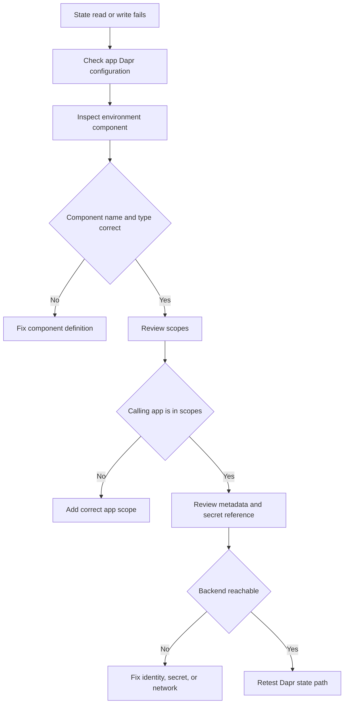

---
content_sources:
  - type: mslearn-adapted
    url: https://learn.microsoft.com/en-us/azure/container-apps/dapr-components
diagrams:
  - id: dapr-state-store-failure-flow
    type: flowchart
    source: mslearn-adapted
    based_on:
      - https://learn.microsoft.com/en-us/azure/container-apps/dapr-components
      - https://learn.microsoft.com/en-us/azure/container-apps/dapr-component-connection
content_validation:
  status: pending_review
  last_reviewed: 2026-04-29
  reviewer: agent
  core_claims:
    - claim: "Dapr components in Azure Container Apps are defined at the environment scope."
      source: https://learn.microsoft.com/en-us/azure/container-apps/dapr-components
      verified: false
    - claim: "Dapr component scopes can limit which apps load a component."
      source: https://learn.microsoft.com/en-us/azure/container-apps/dapr-components
      verified: false
---

# Dapr State Store Failure

Use this playbook when state reads or writes through Dapr fail even though the application itself is reachable.

## Symptom

- Application requests that use Dapr state APIs return errors or time out.
- The app starts, but state-dependent features fail.
- Sidecar or component logs show metadata, secret, or connectivity problems.
- One app fails while another app in the same environment works, which often indicates a scopes mismatch.

<!-- diagram-id: dapr-state-store-failure-flow -->


## Possible Causes

- The Dapr component definition uses the wrong component type or metadata.
- Component secrets or connection information are missing or invalid.
- The app name is missing from the component `scopes` list.
- The container app does not have Dapr enabled or uses the wrong app ID.
- The backend state store is unavailable or blocked by identity or network policy.

## Diagnosis Steps

1. Confirm the app has Dapr enabled and uses the expected app ID.
2. List environment-scoped Dapr components and inspect the state store definition.
3. Check whether `scopes` excludes the failing app.
4. Validate the metadata and connectivity path to the backing service.

```bash
az containerapp show \
    --name "$APP_NAME" \
    --resource-group "$RG" \
    --query "properties.configuration.dapr" \
    --output json

az containerapp env dapr-component list \
    --name "$CONTAINER_ENV" \
    --resource-group "$RG" \
    --output table

az containerapp env dapr-component show \
    --name "$CONTAINER_ENV" \
    --resource-group "$RG" \
    --dapr-component-name "statestore" \
    --output yaml
```

| Command | Why it is used |
|---|---|
| `az containerapp show --name "$APP_NAME" --resource-group "$RG" --query "properties.configuration.dapr" --output json` | Verifies that the container app is configured to use Dapr and exposes the app ID context. |
| `az containerapp env dapr-component list --name "$CONTAINER_ENV" --resource-group "$RG" --output table` | Shows which components exist in the environment and whether the expected state store is present. |
| `az containerapp env dapr-component show --name "$CONTAINER_ENV" --resource-group "$RG" --dapr-component-name "statestore" --output yaml` | Lets you inspect component type, metadata, secret references, and scopes. |

KQL for Dapr-oriented log review:

```kusto
let AppName = "ca-myapp";
ContainerAppConsoleLogs_CL
| where TimeGenerated > ago(4h)
| where ContainerAppName_s == AppName
| where Log_s has_any ("dapr", "state", "component", "statestore", "error", "failed")
| project TimeGenerated, RevisionName_s, Log_s
| order by TimeGenerated desc
```

## Resolution

1. Correct the component definition so the name, type, metadata, and version match the backend.
2. Add the failing app to `scopes` when access should be limited but not denied.
3. Refresh secret references or managed identity permissions for the backing state service.
4. Reapply the component and retest from the affected app.

```bash
az containerapp env dapr-component set \
    --name "$CONTAINER_ENV" \
    --resource-group "$RG" \
    --dapr-component-name "statestore" \
    --yaml "./statestore.yaml"
```

| Command | Why it is used |
|---|---|
| `az containerapp env dapr-component set --name "$CONTAINER_ENV" --resource-group "$RG" --dapr-component-name "statestore" --yaml "./statestore.yaml"` | Reapplies the corrected Dapr component definition in a controlled, source-backed way. |

## Prevention

- Keep Dapr components in source control with explicit `scopes` comments.
- Standardize component naming so application code and component definitions cannot drift.
- Validate secret rotation and managed identity access before production rollout.
- Test state operations from every app that is intentionally in scope.

## See Also

- [Dapr Sidecar or Component Failure](./dapr-sidecar-or-component-failure.md)
- [Dapr Pub/Sub Failure](./dapr-pubsub-failure.md)
- [Dapr State Store Failure Lab](../../lab-guides/dapr-state-store-failure.md)

## Sources

- [Dapr components in Azure Container Apps](https://learn.microsoft.com/en-us/azure/container-apps/dapr-components)
- [Connect Dapr components to Azure services](https://learn.microsoft.com/en-us/azure/container-apps/dapr-component-connection)
- [Azure CLI `az containerapp env dapr-component` reference](https://learn.microsoft.com/en-us/cli/azure/containerapp/env/dapr-component)
