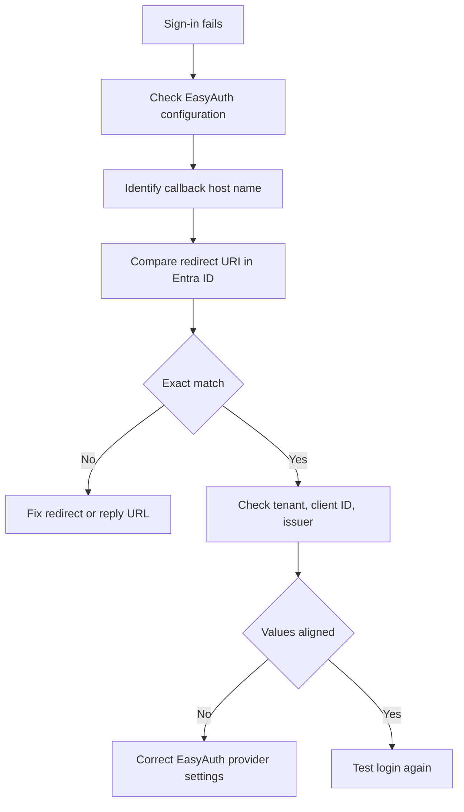

---
content_sources:
  - type: mslearn-adapted
    url: https://learn.microsoft.com/en-us/azure/container-apps/authentication
diagrams:
  - id: easyauth-entra-id-failure-flow
    type: flowchart
    source: mslearn-adapted
    based_on:
      - https://learn.microsoft.com/en-us/azure/container-apps/authentication
      - https://learn.microsoft.com/en-us/azure/container-apps/authentication-entra
      - https://learn.microsoft.com/en-us/troubleshoot/azure/entra/entra-id/app-integration/error-code-AADSTS50011-redirect-uri-mismatch
content_validation:
  status: pending_review
  last_reviewed: 2026-04-29
  reviewer: agent
  core_claims:
    - claim: "Azure Container Apps supports built-in authentication and authorization configuration."
      source: https://learn.microsoft.com/en-us/azure/container-apps/authentication
      verified: false
    - claim: "A redirect URI mismatch in Microsoft Entra ID can surface as AADSTS50011."
      source: https://learn.microsoft.com/en-us/troubleshoot/azure/entra/entra-id/app-integration/error-code-AADSTS50011-redirect-uri-mismatch
      verified: false
---

# EasyAuth Entra ID Failure

Use this playbook when built-in auth to Microsoft Entra ID fails, sign-in loops, or users receive `AADSTS50011` during the redirect flow.

## Symptom

- Browser sign-in fails with `AADSTS50011`.
- Users are redirected back to a bad callback URL.
- Auth worked before a hostname, custom domain, or app registration change.
- `az containerapp auth show` does not match the active Entra ID registration.

<!-- diagram-id: easyauth-entra-id-failure-flow -->


## Possible Causes

- The Entra ID app registration does not include the exact callback URL required by the Container App.
- The auth configuration points at the wrong tenant, issuer, or client ID.
- A custom domain or FQDN changed and the callback URL was not updated.
- The Container App auth config and Entra registration were updated independently and drifted.

## Diagnosis Steps

1. Inspect the current Container Apps auth configuration.
2. Identify the exact hostname users hit during sign-in.
3. Compare the callback URL with the Entra ID redirect URI entry.
4. Confirm tenant ID, client ID, and issuer all match the intended registration.

```bash
az containerapp auth show \
    --name "$APP_NAME" \
    --resource-group "$RG" \
    --output json

az containerapp show \
    --name "$APP_NAME" \
    --resource-group "$RG" \
    --query "properties.configuration.ingress.fqdn" \
    --output tsv
```

| Command | Why it is used |
|---|---|
| `az containerapp auth show --name "$APP_NAME" --resource-group "$RG" --output json` | Shows the active authentication provider settings that Container Apps is using. |
| `az containerapp show --name "$APP_NAME" --resource-group "$RG" --query "properties.configuration.ingress.fqdn" --output tsv` | Retrieves the current application hostname so you can derive the exact callback URL. |

Expected callback pattern:

```text
https://<app-hostname>/.auth/login/aad/callback
```

## Resolution

1. Add the exact Container Apps callback URL to the Entra ID app registration.
2. Update the Container Apps auth provider settings if the tenant, client ID, or secret changed.
3. If you use a custom domain, verify the sign-in flow is using that host and not the default domain.
4. Retest with a fresh browser session after both sides are aligned.

```bash
az containerapp auth microsoft update \
    --name "$APP_NAME" \
    --resource-group "$RG" \
    --client-id "<APP_ID>" \
    --client-secret "<SECRET>" \
    --tenant-id "<TENANT_ID>" \
    --yes
```

| Command | Why it is used |
|---|---|
| `az containerapp auth microsoft update --name "$APP_NAME" --resource-group "$RG" --client-id "<APP_ID>" --client-secret "<SECRET>" --tenant-id "<TENANT_ID>" --yes` | Updates the Container Apps Microsoft provider settings so they match the intended Entra app registration. |

## Prevention

- Treat auth config and Entra app registration as a single change set.
- Keep callback URLs in source-controlled deployment notes.
- Revalidate sign-in after hostname, domain, or tenant changes.
- Maintain a test account that exercises the full login flow after each auth update.

## See Also

- [EasyAuth Entra ID Failure Lab](../../lab-guides/easyauth-entra-id-failure.md)
- [Dapr Pub/Sub Failure](./dapr-pubsub-failure.md)
- [Bad Revision Rollout and Rollback](./bad-revision-rollout-and-rollback.md)

## Sources

- [Authentication and authorization in Azure Container Apps](https://learn.microsoft.com/en-us/azure/container-apps/authentication)
- [Enable Microsoft Entra authentication in Azure Container Apps](https://learn.microsoft.com/en-us/azure/container-apps/authentication-entra)
- [Azure CLI `az containerapp auth` reference](https://learn.microsoft.com/en-us/cli/azure/containerapp/auth)
- [Troubleshoot AADSTS50011 redirect URI mismatch](https://learn.microsoft.com/en-us/troubleshoot/azure/entra/entra-id/app-integration/error-code-AADSTS50011-redirect-uri-mismatch)
