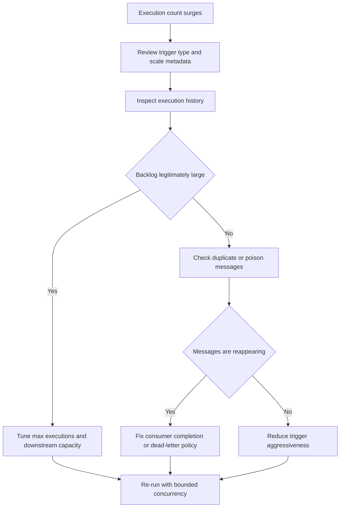

---
content_sources:
  - type: mslearn-adapted
    url: https://learn.microsoft.com/en-us/azure/container-apps/jobs
diagrams:
  - id: event-job-storm-flow
    type: flowchart
    source: mslearn-adapted
    based_on:
      - https://learn.microsoft.com/en-us/azure/container-apps/jobs
      - https://learn.microsoft.com/en-us/azure/container-apps/jobs-get-started-cli
content_validation:
  status: pending_review
  last_reviewed: 2026-04-29
  reviewer: agent
  core_claims:
    - claim: "Azure Container Apps jobs support event-driven execution patterns."
      source: https://learn.microsoft.com/en-us/azure/container-apps/jobs
      verified: false
    - claim: "Job execution history can be reviewed with Azure CLI commands for Container Apps jobs."
      source: https://learn.microsoft.com/en-us/cli/azure/containerapp/job
      verified: false
---

# Event Job Storm

Use this playbook when an event-driven job creates too many executions, drains a queue unexpectedly fast, or amplifies downstream failures.

## Symptom

- A queue spike results in far more job executions than expected.
- Downstream dependencies throttle because too many job executions start concurrently.
- Retries or poison messages keep re-triggering work.
- Operators see a sudden burst in `az containerapp job execution list` even though the backlog was small.

<!-- diagram-id: event-job-storm-flow -->


## Possible Causes

- The event trigger metadata is too aggressive for the queue or downstream dependency.
- Maximum parallel executions are higher than the workload can safely absorb.
- Messages are retried repeatedly because the consumer fails before acknowledging completion.
- A Dapr or queue component points to the wrong source, causing duplicate delivery patterns.
- Operators are measuring execution count instead of unique business work items.

## Diagnosis Steps

1. Confirm the job really is event-driven.
2. Compare execution history with the actual backlog and dead-letter counts.
3. Check whether the same messages are being retried or re-enqueued.
4. Bound the concurrency hypothesis by reviewing the configured max execution behavior.

```bash
az containerapp job show \
    --name "$JOB_NAME" \
    --resource-group "$RG" \
    --output json

az containerapp job execution list \
    --name "$JOB_NAME" \
    --resource-group "$RG" \
    --output table

az containerapp job list \
    --resource-group "$RG" \
    --environment "$CONTAINER_ENV" \
    --output table
```

| Command | Why it is used |
|---|---|
| `az containerapp job show --name "$JOB_NAME" --resource-group "$RG" --output json` | Confirms the job trigger model and lets you inspect queue-related metadata in the applied definition. |
| `az containerapp job execution list --name "$JOB_NAME" --resource-group "$RG" --output table` | Shows how many executions were launched and whether they cluster in short time windows. |
| `az containerapp job list --resource-group "$RG" --environment "$CONTAINER_ENV" --output table` | Verifies you are looking at the correct job in the intended Container Apps environment. |

KQL to correlate burst timing:

```kusto
let JobName = "job-myapp";
ContainerAppSystemLogs_CL
| where TimeGenerated > ago(6h)
| where JobName_s == JobName or ContainerAppName_s == JobName
| where Log_s has_any ("Execution", "Started", "Completed", "Failed")
| summarize Executions=count() by bin(TimeGenerated, 5m), Reason_s
| order by TimeGenerated asc
```

## Resolution

1. Reduce event-trigger aggressiveness and cap safe concurrency in the job definition.
2. Fix duplicate-delivery patterns before increasing throughput.
3. If poison messages are present, route them away from the hot path and retry them separately.
4. Validate the tuned configuration against a controlled backlog instead of production surge traffic.

```bash
az containerapp job show \
    --name "$JOB_NAME" \
    --resource-group "$RG" \
    --output yaml
```

| Command | Why it is used |
|---|---|
| `az containerapp job show --name "$JOB_NAME" --resource-group "$RG" --output yaml` | Provides the current job definition so you can reapply a safer event trigger and concurrency envelope through YAML or IaC. |

## Prevention

- Define explicit upper bounds for job concurrency.
- Dead-letter poison messages instead of allowing infinite business retries.
- Load-test event jobs with realistic backlog shapes.
- Document the mapping between queue depth, execution fan-out, and downstream capacity.

## See Also

- [Scheduled Job Missed](./scheduled-job-missed.md)
- [Event Job Storm Lab](../../lab-guides/event-job-storm.md)
- [Container App Job Execution Failure](./container-app-job-execution-failure.md)

## Sources

- [Azure Container Apps jobs](https://learn.microsoft.com/en-us/azure/container-apps/jobs)
- [Create a job with the Azure CLI](https://learn.microsoft.com/en-us/azure/container-apps/jobs-get-started-cli)
- [Azure CLI `az containerapp job` reference](https://learn.microsoft.com/en-us/cli/azure/containerapp/job)
