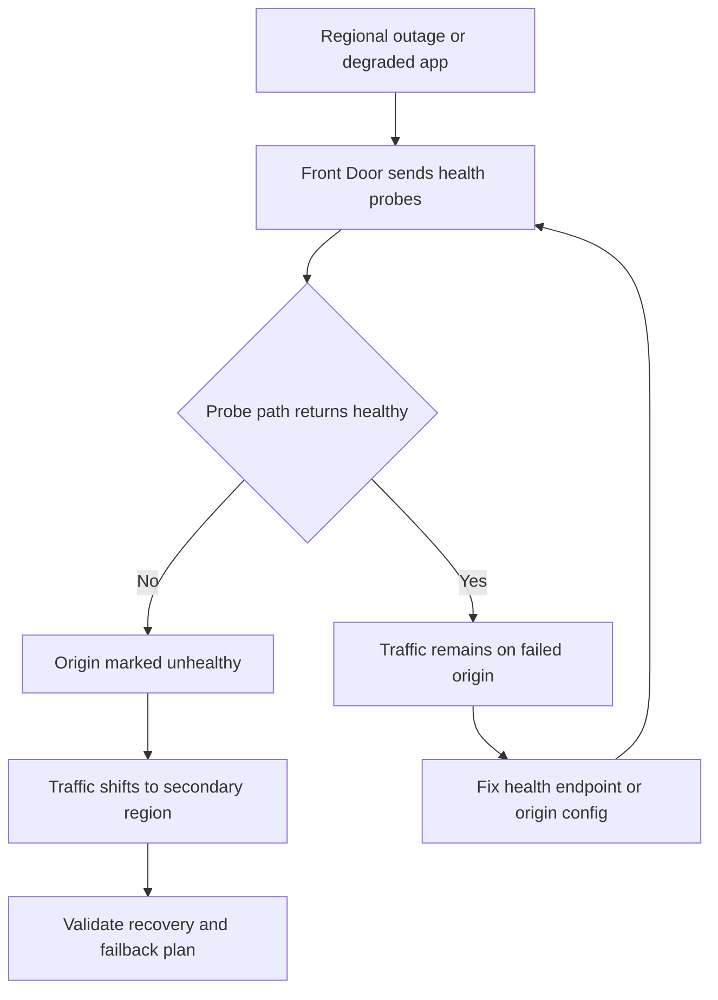

---
content_sources:
  - type: mslearn-adapted
    url: https://learn.microsoft.com/en-us/azure/reliability/reliability-azure-container-apps
diagrams:
  - id: multi-region-failover-flow
    type: flowchart
    source: mslearn-adapted
    based_on:
      - https://learn.microsoft.com/en-us/azure/reliability/reliability-azure-container-apps
      - https://learn.microsoft.com/en-us/azure/frontdoor/create-front-door-cli
content_validation:
  status: pending_review
  last_reviewed: 2026-04-29
  reviewer: agent
  core_claims:
    - claim: "Azure reliability guidance for Container Apps recommends multi-region planning for higher resilience requirements."
      source: https://learn.microsoft.com/en-us/azure/reliability/reliability-azure-container-apps
      verified: false
    - claim: "Azure Front Door can use health probes and origin groups to steer traffic."
      source: https://learn.microsoft.com/en-us/azure/frontdoor/create-front-door-cli
      verified: false
---

# Multi-Region Failover

Use this playbook when traffic does not fail over away from an unhealthy Azure Container Apps region or when failback behavior is inconsistent.

## Symptom

- Users continue hitting an unhealthy regional backend.
- Azure Front Door health probes do not remove a failed origin quickly enough.
- Failover works for one path but not another because health endpoints are inconsistent.
- Active-active traffic steering is configured, but only one region appears healthy.

<!-- diagram-id: multi-region-failover-flow -->


## Possible Causes

- The health probe path does not represent real application health.
- Front Door origin group settings are too tolerant for the failure mode.
- Regional backends are not configured identically.
- Private connectivity or certificate configuration is broken in one region.
- Data, image, or secret replication is incomplete, so the secondary region is alive but not truly ready.

## Diagnosis Steps

1. Confirm both regions are deployed and individually reachable.
2. Inspect the Front Door origin group probe settings.
3. Validate that the probe path exercises a meaningful health dependency.
4. Compare app, ingress, and dependency configuration between regions.

```bash
export RG_PRIMARY="rg-myapp-primary"
export RG_SECONDARY="rg-myapp-secondary"
export APP_NAME_PRIMARY="ca-myapp-primary"
export APP_NAME_SECONDARY="ca-myapp-secondary"
export AFD_PROFILE="afd-myapp"

az afd origin-group show \
    --resource-group "$RG_PRIMARY" \
    --profile-name "$AFD_PROFILE" \
    --origin-group-name "aca-origins" \
    --output json

az containerapp show \
    --name "$APP_NAME_PRIMARY" \
    --resource-group "$RG_PRIMARY" \
    --query "properties.configuration.ingress.fqdn" \
    --output tsv

az containerapp show \
    --name "$APP_NAME_SECONDARY" \
    --resource-group "$RG_SECONDARY" \
    --query "properties.configuration.ingress.fqdn" \
    --output tsv
```

| Command | Why it is used |
|---|---|
| `az afd origin-group show ...` | Exposes the active health probe configuration and failover thresholds used by Front Door. |
| `az containerapp show ... (primary)` | Confirms the primary region backend FQDN that Front Door should probe. |
| `az containerapp show ... (secondary)` | Confirms the secondary region backend FQDN and verifies it is independently reachable. |

KQL to compare regional symptoms when Log Analytics is centralized:

```kusto
ContainerAppSystemLogs_CL
| where TimeGenerated > ago(4h)
| where Log_s has_any ("Replica", "Failed", "Probe", "Revision")
| summarize Events=count() by ContainerAppName_s, Reason_s, bin(TimeGenerated, 10m)
| order by TimeGenerated asc
```

## Resolution

1. Make the health probe endpoint reflect application readiness, not just process liveness.
2. Tighten or relax Front Door probe thresholds based on the failure mode you observed.
3. Bring the secondary region to parity for images, secrets, identities, and dependencies.
4. Rehearse a controlled regional drain and confirm both failover and failback behavior.

```bash
az afd origin-group update \
    --resource-group "$RG_PRIMARY" \
    --profile-name "$AFD_PROFILE" \
    --origin-group-name "aca-origins" \
    --probe-request-type GET \
    --probe-protocol Https \
    --probe-interval-in-seconds 30 \
    --probe-path "/health" \
    --sample-size 4 \
    --successful-samples-required 3 \
    --additional-latency-in-milliseconds 50
```

| Command | Why it is used |
|---|---|
| `az afd origin-group update ...` | Updates the existing origin group probe configuration — use `update` rather than `create` to avoid duplicating the origin group. |

## Prevention

- Keep multi-region deployments symmetrical by design.
- Use health endpoints that check real dependencies required for safe traffic handling.
- Test failover regularly instead of waiting for a real outage.
- Document acceptable recovery time and how Front Door thresholds map to that target.

## See Also

- [Multi-Region Failover Lab](../../lab-guides/multi-region-failover.md)
- [Bad Revision Rollout and Rollback](./bad-revision-rollout-and-rollback.md)
- [Cold Start and Scale-to-Zero Lab](../../lab-guides/cold-start-scale-to-zero.md)

## Sources

- [Reliability in Azure Container Apps](https://learn.microsoft.com/en-us/azure/reliability/reliability-azure-container-apps)
- [Create an Azure Front Door with the Azure CLI](https://learn.microsoft.com/en-us/azure/frontdoor/create-front-door-cli)
- [Azure Front Door CLI reference](https://learn.microsoft.com/en-us/cli/azure/afd)
