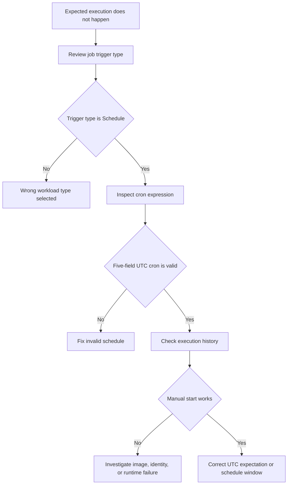

---
content_sources:
  - type: mslearn-adapted
    url: https://learn.microsoft.com/en-us/azure/container-apps/jobs
diagrams:
  - id: scheduled-job-missed-flow
    type: flowchart
    source: mslearn-adapted
    based_on:
      - https://learn.microsoft.com/en-us/azure/container-apps/jobs
      - https://learn.microsoft.com/en-us/azure/container-apps/jobs-get-started-cli
content_validation:
  status: pending_review
  last_reviewed: 2026-04-29
  reviewer: agent
  core_claims:
    - claim: "Azure Container Apps jobs support manual, schedule-based, and event-driven trigger types."
      source: https://learn.microsoft.com/en-us/azure/container-apps/jobs
      verified: false
    - claim: "Scheduled jobs use cron expressions evaluated in UTC."
      source: https://learn.microsoft.com/en-us/azure/container-apps/jobs
      verified: false
---

# Scheduled Job Missed

Use this playbook when a scheduled Container Apps job does not run at the expected time or appears to skip executions.

## Symptom

- A scheduled job did not start at the expected wall-clock time.
- `az containerapp job execution list` shows no execution for the expected interval.
- A deployment or portal edit shows validation errors such as `InvalidCronExpression`.
- Operators believe the schedule drifted, but the root issue is often UTC conversion or a malformed five-field cron expression.

<!-- diagram-id: scheduled-job-missed-flow -->


## Possible Causes

- The job uses the wrong trigger type and was created as manual or event-driven instead of scheduled.
- The cron expression is invalid or not in the supported five-field format.
- The schedule was authored for local time, but Azure Container Apps evaluates it in UTC.
- The job did trigger, but the execution failed immediately and was mistaken for a missed run.
- A recent configuration change was not applied successfully and the portal or ARM validation rejected it.

## Diagnosis Steps

1. Confirm the job uses the `Schedule` trigger type and inspect the configured cron expression.
2. Review recent execution history to separate “never triggered” from “triggered but failed.”
3. Start the job manually to validate the image, identity, and runtime path independently from the schedule.
4. Recalculate the intended run time in UTC.

```bash
az containerapp job show \
    --name "$JOB_NAME" \
    --resource-group "$RG" \
    --output json

az containerapp job execution list \
    --name "$JOB_NAME" \
    --resource-group "$RG" \
    --output table

az containerapp job start \
    --name "$JOB_NAME" \
    --resource-group "$RG"
```

| Command | Why it is used |
|---|---|
| `az containerapp job show --name "$JOB_NAME" --resource-group "$RG" --output json` | Confirms the trigger type and lets you inspect the schedule configuration delivered to the platform. |
| `az containerapp job execution list --name "$JOB_NAME" --resource-group "$RG" --output table` | Shows whether the job actually fired and whether recent executions exist. |
| `az containerapp job start --name "$JOB_NAME" --resource-group "$RG"` | Tests the job template without waiting for the next scheduled interval. |

Useful KQL for confirming the execution timeline:

```kusto
let JobName = "job-myapp";
ContainerAppSystemLogs_CL
| where TimeGenerated > ago(24h)
| where ContainerAppName_s == JobName or JobName_s == JobName
| where Log_s has_any ("Job", "Execution", "Schedule", "Started", "Failed")
| project TimeGenerated, JobName_s, ReplicaName_s, Reason_s, Log_s
| order by TimeGenerated desc
```

## Resolution

1. Re-author the cron expression in UTC using the supported five-field format.
2. If the business schedule is local-time based, document the UTC conversion next to the IaC or CLI definition.
3. If manual start fails, fix the runtime issue first; the schedule is not the real root cause.
4. Reapply the configuration and watch the next interval.

```bash
az containerapp job show \
    --name "$JOB_NAME" \
    --resource-group "$RG" \
    --output yaml
```

| Command | Why it is used |
|---|---|
| `az containerapp job show --name "$JOB_NAME" --resource-group "$RG" --output yaml` | Gives you a clean representation of the current job definition so the schedule can be corrected in source-controlled YAML or IaC. |

## Prevention

- Store scheduled jobs in Bicep, ARM, or YAML with an adjacent UTC note.
- Add an operator runbook entry that lists both local time and UTC for critical schedules.
- Monitor expected-versus-actual execution count for important jobs.
- Validate every schedule change with a manual start before relying on the next production interval.

## See Also

- [Container App Job Execution Failure](./container-app-job-execution-failure.md)
- [Scheduled Job Missed Lab](../../lab-guides/scheduled-job-missed.md)
- [Cold Start and Scale-to-Zero Lab](../../lab-guides/cold-start-scale-to-zero.md)

## Sources

- [Azure Container Apps jobs](https://learn.microsoft.com/en-us/azure/container-apps/jobs)
- [Create a job with the Azure CLI](https://learn.microsoft.com/en-us/azure/container-apps/jobs-get-started-cli)
- [Azure CLI `az containerapp job` reference](https://learn.microsoft.com/en-us/cli/azure/containerapp/job)
