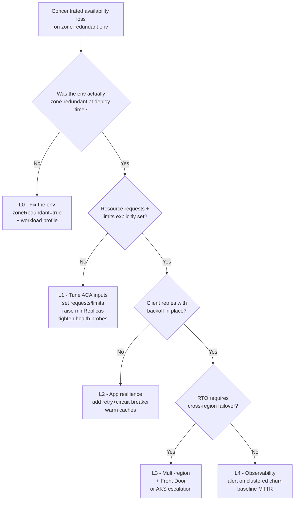

---
content_sources:
  references:
    - type: mslearn-adapted
      url: https://learn.microsoft.com/en-us/azure/reliability/reliability-container-apps
    - type: mslearn-adapted
      url: https://learn.microsoft.com/en-us/azure/container-apps/how-to-zone-redundancy
    - type: mslearn-adapted
      url: https://learn.microsoft.com/en-us/azure/container-apps/planned-maintenance
  diagrams:
    - id: best-effort-decision-flow
      type: flowchart
      source: self-generated
      justification: "No single MS Learn article presents a four-layer mitigation decision flow for ACA zone redundancy. Synthesized from the reliability, zone-redundancy, planned-maintenance, and Front Door articles."
      based_on:
        - https://learn.microsoft.com/en-us/azure/reliability/reliability-container-apps
        - https://learn.microsoft.com/en-us/azure/container-apps/how-to-zone-redundancy
        - https://learn.microsoft.com/en-us/azure/container-apps/planned-maintenance
        - https://learn.microsoft.com/en-us/azure/frontdoor/front-door-overview
content_validation:
  status: verified
  last_reviewed: '2026-06-08'
  reviewer: agent
  core_claims:
    - claim: Container Apps zone redundancy is implemented by the platform scheduler and is described in Microsoft Learn as a best-effort distribution across physical hosts while meeting the minimum replica count.
      source: https://learn.microsoft.com/en-us/azure/reliability/reliability-container-apps
      verified: true
    - claim: Setting resource requests and limits helps the Container Apps scheduler make optimal placement decisions across zones, and underspecified resource requirements can lead to uneven distribution.
      source: https://learn.microsoft.com/en-us/azure/container-apps/how-to-zone-redundancy
      verified: true
    - claim: Container Apps may pause or restart replicas during planned platform maintenance windows.
      source: https://learn.microsoft.com/en-us/azure/container-apps/planned-maintenance
      verified: true
    - claim: For higher availability targets than a single zone-redundant environment provides, Microsoft Learn directs operators to multi-region designs fronted by Azure Front Door.
      source: https://learn.microsoft.com/en-us/azure/reliability/reliability-container-apps
      verified: true
---
# Zone Redundancy Is Best-Effort

Use this playbook when you assumed `zoneRedundant=true` plus `minReplicas=N` guaranteed `N` replicas spread across `N` Availability Zones, then observed a concentrated availability loss anyway.

## Symptom

- A zone-redundant Container Apps environment serving an app with `minReplicas >= 2` shows a brief but complete 503 outage that does not match a deployment, scale event, or known upstream incident.
- Clustered replica restarts: two or more replicas of the same app are terminated and restarted inside a 60-second window.
- The Azure Portal "Availability + zones" tile shows the environment as zone-redundant, yet a single Availability Zone fault correlated with measurable customer impact.
- Support engineer asks "is zone redundancy guaranteeing my N replicas land in N zones?" and the assumption is **No** — the platform offers a best-effort distribution that depends on host capacity, planned maintenance, and per-replica resource shape.

<!-- diagram-id: best-effort-decision-flow -->


## Possible Causes

| Cause | Why it matters |
|---|---|
| Single-zone scheduler decision | The scheduler distributes replicas across zones on a **best-effort** basis. With small `minReplicas`, two or three replicas can legitimately land in the same physical zone. |
| Underspecified resource requests | Without explicit `cpu` / `memory` requests, the scheduler treats placement as fungible and may co-locate replicas. MS Learn calls this out as a leading cause of uneven distribution. |
| Image pull serialization on first cold zone | Container images are pulled into each zone the first time a replica is scheduled there. If the lab/test never scales out, the second zone may never warm up. |
| Planned platform maintenance | Maintenance can restart replicas in waves, producing clustered termination that looks like a zone fault. |
| Single-region single-environment design | Even ideal zone-spread does not survive a regional incident; the assumption that one zone-redundant environment alone meets a multi-zone RTO is the root organizational error. |
| Client without retry / backoff | If clients abort on first 503 instead of retrying the replacement replica, every clustered churn surfaces as a customer-visible failure. |

## Diagnosis Steps

1. **Confirm the environment is actually zone-redundant** — both `zoneRedundant=true` and a workload-profile (not Consumption-only) plan.
2. **Inspect the app's `resources.requests` and `resources.limits`**. Empty or vague values are an L1 fix opportunity.
3. **Run the [Mass-Reschedule KQL pack](../../kql/scaling-and-replicas/zone-redundancy-mass-reschedule.md)** to look for clustered churn events in your incident window.
4. **Compare baseline vs perturbation** with the same KQL (Q6) to separate platform-caused churn from your own deploys.
5. **Check Azure Resource Health and the Service Health blade** for region-wide or zone-specific advisories.

```bash
export RG="rg-myapp"
export APP_NAME="ca-myapp"
export ENV_NAME="cae-myapp"

az containerapp env show \
    --resource-group "$RG" \
    --name "$ENV_NAME" \
    --query "{zoneRedundant: properties.zoneRedundant, profiles: properties.workloadProfiles}" \
    --output json

az containerapp show \
    --resource-group "$RG" \
    --name "$APP_NAME" \
    --query "properties.template.containers[].{name:name, cpu:resources.cpu, memory:resources.memory}" \
    --output table

az containerapp show \
    --resource-group "$RG" \
    --name "$APP_NAME" \
    --query "properties.template.scale" \
    --output json
```

| Command | Why it is used |
|---|---|
| `az containerapp env show` | Confirms that `zoneRedundant=true` is present and that a workload profile (not Consumption-only) is configured, since zone redundancy requires both. |
| `az containerapp show ... resources` | Reveals whether the app has explicit `cpu` / `memory` requests, which MS Learn lists as the primary scheduler input for zone-aware placement. |
| `az containerapp show ... scale` | Reads `minReplicas` and `maxReplicas`, the only two operator-controlled inputs that influence the platform's best-effort spread. |

## Resolution — Four-Layer Mitigation Matrix

> Zone redundancy is one layer in a multi-layer reliability strategy. Pick layers based on your RTO and the evidence you collected above; do not assume any single layer is sufficient.

### L1 — Tune Container Apps inputs (in-platform)

| Lever | What to do | Why it helps |
|---|---|---|
| Explicit `resources.requests` and `resources.limits` | Set both for every container, sized to your real working set. | Per MS Learn, the scheduler uses these values to make placement decisions. Vague resource shapes are the leading documented cause of uneven distribution. |
| `minReplicas >= 3` (when the budget allows) | Larger `minReplicas` dilutes the impact of any single clustered-churn event. | Q7 in the KQL pack measures the per-app churn frequency at `min={2,3,6}`. Higher minimums reduce — but do not eliminate — clustered churn. |
| Startup, readiness, and liveness probes that reflect dependency readiness | Don't pass the readiness probe before the app can actually serve traffic. | A probe that lies green during cold start lets the ingress send traffic to a replica that will 503. |
| Pre-pull the image into the second zone | Force at least one scale-out event during deploy validation. | Avoids the documented "first scheduling into a zone pulls the image" delay during a real failure. |

### L2 — Application resilience

| Lever | What to do | Why it helps |
|---|---|---|
| Client retry with capped exponential backoff | 3–4 retries, `~0.2s, 0.4s, 0.8s, 1.6s`. | Bridges the seconds-scale gap between a replica termination and its replacement coming healthy. The lab measures this explicitly via `trigger.sh --client no-retry` vs `--client retry-backoff`. |
| Circuit breakers on downstream calls | Open-state for the failing replica's downstream, half-open after backoff. | Prevents cascade when several replicas churn at once. |
| Warm caches / connection pools survive replica turnover | Externalize hot caches; let connection pools self-heal. | A 503 caused by a single cold replica should not also blow away a regional cache. |

### L3 — Multi-region (escalation when L1+L2 are insufficient)

| Lever | What to do | Why it helps |
|---|---|---|
| Active-passive multi-region with Azure Front Door | Deploy the app in a second region; let Front Door probe both and shift traffic. | Survives **regional** incidents that no single zone-redundant environment can. See the [Multi-Region Failover Playbook](./multi-region-failover.md) and [Lab](../../lab-guides/multi-region-failover.md). |
| **Escalate to AKS** when zone placement must be operator-controlled | Move the workload to Azure Kubernetes Service with `topologySpreadConstraints`. | ACA does not surface per-replica zone placement to operators. If your reliability requirements demand explicit zone placement guarantees, you have outgrown what ACA's best-effort scheduler can offer. |

### L4 — Observability and SLO honesty

| Lever | What to do | Why it helps |
|---|---|---|
| Alert on clustered churn | Use the [Mass-Reschedule KQL pack Q3](../../kql/scaling-and-replicas/zone-redundancy-mass-reschedule.md#q3-clustered-churn-detection) in an Azure Monitor alert rule. | Detects the failure mode before customers do, even when zone redundancy was working. |
| Baseline your real MTTR | Run the KQL pack's Q4 over a 7-day window; treat its 95th percentile as your true platform MTTR. | Lets you set SLOs you can actually meet, instead of inheriting the "redundant therefore fast" assumption. |
| Document the assumption in your runbook | Replace any "zone-redundant means zero 5xx" wording with "zone-redundant means platform makes a best-effort spread; expect clustered churn at low frequency." | Stops the same incident from recurring as a postmortem item with no operator action. |

## Prevention

- **Set requests + limits on every container** during the first deploy. Treat unset resource shapes as a deploy-time CI check failure.
- **Pick `minReplicas` from your RTO**, not from cost intuition. Higher minimums reduce — not eliminate — clustered-churn impact.
- **Treat zone redundancy as one layer**, not a guarantee. The four-layer matrix above is the actual reliability contract; documenting it in your service definition stops the recurring "but we set `zoneRedundant=true`" postmortem.
- **Schedule quarterly fault injection** using `trigger.sh --perturb restart` (or the equivalent runbook) so the team sees clustered churn in a controlled window and can verify the L2 retry path actually works.
- **Subscribe to Azure Service Health alerts** for the region; planned maintenance is a documented source of clustered restarts and is signalled in advance.

## See Also

- [Lab: Zone redundancy is best-effort](../../lab-guides/zone-redundancy-best-effort.md)
- [KQL: Mass-Reschedule pack](../../kql/scaling-and-replicas/zone-redundancy-mass-reschedule.md)
- [Multi-Region Failover Playbook](./multi-region-failover.md)
- [Multi-Region Failover Lab](../../lab-guides/multi-region-failover.md)
- [Replica Load Imbalance Playbook](../scaling-and-runtime/replica-load-imbalance.md)
- [Replica Load Imbalance Lab](../../lab-guides/replica-load-imbalance.md)

## Sources

- [Reliability in Azure Container Apps](https://learn.microsoft.com/en-us/azure/reliability/reliability-container-apps)
- [Set up zone redundancy in Azure Container Apps](https://learn.microsoft.com/en-us/azure/container-apps/how-to-zone-redundancy)
- [Planned maintenance for Azure Container Apps](https://learn.microsoft.com/en-us/azure/container-apps/planned-maintenance)
- [Scale an app in Azure Container Apps](https://learn.microsoft.com/en-us/azure/container-apps/scale-app)
- [Workload profiles in Azure Container Apps](https://learn.microsoft.com/en-us/azure/container-apps/workload-profiles-overview)
- [What is Azure Front Door?](https://learn.microsoft.com/en-us/azure/frontdoor/front-door-overview)
