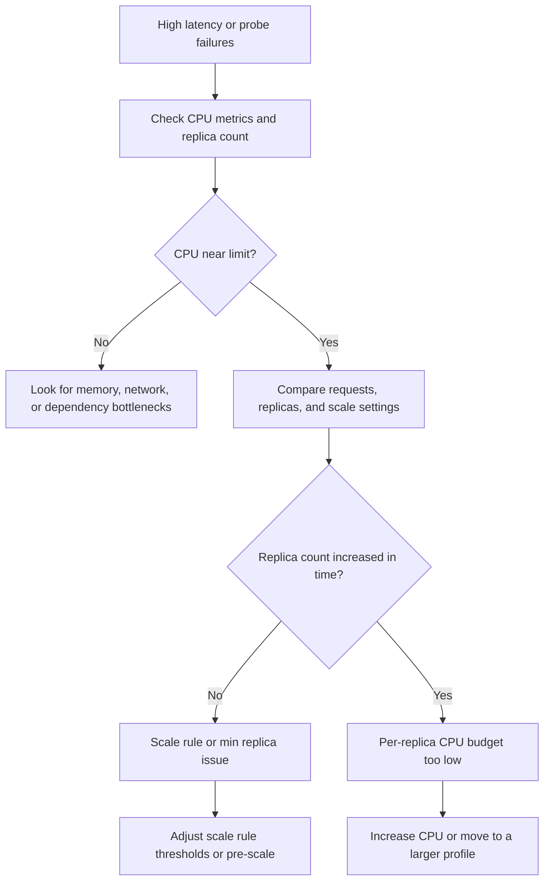

---
content_sources:
  - type: mslearn-adapted
    url: https://learn.microsoft.com/en-us/azure/container-apps/workload-profiles-overview
diagrams:
  - id: cpu-throttling-decision-flow
    type: flowchart
    source: mslearn-adapted
    based_on:
      - https://learn.microsoft.com/en-us/azure/container-apps/workload-profiles-overview
      - https://learn.microsoft.com/en-us/azure/container-apps/quotas
      - https://learn.microsoft.com/en-us/azure/container-apps/metrics
      - https://learn.microsoft.com/en-us/azure/container-apps/scale-app
content_validation:
  status: pending_review
  last_reviewed: 2026-04-29
  reviewer: agent
  core_claims:
    - claim: "Azure Container Apps exposes CPU-related metrics that can be queried from Azure Monitor."
      source: https://learn.microsoft.com/en-us/azure/container-apps/metrics
      verified: false
    - claim: "Workload profile selection and environment quotas affect the CPU capacity available to Container Apps workloads."
      source: https://learn.microsoft.com/en-us/azure/container-apps/workload-profiles-overview
      verified: false
---

# CPU Throttling

Use this playbook when latency rises under burst traffic, startup becomes slow under load, or replicas stay healthy but CPU saturation prevents them from keeping up.

## Symptom

- Request latency climbs during bursts even though the app stays nominally available.
- Health probes begin to fail only when traffic or background work increases.
- CPU metrics stay pinned near the configured limit while replica count lags demand.
- Environment or revision events suggest quota pressure rather than an application crash.

## Possible Causes

- Per-replica CPU allocation is too small for the request burst.
- HTTP concurrency is too high, so each replica accepts more work than its CPU budget can sustain.
- Scale-out is too slow for the burst profile.
- Environment-level quota pressure reduces available headroom.
- Startup or warm-up logic competes with live traffic for the same CPU budget.

## Diagnosis Steps

<!-- diagram-id: cpu-throttling-decision-flow -->


1. Confirm the current resource envelope and scale settings.

    ```bash
    az containerapp show \
        --name "$APP_NAME" \
        --resource-group "$RG" \
        --query "{resources:properties.template.containers[0].resources,scale:properties.template.scale}" \
        --output json

    az containerapp env list-usages \
        --subscription "<subscription-id>" \
        --resource-group "$RG" \
        --name "$CONTAINER_ENV"
    ```

2. Check whether CPU usage is saturating while requests continue to rise.

    ```bash
    az monitor metrics list \
        --resource "/subscriptions/<subscription-id>/resourceGroups/$RG/providers/Microsoft.App/containerApps/$APP_NAME" \
        --metric UsageNanoCores \
        --aggregation Average \
        --timespan PT1H
    ```

3. Correlate request pressure, replica count, and throttling symptoms in Log Analytics.

    ```kusto
    let AppName = "ca-myapp";
    ContainerAppSystemLogs_CL
    | where ContainerAppName_s == AppName
    | where TimeGenerated > ago(1h)
    | where Reason_s has_any ("ProbeFailed", "ReplicaStarted", "ReplicaReady")
       or Log_s has_any ("timeout", "probe", "throttle", "cpu")
    | project TimeGenerated, RevisionName_s, ReplicaName_s, Reason_s, Log_s
    | order by TimeGenerated desc
    ```

4. Inspect whether the scale rule is allowing too much work per replica before additional replicas appear.

    ```bash
    az containerapp show \
        --name "$APP_NAME" \
        --resource-group "$RG" \
        --query "properties.template.scale.rules" \
        --output json
    ```

| Command or Query | Why it is used |
|---|---|
| `az containerapp show --query "{resources...,scale...}"` | Confirms the current CPU allocation and scaling configuration. |
| `az containerapp env list-usages ...` | Checks whether the environment is already near its quota boundary. |
| `az monitor metrics list --metric UsageNanoCores ...` | Verifies whether the app is CPU-bound rather than merely slow. |
| KQL against `ContainerAppSystemLogs_CL` | Correlates probe failures and replica events with the CPU saturation window. |

## Resolution

1. Increase per-replica CPU when each request genuinely needs more compute.

    ```bash
    az containerapp update \
        --name "$APP_NAME" \
        --resource-group "$RG" \
        --cpu 1.0 \
        --memory 2.0Gi
    ```

2. Reduce HTTP concurrency or lower scale thresholds so new replicas arrive before each replica is overloaded.
3. Increase `minReplicas` for known burst windows to avoid slow scale-out.
4. Move the workload to a workload profile with more predictable CPU headroom if burst traffic is normal.
5. If startup is CPU-heavy, separate warm-up work from live request handling or extend startup timing appropriately.

## Prevention

- Baseline `UsageNanoCores`, latency, and replica count together, not in isolation.
- Keep load-test evidence for the chosen CPU setting and scale thresholds.
- Alert on sustained high CPU plus rising latency, not on CPU alone.
- Avoid very high HTTP concurrency on CPU-intensive endpoints.
- Revisit workload profile and quota assumptions before major traffic events.

## See Also

- [Memory Leak OOMKilled](memory-leak-oomkilled.md)
- [Replica Load Imbalance](replica-load-imbalance.md)
- [Workload Profile Mismatch](../cost-and-quota/workload-profile-mismatch.md)
- [Subscription Quota Exceeded](../cost-and-quota/subscription-quota-exceeded.md)

## Sources

- [Workload profiles in Azure Container Apps](https://learn.microsoft.com/en-us/azure/container-apps/workload-profiles-overview)
- [Quotas for Azure Container Apps](https://learn.microsoft.com/en-us/azure/container-apps/quotas)
- [Metrics in Azure Container Apps](https://learn.microsoft.com/en-us/azure/container-apps/metrics)
- [Scaling in Azure Container Apps](https://learn.microsoft.com/en-us/azure/container-apps/scale-app)
