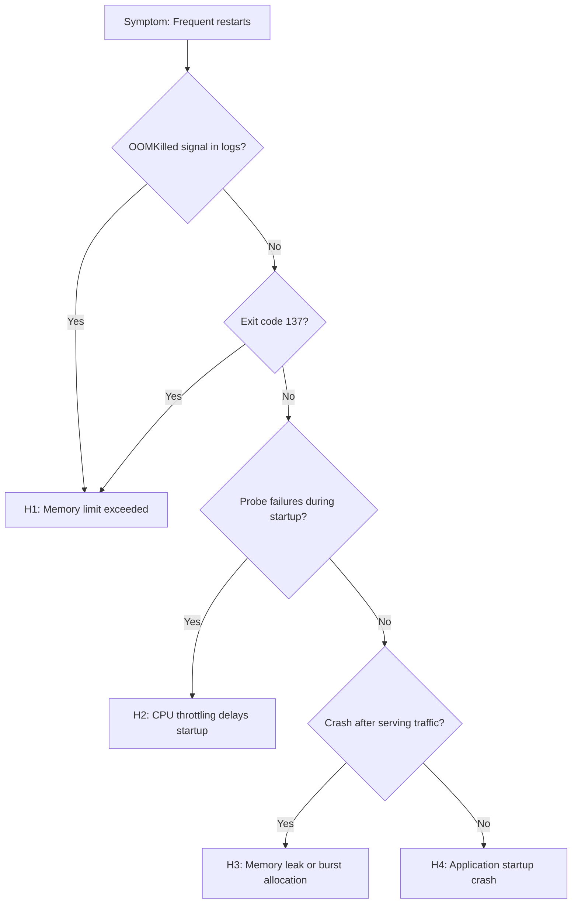

---
hide:
  - toc
content_sources:
  diagrams:
    - id: troubleshooting-decision-flow
      type: flowchart
      source: mslearn-adapted
      based_on:
        - https://learn.microsoft.com/azure/container-apps/health-probes
        - https://learn.microsoft.com/azure/container-apps/containers
        - https://learn.microsoft.com/azure/container-apps/troubleshooting
---

# CrashLoop OOM and Resource Pressure

## 1. Summary

### Symptom

Replicas repeatedly restart with `CrashLoopBackOff`, `OOMKilled`, or `ContainerTerminated` events. Application may briefly serve traffic before crashing, or fail to start at all. Latency spikes and timeouts often precede or accompany crash cycles.

### Why this scenario is confusing

Resource pressure manifests differently depending on the bottleneck (memory vs CPU vs startup time). An application bug can look like a resource limit issue, and vice versa. OOM kills may occur without obvious memory warnings if the spike is sudden.

### Troubleshooting decision flow

<!-- diagram-id: troubleshooting-decision-flow -->


## 2. Common Misreadings

- "Application bug only" — Resource pressure can trigger crashes in correct code.
- "Just raise memory limit" — Unbounded memory growth will still fail; root cause matters.
- "CPU throttling won't crash the app" — Probe timeouts due to CPU starvation cause restarts.
- "OOMKilled always means memory leak" — Can also be legitimate peak usage exceeding limits.
- "Exit code 1 means app bug" — Could be uncaught exception from resource exhaustion.

## 3. Competing Hypotheses

| Hypothesis | Typical Evidence For | Typical Evidence Against |
|---|---|---|
| **H1: Memory limit too low** | OOMKilled signals, exit code 137, abrupt termination | Stable memory profile well below limit |
| **H2: CPU throttling delays startup** | Probe timeout with high CPU contention, slow startup logs | Startup latency unchanged under CPU increase |
| **H3: Memory leak or burst allocation** | Memory grows over time, crashes after serving traffic | Memory stable, crashes during startup |
| **H4: Application startup crash** | Exit code 1, exception stack in logs, crashes before any requests | Crashes only under load, not at startup |

## 4. What to Check First

### Metrics

- Memory working set vs memory limit over time
- CPU usage vs CPU limit (throttling indicator)
- Restart count trend
- Request latency percentiles (P95, P99) before crashes

### Logs

```kusto
let AppName = "ca-myapp";
ContainerAppSystemLogs_CL
| where ContainerAppName_s == AppName
| where TimeGenerated > ago(2h)
| where Reason_s has_any ("OOMKilled", "CrashLoopBackOff", "ContainerTerminated", "BackOff", "Killed")
   or Log_s has_any ("OOM", "killed", "terminated", "exit code", "signal 9", "signal 137")
| project TimeGenerated, RevisionName_s, ReplicaName_s, Reason_s, Log_s
| order by TimeGenerated desc
```

### Platform Signals

```bash
# Check resource allocation
az containerapp show --name "$APP_NAME" --resource-group "$RG" \
  --query "properties.template.containers[0].resources" --output json

# Check probe configuration
az containerapp show --name "$APP_NAME" --resource-group "$RG" \
  --query "properties.template.containers[0].probes" --output json

# Check replica status and restart count
az containerapp replica list --name "$APP_NAME" --resource-group "$RG" --output table
```

## 5. Evidence to Collect

### Required Evidence

| Evidence | Command/Query | Purpose |
|---|---|---|
| Resource limits | `az containerapp show ... --query containers[0].resources` | Verify CPU/memory allocation |
| System logs | KQL for OOM/crash events | Identify crash pattern |
| Console logs | `az containerapp logs show --type console` | Find stack traces, memory errors |
| Restart timeline | KQL with time bins | Correlate crashes with events |
| Probe config | `az containerapp show ... --query probes` | Check timeout/threshold settings |

### Useful Context

- Application memory footprint at idle and under load
- Startup time requirements
- Recent code or dependency changes
- Traffic pattern during incidents

## 6. Validation and Disproof by Hypothesis

### H1: Memory limit too low

**Signals that support:**

- Explicit `OOMKilled` in system logs
- Exit code 137 (128 + SIGKILL signal 9)
- Container terminated abruptly without graceful shutdown logs
- Memory usage approaching limit before termination

**Signals that weaken:**

- Memory usage consistently well below limit
- Graceful shutdown messages in logs
- Exit code 1 with application exception

**What to verify:**

```kusto
// Find OOM signals
let AppName = "ca-myapp";
ContainerAppSystemLogs_CL
| where ContainerAppName_s == AppName
| where TimeGenerated > ago(6h)
| where Log_s has_any ("OOM", "137", "killed", "memory")
| project TimeGenerated, RevisionName_s, Log_s
| order by TimeGenerated desc
```

```bash
# Check current memory limits
az containerapp show --name "$APP_NAME" --resource-group "$RG" \
  --query "properties.template.containers[0].resources.memory" --output tsv

# Typical fix: increase memory
az containerapp update --name "$APP_NAME" --resource-group "$RG" \
  --memory "1.0Gi" --cpu "0.5"
```

### H2: CPU throttling delays startup

**Signals that support:**

- Probe failures during startup phase
- Startup takes longer than probe `initialDelaySeconds`
- CPU limit is very low (e.g., 0.25 cores)
- Logs show slow initialization steps

**Signals that weaken:**

- Startup completes within probe window
- CPU usage well below limit
- Crashes occur after stable running period

**What to verify:**

```bash
# Check probe configuration
az containerapp show --name "$APP_NAME" --resource-group "$RG" \
  --query "properties.template.containers[0].probes" --output json

# Check CPU allocation
az containerapp show --name "$APP_NAME" --resource-group "$RG" \
  --query "properties.template.containers[0].resources.cpu" --output tsv
```

```kusto
// Find probe failures
let AppName = "ca-myapp";
ContainerAppSystemLogs_CL
| where ContainerAppName_s == AppName
| where TimeGenerated > ago(2h)
| where Reason_s == "ProbeFailed" or Log_s has "probe"
| project TimeGenerated, RevisionName_s, Log_s
| order by TimeGenerated desc
```

### H3: Memory leak or burst allocation

**Signals that support:**

- Memory grows steadily over time (saw-tooth pattern)
- Crashes occur after serving traffic for some period
- Restart temporarily fixes the issue
- Specific endpoints or operations correlate with crashes

**Signals that weaken:**

- Memory stable throughout operation
- Crashes during startup before any traffic

**What to verify:**

```kusto
// Correlate crashes with traffic
let AppName = "ca-myapp";
let Crashes = ContainerAppSystemLogs_CL
| where ContainerAppName_s == AppName
| where TimeGenerated > ago(6h)
| where Reason_s has_any ("OOMKilled", "ContainerTerminated")
| project CrashTime=TimeGenerated;
// Cross-reference with request patterns in Application Insights if available
```

```bash
# Check for memory-related app settings
az containerapp show --name "$APP_NAME" --resource-group "$RG" \
  --query "properties.template.containers[0].env[?contains(name, 'MEMORY') || contains(name, 'HEAP')]" \
  --output table
```

### H4: Application startup crash

**Signals that support:**

- Exit code 1 with exception stack trace
- Crashes immediately at startup
- Missing configuration or environment variables
- Dependency connection failures in logs

**Signals that weaken:**

- Successful startup, crashes only under load
- OOMKilled or exit code 137

**What to verify:**

```bash
# Get console logs for stack traces
az containerapp logs show --name "$APP_NAME" --resource-group "$RG" \
  --type console --tail 200
```

```kusto
// Find startup errors
let AppName = "ca-myapp";
ContainerAppConsoleLogs_CL
| where ContainerAppName_s == AppName
| where TimeGenerated > ago(2h)
| where Log_s has_any ("error", "exception", "failed", "traceback", "Error:", "Exception:")
| project TimeGenerated, Log_s
| order by TimeGenerated desc
| take 50
```

## 7. Likely Root Cause Patterns

| Pattern | Frequency | First Signal | Typical Resolution |
|---|---|---|---|
| Memory limit too low | Very common | Exit code 137, OOMKilled | Increase memory allocation |
| Startup too slow for probes | Common | ProbeFailed during startup | Increase initialDelaySeconds or CPU |
| Memory leak in app | Occasional | Crashes after running period | Fix app code, add memory monitoring |
| Missing env vars | Occasional | Exit code 1 at startup | Add required configuration |
| Dependency unavailable | Occasional | Connection errors in console | Fix dependency access |

## 8. Immediate Mitigations

1. **If OOM:** Increase memory limit
   ```bash
   az containerapp update --name "$APP_NAME" --resource-group "$RG" \
     --memory "2.0Gi" --cpu "1.0"
   ```

2. **If probe timeout:** Relax probe settings
   ```bash
   az containerapp update --name "$APP_NAME" --resource-group "$RG" \
     --yaml probe-config.yaml  # With increased initialDelaySeconds
   ```

3. **If startup crash:** Roll back to known good revision
   ```bash
   az containerapp ingress traffic set --name "$APP_NAME" --resource-group "$RG" \
     --revision-weight "<previous-revision>=100"
   ```

4. **If memory leak:** Restart replicas while investigating
   ```bash
   az containerapp revision restart --name "$APP_NAME" --resource-group "$RG" \
     --revision "<current-revision>"
   ```

## 9. Prevention

- Baseline resource profiles in staging before production
- Set resource requests based on observed P95 usage + headroom
- Implement memory monitoring and alerts in Application Insights
- Add startup health endpoints that fail fast on missing dependencies
- Use liveness probes with appropriate failure thresholds
- Apply performance regression checks in CI pipeline

## See Also

- [Container Start Failure](../startup-and-provisioning/container-start-failure.md)
- [Probe Failure and Slow Start](../startup-and-provisioning/probe-failure-and-slow-start.md)
- [HTTP Scaling Not Triggering](http-scaling-not-triggering.md)
- [Replica Crash Signals KQL](../../kql/system-and-revisions/replica-crash-signals.md)
- [Restart Timing Correlation KQL](../../kql/restarts/restart-timing-correlation.md)
- [Repeated Startup Attempts KQL](../../kql/restarts/repeated-startup-attempts.md)

## Sources

- [Set up health probes for a container app](https://learn.microsoft.com/azure/container-apps/health-probes)
- [Manage resource allocation in Azure Container Apps](https://learn.microsoft.com/azure/container-apps/containers)
- [Troubleshoot Azure Container Apps](https://learn.microsoft.com/azure/container-apps/troubleshooting)
