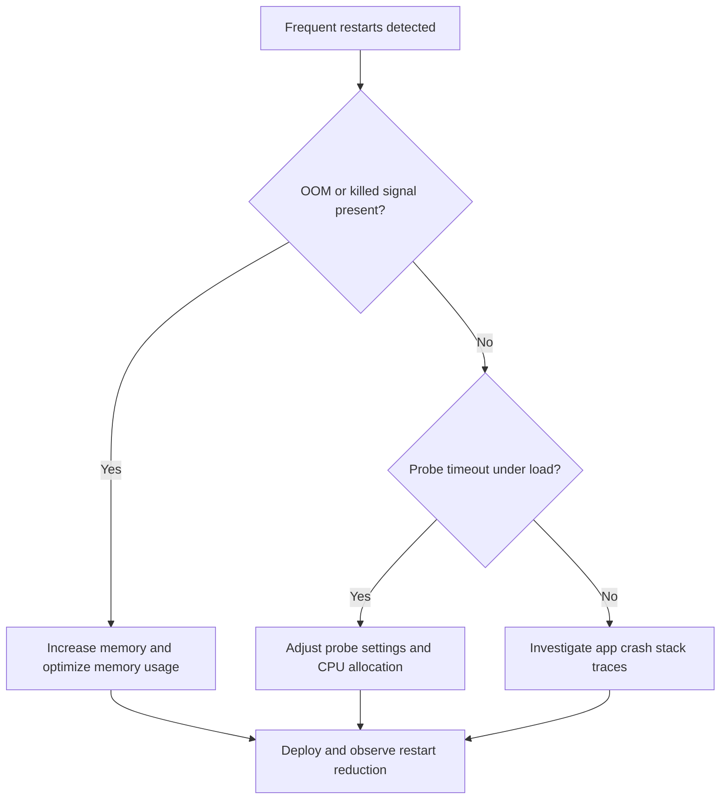

# CrashLoop OOM and Resource Pressure

Use this playbook when replicas repeatedly restart due to memory pressure, CPU starvation, or runtime resource limits.

## Symptoms

- `CrashLoopBackOff` or frequent restart events.
- System logs mention `OOMKilled`, terminated, or killed process.
- Latency and timeout increase during resource contention.

## Common Misreadings

!!! warning "Common Misreadings"
    - Misreading: "Application bug only." Resource pressure can trigger crashes without code defects.
    - Misreading: "Just raise memory limit." Unbounded memory growth or inefficient startup can still fail.

## Competing Hypotheses

| Hypothesis | Evidence For | Evidence Against |
|---|---|---|
| Memory limit too low | OOM kill signals and abrupt process exits | Stable memory profile below limit |
| CPU throttling delays startup | Probe timeout with high CPU contention | Startup latency unchanged under CPU increase |
| Log/trace burst overwhelms process | Crashes during peak logging periods | Crashes unrelated to traffic or logging |

## What to Check First

### Metrics

- Memory working set, CPU usage, restarts, and request latency.

### Logs

```kusto
let AppName = "ca-myapp";
ContainerAppSystemLogs_CL
| where ContainerAppName_s == AppName
| where Log_s has_any ("OOM", "killed", "terminated", "restart", "CrashLoopBackOff")
| project TimeGenerated, RevisionName_s, ReplicaName_s, Log_s
| order by TimeGenerated desc
```

### Platform Signals

```bash
az containerapp show --name "$APP_NAME" --resource-group "$RG" --query "properties.template.containers[0].resources" --output json
az containerapp replica list --name "$APP_NAME" --resource-group "$RG" --output table
```

## Evidence Collection

```bash
az containerapp logs show --name "$APP_NAME" --resource-group "$RG" --type system
az containerapp logs show --name "$APP_NAME" --resource-group "$RG" --type console
az containerapp show --name "$APP_NAME" --resource-group "$RG" --query "properties.template.containers[0].probes" --output json
```

Observed warning signal shape from real lifecycle events:

```text
Reason_s              Type_s    Typical count
--------------------  --------  -------------
ContainerTerminated   Warning   2
```

## Decision Flow



## Resolution Steps

1. Increase CPU/memory limits to match observed peak behavior.
2. Optimize startup and request memory usage.
3. Tune probes to avoid false negatives during CPU contention.
4. Validate restart rate and latency after redeploy.

## Prevention

- Baseline resource profiles before production traffic.
- Alert on restart spikes and memory saturation.
- Apply performance regression checks in CI.

## See Also

- [Container Start Failure](../startup-and-provisioning/container-start-failure.md)
- [Probe Failure and Slow Start](../startup-and-provisioning/probe-failure-and-slow-start.md)
- [Replica Crash Signals KQL](../../kql/system-and-revisions/replica-crash-signals.md)
