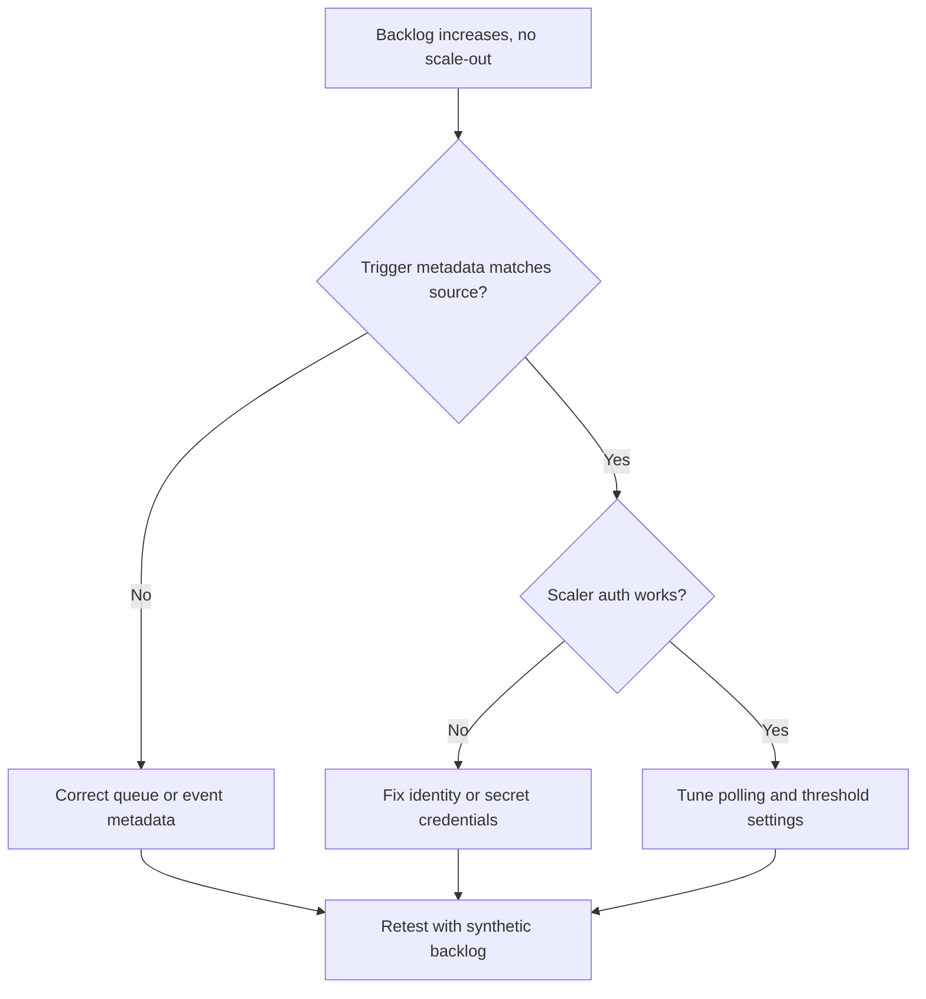

# Event Scaler Mismatch

This playbook addresses cases where queue or event-driven workloads do not scale as expected due to trigger metadata mismatch.

## Symptoms

- Backlog grows while replicas remain low.
- Scale events appear but with wrong trigger metadata or authentication errors.
- Event-driven job runs sporadically despite available messages.

## Common Misreadings

!!! warning "Common Misreadings"
    - Misreading: "No messages are arriving." Backlog can exist while scaler cannot read metric source.
    - Misreading: "Increase max replicas only." Wrong trigger metadata prevents any meaningful scale-out.

## Competing Hypotheses

| Hypothesis | Evidence For | Evidence Against |
|---|---|---|
| Trigger metadata mismatch | Errors mention queue name, consumer group, or subscription | Metadata matches source and works elsewhere |
| Scaler auth failure | Secret/identity errors in scaler logs | Auth successful and metric endpoint reachable |
| Poll interval too slow for burst traffic | Delayed scale-out despite healthy trigger auth | Immediate scaling after each event burst |

## What to Check First

### Metrics

- Backlog depth and consumer lag versus replica count.

### Logs

```kusto
let AppName = "ca-myapp";
ContainerAppSystemLogs_CL
| where ContainerAppName_s == AppName
| where Log_s has_any ("keda", "trigger", "queue", "eventhub", "servicebus", "scale")
| project TimeGenerated, RevisionName_s, Log_s
| order by TimeGenerated desc
```

### Platform Signals

```bash
az containerapp show --name "$APP_NAME" --resource-group "$RG" --query "properties.template.scale.rules" --output json
az containerapp replica list --name "$APP_NAME" --resource-group "$RG" --output table
```

## Evidence Collection

```bash
az containerapp logs show --name "$APP_NAME" --resource-group "$RG" --type system
az containerapp secret list --name "$APP_NAME" --resource-group "$RG"
az containerapp show --name "$APP_NAME" --resource-group "$RG" --query "identity" --output json
```

Observed scaler lifecycle signal when rule initialization succeeds:

```text
Reason_s             Type_s    Typical count
-------------------  --------  -------------
KEDAScalersStarted   Normal    6
```

## Decision Flow



## Resolution Steps

1. Verify scaler metadata (queue/subscription/topic names) exactly.
2. Fix scaler authentication via managed identity or secret reference.
3. Tune trigger thresholds and polling intervals for workload profile.
4. Generate test events and confirm replica reaction time.

## Prevention

- Keep scaler metadata in version-controlled IaC.
- Add synthetic event checks after deploy.
- Maintain runbook per event source with expected lag and thresholds.

## See Also

- [HTTP Scaling Not Triggering](http-scaling-not-triggering.md)
- [Container App Job Execution Failure](../platform-features/container-app-job-execution-failure.md)
- [Scaling Events KQL](../../kql/scaling-and-replicas/scaling-events.md)
