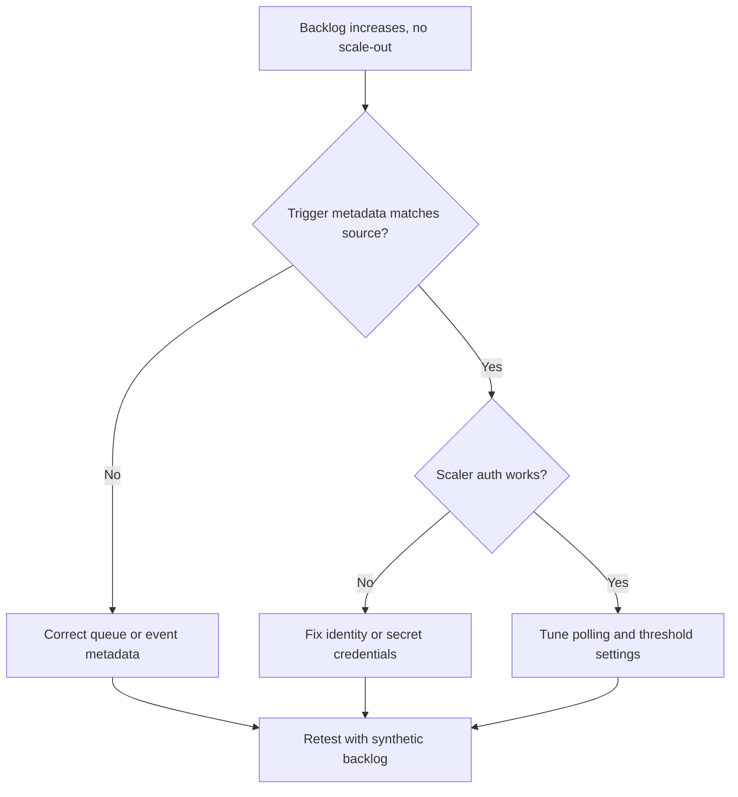

# Event Scaler Mismatch

## 1. Summary

### Symptom

Queue or event-driven workloads do not scale as expected because trigger metadata does not match the event source. Common symptoms include growing backlog while replicas remain low, scale events with wrong trigger metadata or authentication errors, and event-driven jobs that run sporadically despite available messages.

### Why this scenario is confusing

A scaler mismatch can look like low traffic, platform delay, or an insufficient `maxReplicas` setting. In practice, backlog can exist while the scaler cannot read the metric source at all, and increasing max replicas does nothing if the trigger metadata is wrong.

### Troubleshooting decision flow



## 2. Common Misreadings

- "No messages are arriving." Backlog can exist while scaler cannot read metric source.
- "Increase max replicas only." Wrong trigger metadata prevents any meaningful scale-out.

## 3. Competing Hypotheses

| Hypothesis | Typical Evidence For | Typical Evidence Against |
|---|---|---|
| Trigger metadata mismatch | Errors mention queue name, consumer group, or subscription | Metadata matches source and works elsewhere |
| Scaler auth failure | Secret/identity errors in scaler logs | Auth successful and metric endpoint reachable |
| Poll interval too slow for burst traffic | Delayed scale-out despite healthy trigger auth | Immediate scaling after each event burst |

## 4. What to Check First

### Metrics

- Backlog depth and consumer lag versus replica count.

### Logs

```kusto
let AppName = "ca-myapp";
ContainerAppSystemLogs_CL
| where ContainerAppName_s == AppName
| where Log_s has_any ("keda", "trigger", "queue", "eventhub", "servicebus", "scale")
| project TimeGenerated, RevisionName_s, Log_s
| order by TimeGenerated desc
```

### Platform Signals

```bash
az containerapp show --name "$APP_NAME" --resource-group "$RG" --query "properties.template.scale.rules" --output json
az containerapp replica list --name "$APP_NAME" --resource-group "$RG" --output table
```

## 5. Evidence to Collect

### Required Evidence

| Evidence | Command/Query | Purpose |
|---|---|---|
| Scale rule definition | `az containerapp show --name "$APP_NAME" --resource-group "$RG" --query "properties.template.scale.rules" --output json` | Validate trigger metadata |
| Replica state | `az containerapp replica list --name "$APP_NAME" --resource-group "$RG" --output table` | Confirm whether scaling is happening |
| System scaler logs | `az containerapp logs show --name "$APP_NAME" --resource-group "$RG" --type system` | Find KEDA trigger or auth errors |
| Secret inventory | `az containerapp secret list --name "$APP_NAME" --resource-group "$RG"` | Validate secret-backed auth inputs |
| Identity configuration | `az containerapp show --name "$APP_NAME" --resource-group "$RG" --query "identity" --output json` | Verify managed identity for scaler auth |
| KEDA-related platform logs | KQL on `ContainerAppSystemLogs_CL` | Correlate backlog and scaler behavior |

### Useful Context

- Event source type and exact metadata values in use.
- Expected backlog threshold and acceptable reaction time.
- Whether the issue affects a Container App or an event-driven job.

Observed scaler lifecycle signal when rule initialization succeeds:

```text
Reason_s             Type_s    Typical count
-------------------  --------  -------------
KEDAScalersStarted   Normal    6
```

## 6. Validation and Disproof by Hypothesis

### H1: Trigger metadata mismatch

**Signals that support:**

- Errors mention queue name, consumer group, or subscription.
- Backlog grows while scale rules show metadata that does not match the actual source.
- Scale rule initialization never reaches the expected healthy pattern.

**Signals that weaken:**

- Metadata matches source and works elsewhere.
- `KEDAScalersStarted` appears as expected and scaling still does not happen for another reason.

**What to verify:**

```bash
az containerapp show --name "$APP_NAME" --resource-group "$RG" --query "properties.template.scale.rules" --output json
az containerapp logs show --name "$APP_NAME" --resource-group "$RG" --type system
```

```kusto
let AppName = "ca-myapp";
ContainerAppSystemLogs_CL
| where ContainerAppName_s == AppName
| where Log_s has_any ("keda", "trigger", "queue", "eventhub", "servicebus", "scale")
| project TimeGenerated, RevisionName_s, Log_s
| order by TimeGenerated desc
```

**Disproof logic:**

If the scale rule metadata exactly matches the event source and system logs show successful scaler initialization, metadata mismatch is less likely.

### H2: Scaler auth failure

**Signals that support:**

- Secret or identity errors appear in scaler logs.
- Secret-backed auth values are missing or wrong.
- Managed identity is absent or not the one expected for the scaler.

**Signals that weaken:**

- Auth successful and metric endpoint reachable.
- Secret inventory and identity configuration match the expected scaler configuration.

**What to verify:**

```bash
az containerapp logs show --name "$APP_NAME" --resource-group "$RG" --type system
az containerapp secret list --name "$APP_NAME" --resource-group "$RG"
az containerapp show --name "$APP_NAME" --resource-group "$RG" --query "identity" --output json
```

**Disproof logic:**

If system logs do not show auth failures and both secrets and identity are correct, auth is unlikely to be the main blocker.

### H3: Poll interval too slow for burst traffic

**Signals that support:**

- Delayed scale-out despite healthy trigger auth.
- Replica count eventually increases, but too late for the burst profile.
- System logs show healthy scaler behavior without metadata or auth errors.

**Signals that weaken:**

- Immediate scaling after each event burst.
- No scaling at all even when backlog is sustained, which points back to metadata or auth issues.

**What to verify:**

```bash
az containerapp show --name "$APP_NAME" --resource-group "$RG" --query "properties.template.scale.rules" --output json
az containerapp replica list --name "$APP_NAME" --resource-group "$RG" --output table
```

**Disproof logic:**

If scaling reacts immediately during synthetic backlog tests, polling and threshold tuning are not the primary cause.

## 7. Likely Root Cause Patterns

| Pattern | Frequency | First Signal | Typical Resolution |
|---|---|---|---|
| Wrong queue, topic, subscription, or consumer group | Common | Scaler logs mention trigger metadata | Correct scale rule metadata |
| Missing secret or identity for scaler auth | Common | Auth errors in system logs | Fix secret reference or managed identity |
| Threshold and polling tuned for steady traffic, not bursts | Occasional | Delayed scale-out without auth errors | Tune polling and threshold settings |

## 8. Immediate Mitigations

1. Verify scaler metadata (queue/subscription/topic names) exactly.
2. Fix scaler authentication via managed identity or secret reference.
3. Tune trigger thresholds and polling intervals for workload profile.
4. Generate test events and confirm replica reaction time.

## 9. Prevention

- Keep scaler metadata in version-controlled IaC.
- Add synthetic event checks after deploy.
- Maintain runbook per event source with expected lag and thresholds.

## See Also

- [HTTP Scaling Not Triggering](http-scaling-not-triggering.md)
- [Container App Job Execution Failure](../platform-features/container-app-job-execution-failure.md)
- [Scaling Events KQL](../../kql/scaling-and-replicas/scaling-events.md)

## Sources

- [Scale applications in Azure Container Apps](https://learn.microsoft.com/azure/container-apps/scale-app)
- [Set scaling rules in Azure Container Apps](https://learn.microsoft.com/azure/container-apps/scale-app#scale-rules)
- [Jobs in Azure Container Apps](https://learn.microsoft.com/azure/container-apps/jobs)
