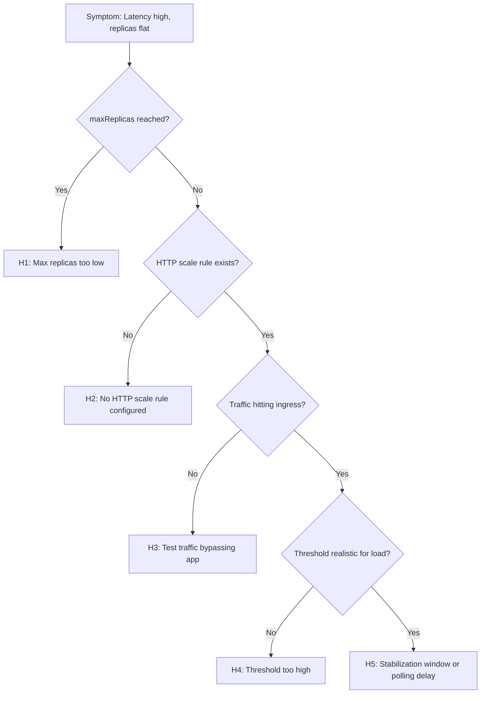

---
content_sources:
  diagrams:
    - id: troubleshooting-decision-flow
      type: flowchart
      source: mslearn-adapted
      based_on:
        - https://learn.microsoft.com/azure/container-apps/scale-app
        - https://learn.microsoft.com/azure/container-apps/troubleshooting
content_validation:
  status: verified
  last_reviewed: "2026-04-12"
  reviewer: ai-agent
  core_claims:
    - claim: "Azure Container Apps can scale based on HTTP traffic, CPU, memory, and custom scale rules."
      source: "https://learn.microsoft.com/azure/container-apps/scale-app"
      verified: true
    - claim: "Scale rules define the conditions under which a container app scales."
      source: "https://learn.microsoft.com/azure/container-apps/scale-app"
      verified: true
---

# HTTP Scaling Not Triggering

## 1. Summary

### Symptom

Request load increases significantly but replica count remains flat or scales too slowly. Users experience high latency while the app appears under-provisioned. Load tests do not produce expected scale-out behavior. KEDA scalers are configured but seem inactive.

### Why this scenario is confusing

HTTP scaling involves multiple components: KEDA metrics server, stabilization windows, threshold calculations, and min/max boundaries. A misconfiguration in any of these can make it look like "scaling is broken" when it's actually working as configured—just not as intended.

### Troubleshooting decision flow

<!-- diagram-id: troubleshooting-decision-flow -->


## 2. Common Misreadings

- "KEDA is broken" — Most incidents are min/max boundaries, threshold mismatches, or test configuration issues.
- "Any traffic should instantly scale out" — HTTP scaling has polling intervals (15-30s) and stabilization windows.
- "Replicas didn't increase, so something is wrong" — If load is below threshold, no scaling is expected behavior.
- "I set concurrentRequests=10, so 100 requests should give me 10 replicas" — It's concurrent requests per replica, not total requests.
- "Scale worked in staging but not production" — Different traffic patterns, DNS, or ingress configurations.

## 3. Competing Hypotheses

| Hypothesis | Typical Evidence For | Typical Evidence Against |
|---|---|---|
| **H1: Max replicas too low** | Replica count capped at configured max during load | Replicas remain well below max |
| **H2: No HTTP scale rule configured** | No scale rules in template, only min/max | HTTP rule exists in configuration |
| **H3: Test traffic bypassing app** | No request logs during load test | App logs show request surge |
| **H4: Threshold too high** | Concurrent requests < threshold × replica count | Traffic exceeds threshold significantly |
| **H5: Stabilization window delay** | Scale-out happens but delayed by 30-60 seconds | Immediate scaling when expected |

## 4. What to Check First

### Metrics

- Request rate and concurrent connections over time
- P95/P99 latency correlation with replica count
- Replica count timeline during load test

### Logs

```kusto
let AppName = "ca-myapp";
ContainerAppSystemLogs_CL
| where ContainerAppName_s == AppName
| where TimeGenerated > ago(1h)
| where Reason_s has_any ("KEDAScaler", "Scaling", "Replica")
   or Log_s has_any ("scale", "keda", "replica", "http")
| project TimeGenerated, RevisionName_s, Reason_s, Log_s
| order by TimeGenerated desc
```

**Example Output**

| TimeGenerated | RevisionName_s | Reason_s | Log_s |
|---|---|---|---|
| 2026-04-12T05:57:38.558Z | ca-cakqltest-54kxmtjeuidri--nu8o2ji | AssigningReplica | Replica has been scheduled to run on a node |
| 2026-04-12T05:57:38.558Z | ca-cakqltest-54kxmtjeuidri--nu8o2ji | KEDAScalersStarted | KEDA is starting a watch for revision 'ca-cakqltest-54kxmtjeuidri--nu8o2ji' to monitor scale operations |

**How to Read This**

- `KEDAScalersStarted` confirms the HTTP scaler is active for revision `ca-cakqltest-54kxmtjeuidri--nu8o2ji`.
- `AssigningReplica` at the same timestamp shows the platform was also placing a replica, so scaling infrastructure was not idle.
- If your output has no KEDA or replica events during load, investigate missing scale rules, wrong target URL, or insufficient traffic.

### Platform Signals

```bash
# Check scale configuration
az containerapp show --name "$APP_NAME" --resource-group "$RG" \
  --query "properties.template.scale" --output json

# Check current replica count
az containerapp replica list --name "$APP_NAME" --resource-group "$RG" --output table

# Check system logs for scaling events
az containerapp logs show --name "$APP_NAME" --resource-group "$RG" --type system
```

## 5. Evidence to Collect

### Required Evidence

| Evidence | Command/Query | Purpose |
|---|---|---|
| Scale config | `az containerapp show ... --query template.scale` | Verify min/max/rules |
| Replica count | `az containerapp replica list` | Current state |
| System logs | KQL for scaling events | KEDA activity |
| Request logs | Console logs during load | Traffic confirmation |
| Ingress metrics | Azure Portal metrics | Request rate |

### Useful Context

- Expected concurrent requests during peak
- Load test tool and configuration
- Target FQDN being tested
- Previous scaling behavior (if any)

## 6. Validation and Disproof by Hypothesis

### H1: Max replicas too low

**Signals that support:**

- Replica count reaches exactly maxReplicas and stays there
- Latency keeps increasing while at max
- System logs show no further scale-out attempts

**Signals that weaken:**

- Replica count stays well below max
- Max is set high (e.g., 30) but only 2 replicas running

**What to verify:**

```bash
# Check min/max configuration
az containerapp show --name "$APP_NAME" --resource-group "$RG" \
  --query "properties.template.scale.{min:minReplicas,max:maxReplicas}" --output json

# Check if currently at max
CURRENT=$(az containerapp replica list --name "$APP_NAME" --resource-group "$RG" --query "length(@)" --output tsv)
MAX=$(az containerapp show --name "$APP_NAME" --resource-group "$RG" --query "properties.template.scale.maxReplicas" --output tsv)
echo "Current: $CURRENT, Max: $MAX"
```

```kusto
// Check replica count over time
let AppName = "ca-myapp";
ContainerAppSystemLogs_CL
| where ContainerAppName_s == AppName
| where TimeGenerated > ago(2h)
| where Reason_s has_any ("AssigningReplica", "TerminatingReplica", "Scaling")
| summarize count() by bin(TimeGenerated, 5m), Reason_s
| render timechart
```

**Example Output**

| TimeGenerated | Reason_s | count_ |
|---|---|---:|
| 2026-04-12T05:55:00Z | AssigningReplica | 1 |

**Interpretation**

- The 5-minute bucket at `2026-04-12T05:55:00Z` contains one `AssigningReplica` event, which is consistent with a single scale-out action.
- If this table flattens while latency rises, the app may be pinned by `maxReplicas` or not receiving enough concurrent load to trigger more replicas.
- A complete absence of replica lifecycle events during the test window weakens the "max replicas too low" hypothesis.

**Fix:**

```bash
# Increase max replicas
az containerapp update --name "$APP_NAME" --resource-group "$RG" \
  --max-replicas 20
```

### H2: No HTTP scale rule configured

**Signals that support:**

- Scale rules array is empty or null
- Only min/max specified without rules
- Scale to zero is disabled but no scale-out rule

**Signals that weaken:**

- HTTP rule present in configuration
- KEDAScalersStarted events in system logs

**What to verify:**

```bash
# Check if HTTP scale rule exists
az containerapp show --name "$APP_NAME" --resource-group "$RG" \
  --query "properties.template.scale.rules" --output json

# Expected output for HTTP rule:
# [
#   {
#     "name": "http-rule",
#     "http": {
#       "metadata": {
#         "concurrentRequests": "10"
#       }
#     }
#   }
# ]
```

```kusto
// Check for KEDA scaler activity
let AppName = "ca-myapp";
ContainerAppSystemLogs_CL
| where ContainerAppName_s == AppName
| where TimeGenerated > ago(1h)
| where Reason_s == "KEDAScalersStarted"
| project TimeGenerated, Log_s
```

**Example Output**

| TimeGenerated | Log_s |
|---|---|
| 2026-04-12T05:57:38.558Z | KEDA is starting a watch for revision 'ca-cakqltest-54kxmtjeuidri--nu8o2ji' to monitor scale operations |

**How to Read This**

- This event is strong evidence that Azure Container Apps started the KEDA watcher for the active revision.
- If you see this event, "no HTTP scale rule configured" becomes less likely and you should inspect threshold math or request routing next.
- If you do not see any `KEDAScalersStarted` rows after a deployment, verify that the scale rules array includes an HTTP rule.

**Fix:**

```bash
# Add HTTP scale rule
az containerapp update --name "$APP_NAME" --resource-group "$RG" \
  --scale-rule-name "http-rule" \
  --scale-rule-type "http" \
  --scale-rule-http-concurrency 10

# Or with full scale configuration
az containerapp update --name "$APP_NAME" --resource-group "$RG" \
  --min-replicas 1 \
  --max-replicas 10 \
  --scale-rule-name "http-rule" \
  --scale-rule-type "http" \
  --scale-rule-http-concurrency 10
```

### H3: Test traffic bypassing app

**Signals that support:**

- Load test shows requests sent, but no app logs
- Testing wrong URL (e.g., old revision, wrong environment)
- DNS not resolving to correct environment

**Signals that weaken:**

- App logs show request surge matching test
- Latency increases correlate with test timing

**What to verify:**

```bash
# Get correct FQDN
APP_FQDN=$(az containerapp show --name "$APP_NAME" --resource-group "$RG" \
  --query "properties.configuration.ingress.fqdn" --output tsv)
echo "Correct FQDN: $APP_FQDN"

# Test connectivity
curl -s -o /dev/null -w "%{http_code}" "https://${APP_FQDN}/health"

# Check DNS resolution
nslookup "$APP_FQDN"
```

```kusto
// Check if requests are hitting the app
let AppName = "ca-myapp";
ContainerAppConsoleLogs_CL
| where ContainerAppName_s == AppName
| where TimeGenerated > ago(30m)
| where Log_s has_any ("GET", "POST", "request", "200", "404")
| summarize RequestCount=count() by bin(TimeGenerated, 1m)
| render timechart
```

**Example Output**

| TimeGenerated | RequestCount |
|---|---:|
| 2026-04-12T05:59:00Z | 1 |

**How to Read This**

- This 1-minute bucket lines up with the observed console log `GET /api/exceptions/test-error HTTP/1.1 500 173`, proving traffic reached the container.
- When request buckets rise during the load test but replicas stay flat, focus on thresholds, min/max settings, or stabilization timing.
- If no rows appear at all, the test may be targeting the wrong FQDN, path, revision, or network entry point.

**Fix:**

- Verify load test targets correct FQDN
- Check if ingress is external (for internet tests) or internal (for VNet tests)
- Ensure revision receiving traffic is the one with scale rules

### H4: Threshold too high

**Signals that support:**

- concurrentRequests set very high (e.g., 100) but traffic is lower
- Replica count stays at min even under load
- Math doesn't work out: 50 concurrent / 100 threshold = 0.5 replicas (rounds to min)

**Signals that weaken:**

- Threshold is low (e.g., 10) and traffic exceeds it significantly
- Scale-out does happen, just slowly

**What to verify:**

```bash
# Check configured threshold
az containerapp show --name "$APP_NAME" --resource-group "$RG" \
  --query "properties.template.scale.rules[?http].http.metadata.concurrentRequests" --output tsv

# Calculate expected replicas
# Formula: ceil(concurrent_requests / threshold)
# Example: 75 concurrent / 10 threshold = 8 replicas needed
```

**Fix:**

```bash
# Lower the threshold for more aggressive scaling
az containerapp update --name "$APP_NAME" --resource-group "$RG" \
  --scale-rule-name "http-rule" \
  --scale-rule-type "http" \
  --scale-rule-http-concurrency 5  # Lower = more aggressive scaling
```

### H5: Stabilization window delay

**Signals that support:**

- Scale-out happens but takes 30-60+ seconds
- KEDA metrics visible but replica changes lag
- Bursty traffic triggers scaling late

**Signals that weaken:**

- No scaling even after extended load period
- Scale events don't appear at all

**What to verify:**

```kusto
// Check timing between load and scale events
let AppName = "ca-myapp";
ContainerAppSystemLogs_CL
| where ContainerAppName_s == AppName
| where TimeGenerated > ago(1h)
| where Reason_s has_any ("KEDAScaler", "AssigningReplica", "Scaling")
| project TimeGenerated, Reason_s, Log_s
| order by TimeGenerated asc
```

**Example Output**

| TimeGenerated | Reason_s | Log_s |
|---|---|---|
| 2026-04-12T05:57:38.558Z | AssigningReplica | Replica has been scheduled to run on a node |

**Interpretation**

- This row shows a replica assignment event for revision `ca-cakqltest-54kxmtjeuidri--nu8o2ji` at `2026-04-12T05:57:38.558Z`.
- If your load-test timestamps are earlier than this row, the gap represents expected polling and stabilization delay rather than a total scaling failure.
- If this query never shows replica events during sustained load, investigate threshold configuration or whether the traffic spike was too short-lived.

**Explanation:**

KEDA has built-in stabilization to prevent thrashing:
- **Polling interval**: Metrics checked every 15-30 seconds
- **Scale-up stabilization**: Wait for metrics to stay above threshold
- **Scale-down stabilization**: Longer wait (5+ minutes) before reducing replicas

This is expected behavior, not a bug.

## 7. Likely Root Cause Patterns

| Pattern | Frequency | First Signal | Typical Resolution |
|---|---|---|---|
| Threshold too high | Very common | Replicas stay at min | Lower concurrentRequests |
| Max replicas too low | Common | Capped at max during load | Increase maxReplicas |
| No scale rule | Common | Empty rules array | Add HTTP scale rule |
| Wrong target URL | Occasional | No app logs during test | Fix load test target |
| Stabilization delay | Expected | Delayed but eventual scale | Not a bug; optimize threshold |

## 8. Immediate Mitigations

1. **Quick scale out (manual):**
   ```bash
   az containerapp update --name "$APP_NAME" --resource-group "$RG" \
     --min-replicas 5  # Force minimum higher
   ```

2. **Lower threshold for faster response:**
   ```bash
   az containerapp update --name "$APP_NAME" --resource-group "$RG" \
     --scale-rule-name "http-rule" \
     --scale-rule-type "http" \
     --scale-rule-http-concurrency 5
   ```

3. **Increase max if capped:**
   ```bash
   az containerapp update --name "$APP_NAME" --resource-group "$RG" \
     --max-replicas 30
   ```

4. **Add HTTP rule if missing:**
   ```bash
   az containerapp update --name "$APP_NAME" --resource-group "$RG" \
     --scale-rule-name "http-rule" \
     --scale-rule-type "http" \
     --scale-rule-http-concurrency 10
   ```

## 9. Prevention

- Keep baseline load profiles and target thresholds documented per service
- Set up alerts on latency increase without replica growth
- Review scale settings during release readiness
- Load test in staging with realistic traffic patterns before production
- Monitor replica count alongside latency in dashboards

## HTTP Scaling Calculation Reference

```
Desired Replicas = ceil(Current Concurrent Requests / concurrentRequests threshold)

Example:
- concurrentRequests: 10
- Current load: 75 concurrent requests
- Desired replicas: ceil(75/10) = 8

Actual replicas = max(minReplicas, min(Desired, maxReplicas))
```

| Concurrent Requests | Threshold | Desired Replicas |
|--------------------:|----------:|-----------------:|
| 10 | 10 | 1 |
| 25 | 10 | 3 |
| 100 | 10 | 10 |
| 100 | 50 | 2 |
| 100 | 100 | 1 |

## See Also

- [Event Scaler Mismatch](event-scaler-mismatch.md)
- [CrashLoop OOM and Resource Pressure](crashloop-oom-and-resource-pressure.md)
- [Ingress Not Reachable](../ingress-and-networking/ingress-not-reachable.md)
- [Scaling Events KQL](../../kql/scaling-and-replicas/scaling-events.md)
- [Replica Count Over Time KQL](../../kql/scaling-and-replicas/replica-count-over-time.md)
- [Scale Rule Mismatch Lab](../../lab-guides/scale-rule-mismatch.md)

## Sources

- [Set scaling rules in Azure Container Apps](https://learn.microsoft.com/azure/container-apps/scale-app)
- [KEDA HTTP Add-on](https://keda.sh/docs/latest/scalers/http/)
- [Troubleshoot Azure Container Apps](https://learn.microsoft.com/azure/container-apps/troubleshooting)
