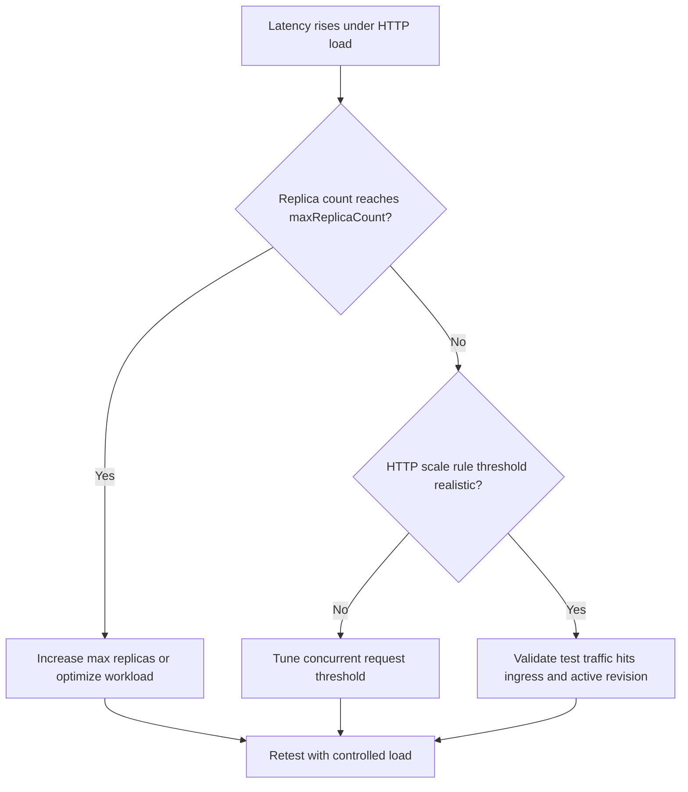

# HTTP Scaling Not Triggering

Use this playbook when request load increases but replica count remains flat or scales too late.

## Symptoms

- High request latency while replicas stay near minimum.
- CPU is moderate but queueing grows at ingress.
- Load tests do not produce expected scale-out.

## Common Misreadings

!!! warning "Common Misreadings"
    - Misreading: "KEDA is broken." Most incidents are min/max boundaries or test traffic patterns.
    - Misreading: "Any traffic should instantly scale out." HTTP scaling has polling and stabilization windows.

## Competing Hypotheses

| Hypothesis | Evidence For | Evidence Against |
|---|---|---|
| Max replicas too low | Replica count capped at configured max | Replicas remain low despite high max |
| HTTP scale rule threshold too high | Sustained latency with low concurrent trigger rate | Threshold aligned with measured load |
| Load test bypasses ingress path | No request logs at app while test runs | App logs show request surge |

## What to Check First

### Metrics

- Request rate, latency percentile, and replica count timeline.

### Logs

```kusto
let AppName = "my-container-app";
ContainerAppSystemLogs_CL
| where ContainerAppName_s == AppName
| where Log_s has_any ("scale", "http", "replica")
| project TimeGenerated, RevisionName_s, Log_s
| order by TimeGenerated desc
```

### Platform Signals

```bash
az containerapp show --name "$APP_NAME" --resource-group "$RG" --query "properties.template.scale" --output json
az containerapp replica list --name "$APP_NAME" --resource-group "$RG" --output table
```

## Evidence Collection

```bash
az containerapp show --name "$APP_NAME" --resource-group "$RG" --query "properties.template.scale.rules" --output json
az containerapp logs show --name "$APP_NAME" --resource-group "$RG" --type system
az containerapp logs show --name "$APP_NAME" --resource-group "$RG" --type console
```

## Decision Flow



## Resolution Steps

1. Confirm HTTP scale rule exists and is attached to the active revision template.
2. Tune min/max replica bounds and concurrent request threshold.
3. Ensure load test targets correct FQDN and path.
4. Re-run load test and compare replica timeline with latency.

## Prevention

- Keep baseline load profiles and target thresholds per service.
- Alert on latency increase without replica growth.
- Review scale settings during release readiness.

## See Also

- [Event Scaler Mismatch](event-scaler-mismatch.md)
- [Ingress Not Reachable](../ingress-and-networking/ingress-not-reachable.md)
- [Scaling Events KQL](../../kql/scaling-and-replicas/scaling-events.md)
