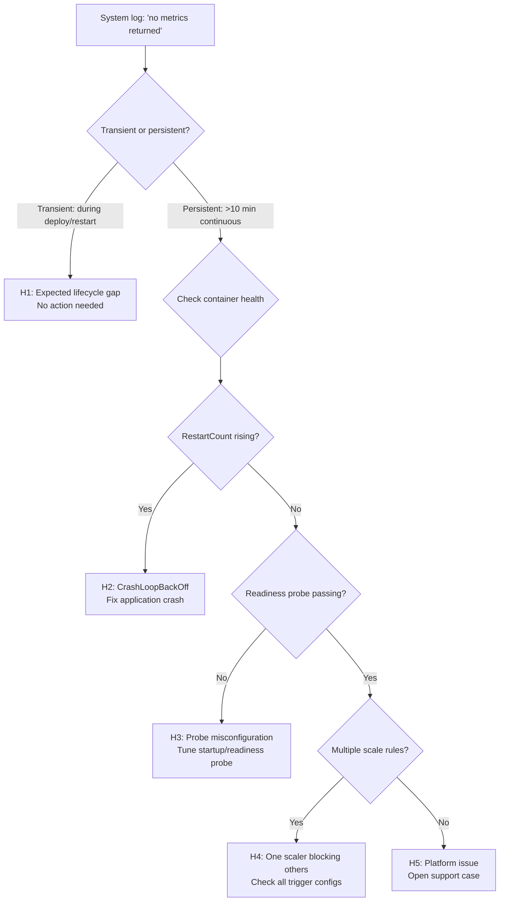

---
content_sources:
  diagrams:
  - id: troubleshooting-decision-flow
    type: flowchart
    source: self-generated
    justification: Synthesizes the KEDA/HPA metric collection lifecycle and
      the conditions under which the Kubernetes Metrics Server returns no data,
      based on Kubernetes HPA docs and KEDA troubleshooting references.
    based_on:
    - https://kubernetes.io/docs/tasks/run-application/horizontal-pod-autoscale/#algorithm-details
    - https://keda.sh/docs/latest/scalers/memory/
    - https://signoz.io/guides/kubernetes-hpa-unable-to-get-metrics-for-resource-memory-no-metrics-returned-from-resource-metrics-api/
content_validation:
  status: verified
  last_reviewed: '2026-06-05'
  reviewer: ai-agent
  core_claims:
  - claim: KEDA CPU/Memory scalers rely on the Kubernetes Resource Metrics API
      (metrics-server) to collect per-container utilization data.
    source: https://keda.sh/docs/latest/scalers/memory/
    verified: true
  - claim: The Kubernetes Metrics Server cannot return data for pods that are
      not yet in Ready state, causing "no metrics returned" errors in the HPA.
    source: https://github.com/kubernetes/kubernetes/issues/127169
    verified: true
  - claim: The KEDA memory scaler metadata field 'type' was deprecated in
      v2.7 in favor of trigger-level 'metricType' and removed in v2.18.
    source: https://github.com/kedacore/keda/discussions/6348
    verified: true
---
# KEDA "No Metrics Returned from Resource Metrics API"

## 1. Summary

### Symptom

Container Apps system logs (`ContainerAppSystemLogs_CL`) show one or more
of these messages:

```text
failed to get memory usage: unable to get metrics for resource memory: no metrics returned from resource metrics API
invalid metrics (1 invalid out of 5), first error is: failed to get <app> container metric value: failed to get cpu usage: unable to get metrics for resource cpu: no metrics returned from resource metrics API
scaler memory info: The 'type' setting is DEPRECATED and will be removed in v2.18 - Use 'metricType' instead.
```

!!! tip "TL;DR"
    The first two messages are **transient** and occur when the Kubernetes
    Metrics Server has no data for a container — typically during startup,
    restart, or deployment. They do not indicate a broken scaler. The third
    message is a **configuration deprecation warning** unrelated to
    runtime health.

### Why these messages appear

KEDA's CPU and memory scalers delegate to the standard Kubernetes HPA,
which queries the **Resource Metrics API** (backed by the metrics-server
or kubelet summary API) for per-container utilization. The Metrics Server
can only return data for containers that:

1. Are **Running** and **Ready** (passed readiness probe).
2. Have been running long enough for the kubelet to collect at least one
   metrics sample (typically ~60 seconds after container start).

When either condition is not met, the Metrics API returns an empty
response, and the HPA controller logs:

```
unable to get metrics for resource <cpu|memory>: no metrics returned from resource metrics API
```

If the ScaledObject has **multiple triggers** and only some fail, the HPA
reports `invalid metrics (N invalid out of M)`.

### Troubleshooting decision flow

<!-- diagram-id: troubleshooting-decision-flow -->


## 2. Common Scenarios

| Scenario | Duration | Impact on scaling | Action required |
|---|---|---|---|
| **New revision deployment** | 30-60s per replica (lab-validated: healthy container showed ~60s gap) | None — transient | No |
| **Scale-from-zero cold start** | 60-180s | First scaling decision delayed | Set `minReplicas >= 1` if latency-sensitive |
| **Container crash/restart** | Repeats each cycle | Scaling decisions skip affected replica | Fix the crash |
| **OOMKill** | Brief per kill | Similar to crash | Right-size memory or fix leak |
| **Platform node maintenance** | 30-120s | Transparent if multiple replicas | No |
| **Readiness probe too aggressive** | Persistent if probe keeps failing | Replica stays Not Ready, never reports metrics | Tune probe timing |

## 3. Competing Hypotheses

| Hypothesis | Evidence For | Evidence Against |
|---|---|---|
| **H1: Expected lifecycle gap** | Logs appear only during deploy/restart windows; `RestartCount` is stable; scaling works normally otherwise | Logs persist beyond 10 minutes with no deploy activity |
| **H2: CrashLoopBackOff** | `RestartCount` metric rises steadily; console logs show application errors or exit codes | `RestartCount` is flat; container runs stably |
| **H3: Probe misconfiguration** | Replica stays in Not Ready state; `FailedHealthProbe` events in system logs | Probes pass; replica becomes Ready within expected time |
| **H4: One scaler blocking others** | `invalid metrics (N invalid out of M)` where N < M; only specific trigger fails | All metrics fail equally |
| **H5: Platform issue** | Logs persist with healthy container, correct probes, single trigger | Any of the above explains it |

## 4. What to Check First

### System logs query (KQL)

```bash
WORKSPACE_ID="<log-analytics-workspace-resource-id>"

az monitor log-analytics query \
  --workspace "$WORKSPACE_ID" \
  --analytics-query "
    ContainerAppSystemLogs_CL
    | where ContainerAppName_s == '<app-name>'
    | where Log_s has_any ('no metrics returned', 'invalid metrics', 'failed to get')
    | project TimeGenerated, Log_s
    | order by TimeGenerated desc
    | take 30
  " \
  --output table
```

### Restart count correlation

```bash
APP_ID="$(az containerapp show --name '<app-name>' --resource-group '<rg>' --query id --output tsv)"

az monitor metrics list \
  --resource "$APP_ID" --metric "RestartCount" \
  --aggregation Total --interval PT5M --offset PT1H \
  --output table
```

If restart timestamps align with "no metrics" log timestamps, the cause
is container lifecycle, not a scaler defect.

### Console logs for crash evidence

```bash
az containerapp logs show \
  --name "<app-name>" --resource-group "<rg>" \
  --type console --follow false --tail 30
```

Look for stack traces, `exit(1)`, or OOMKilled messages.

### DEPRECATED warning

The `type` metadata field warning:

```text
scaler memory info: The 'type' setting is DEPRECATED and will be removed in v2.18 - Use 'metricType' instead.
```

This appears because the scale rule uses `--scale-rule-metadata "type=Utilization"`.
KEDA v2.7+ deprecated `metadata.type` in favor of the trigger-level `metricType`
field. The `type` field was removed in KEDA v2.18.

In Azure Container Apps, the KEDA version is managed by the platform. Whether
`metricType` is exposed depends on the Container Apps API version.
**This warning is cosmetic and does not affect scaling behavior** on current
platform versions.

## 5. Resolution

| Hypothesis | Action |
|---|---|
| **H1** | No action. These are expected transient logs during container lifecycle transitions. |
| **H2** | Fix the application crash. Check console logs for the root cause. Once the container runs stably, the metric errors will stop. |
| **H3** | Adjust `startupProbe` and `readinessProbe` timings to match the actual container startup duration. Increase `initialDelaySeconds` or `failureThreshold` if the container needs more time. |
| **H4** | Review all scale rule triggers. An unreachable external scaler or misconfigured trigger can cause `invalid metrics` for other scalers in the same ScaledObject. |
| **H5** | Open a support case with timestamps, the scale rule definition, and relevant `ContainerAppSystemLogs_CL` excerpts. |

## 6. Prevention

- Set `minReplicas >= 1` for latency-sensitive workloads to avoid
  cold-start metrics gaps from scale-to-zero.
- Configure `startupProbe` with appropriate `initialDelaySeconds` and
  `failureThreshold` so the container has time to initialize before
  being marked unhealthy.
- Fix application crashes that cause CrashLoopBackOff — each restart
  creates a new metrics gap window.
- These logs **cannot be suppressed or filtered** — they are internal
  KEDA/HPA controller logs emitted by the platform.

## See Also

- Lab guide: [KEDA No Metrics Returned Lab](../../lab-guides/keda-no-metrics-returned.md)
- Playbook: [Memory Scale Rule Not Triggering Despite High Memory Percentage](./memory-percentage-vs-keda-utilization.md)
- Playbook: [HTTP Scaling Not Triggering](./http-scaling-not-triggering.md)
- Platform: [CPU and Memory Scaler](../../../platform/scaling/cpu-memory-scaler.md)

## Sources

- [Set scaling rules - Azure Container Apps](https://learn.microsoft.com/azure/container-apps/scale-app)
- [KEDA memory scaler](https://keda.sh/docs/latest/scalers/memory/)
- [Horizontal Pod Autoscaler algorithm details - Kubernetes](https://kubernetes.io/docs/tasks/run-application/horizontal-pod-autoscale/#algorithm-details)
- [HPA with container metrics fails when pod is not ready - kubernetes#127169](https://github.com/kubernetes/kubernetes/issues/127169)
- [Deprecating parameter 'type' in CPU/Memory scaler - kedacore/keda#6348](https://github.com/kedacore/keda/discussions/6348)
- [Troubleshooting HPA metric retrieval - SigNoz](https://signoz.io/guides/kubernetes-hpa-unable-to-get-metrics-for-resource-memory-no-metrics-returned-from-resource-metrics-api/)
