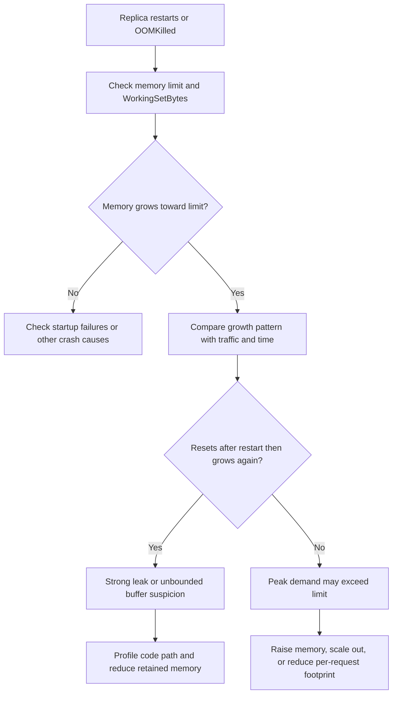

---
content_sources:
  - type: mslearn-adapted
    url: https://learn.microsoft.com/en-us/azure/container-apps/troubleshoot-container-start-failures
diagrams:
  - id: memory-leak-oomkilled-decision-flow
    type: flowchart
    source: mslearn-adapted
    based_on:
      - https://learn.microsoft.com/en-us/azure/container-apps/troubleshoot-container-start-failures
      - https://learn.microsoft.com/en-us/azure/container-apps/containers
      - https://learn.microsoft.com/en-us/azure/container-apps/metrics
      - https://learn.microsoft.com/en-us/azure/reliability/reliability-container-apps
content_validation:
  status: pending_review
  last_reviewed: 2026-04-29
  reviewer: agent
  core_claims:
    - claim: "Azure Container Apps can terminate a container that exceeds its memory limit."
      source: https://learn.microsoft.com/en-us/azure/container-apps/troubleshoot-container-start-failures
      verified: false
    - claim: "Azure Monitor exposes memory-related metrics for Azure Container Apps."
      source: https://learn.microsoft.com/en-us/azure/container-apps/metrics
      verified: false
---

# Memory Leak OOMKilled

Use this playbook when replicas restart with `OOMKilled`, exit code `137`, or repeated memory-pressure symptoms that briefly improve after a restart and then return.

## Symptom

- Replicas restart repeatedly after serving traffic for a period of time.
- System logs or revision events contain `OOMKilled`, `Killed`, or abrupt termination signals.
- Working set memory climbs until it approaches the configured limit.
- Increasing traffic or long-lived sessions accelerates the restart pattern.

## Possible Causes

- Application memory leak in caches, queues, or retained objects.
- Legitimate peak memory demand that exceeds the replica limit.
- Memory-heavy startup or background jobs sharing the same replica budget.
- Missing backpressure, causing unbounded in-memory buffering.
- Too few replicas, forcing each replica to hold too much state.

## Diagnosis Steps

<!-- diagram-id: memory-leak-oomkilled-decision-flow -->


1. Confirm the configured memory limit and the latest replica restart pattern.

    ```bash
    az containerapp show \
        --name "$APP_NAME" \
        --resource-group "$RG" \
        --query "properties.template.containers[0].resources" \
        --output json

    az containerapp replica list \
        --name "$APP_NAME" \
        --resource-group "$RG" \
        --output table
    ```

2. Pull memory metrics for the incident window.

    ```bash
    az monitor metrics list \
        --resource "/subscriptions/<subscription-id>/resourceGroups/$RG/providers/Microsoft.App/containerApps/$APP_NAME" \
        --metric WorkingSetBytes \
        --aggregation Average \
        --timespan PT1H
    ```

3. Collect system and console logs to distinguish hard OOM from application exceptions.

    ```kusto
    let AppName = "ca-myapp";
    ContainerAppSystemLogs_CL
    | where ContainerAppName_s == AppName
    | where TimeGenerated > ago(6h)
    | where Reason_s has_any ("OOMKilled", "ContainerTerminated", "BackOff")
       or Log_s has_any ("OOM", "137", "Killed", "memory")
    | project TimeGenerated, RevisionName_s, ReplicaName_s, Reason_s, Log_s
    | order by TimeGenerated desc
    ```

    ```bash
    az containerapp logs show \
        --name "$APP_NAME" \
        --resource-group "$RG" \
        --type console \
        --tail 200
    ```

4. Verify whether scale configuration forces too much work into each replica.

    ```bash
    az containerapp show \
        --name "$APP_NAME" \
        --resource-group "$RG" \
        --query "properties.template.scale" \
        --output json
    ```

| Command or Query | Why it is used |
|---|---|
| `az containerapp show --query resources` | Verifies the enforced memory ceiling per replica. |
| `az containerapp replica list` | Shows restart churn and replica health at the platform level. |
| `az monitor metrics list --metric WorkingSetBytes ...` | Confirms whether memory climbs toward the limit over time. |
| KQL for `OOMKilled` and console logs | Separates hard memory pressure from normal app exceptions. |

## Resolution

1. Fix the leak or unbounded in-memory behavior in the application first.
2. Increase memory only as a mitigation or to buy investigation time.

    ```bash
    az containerapp update \
        --name "$APP_NAME" \
        --resource-group "$RG" \
        --memory 2.0Gi \
        --cpu 1.0
    ```

3. Scale out earlier so each replica handles less concurrent state.
4. Add or tune readiness and liveness probes so restart behavior is easier to interpret.
5. Capture heap dumps, profiles, or allocation traces in a non-production reproduction environment.

## Prevention

- Track memory growth over long test runs, not only short smoke tests.
- Avoid unbounded caches, queues, and per-request object retention.
- Set alerts on rising `WorkingSetBytes` plus restart count.
- Load-test with realistic payload sizes and concurrency.
- Keep memory budgets documented per revision and revisit them after dependency changes.

## See Also

- [CrashLoop OOM and Resource Pressure](crashloop-oom-and-resource-pressure.md)
- [CPU Throttling](cpu-throttling.md)
- [Replica Load Imbalance](replica-load-imbalance.md)

## Sources

- [Troubleshoot container start failures in Azure Container Apps](https://learn.microsoft.com/en-us/azure/container-apps/troubleshoot-container-start-failures)
- [Containers in Azure Container Apps](https://learn.microsoft.com/en-us/azure/container-apps/containers)
- [Metrics in Azure Container Apps](https://learn.microsoft.com/en-us/azure/container-apps/metrics)
- [Reliability in Azure Container Apps](https://learn.microsoft.com/en-us/azure/reliability/reliability-container-apps)
