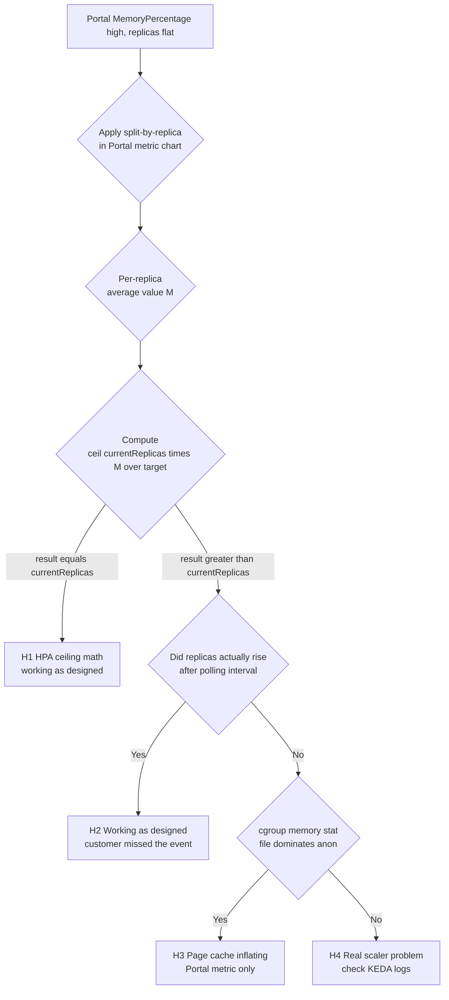

---
content_sources:
  diagrams:
  - id: troubleshooting-decision-flow
    type: flowchart
    source: self-generated
    justification: Synthesizes the HPA ceiling math and metric-source-mismatch
      diagnostic flow described in the Azure Container Apps scaling docs and
      the Kubernetes HPA algorithm reference.
    based_on:
    - https://learn.microsoft.com/azure/container-apps/scale-app
    - https://learn.microsoft.com/azure/container-apps/memory-scale-rule
    - https://kubernetes.io/docs/tasks/run-application/horizontal-pod-autoscale/#algorithm-details
content_validation:
  status: verified
  last_reviewed: '2026-06-02'
  reviewer: ai-agent
  core_claims:
  - claim: Azure Container Apps memory scale rules use the standard Kubernetes
      HPA algorithm `desiredReplicas = ceil(currentReplicas * currentMetric / targetMetric)`.
    source: https://kubernetes.io/docs/tasks/run-application/horizontal-pod-autoscale/#algorithm-details
    verified: true
  - claim: Azure Container Apps memory scale rules use KEDA's memory scaler, which
      reads container memory usage from the Kubernetes metrics API rather than
      from Azure Monitor.
    source: https://learn.microsoft.com/azure/container-apps/memory-scale-rule
    verified: true
  - claim: The Azure Monitor `Memory Percentage (Preview)` metric reports working
      set as a percentage of the memory limit and may include page cache.
    source: https://learn.microsoft.com/azure/container-apps/metrics
    verified: true
  - claim: The KEDA memory scaler evaluates `Utilization` as a percentage of the
      container's requested memory, using the Kubernetes resource-memory metric.
    source: https://keda.sh/docs/latest/scalers/memory/
    verified: true
---
# Memory Scale Rule Not Triggering Despite High Memory Percentage

## 1. Summary

### Symptom

The Azure Portal metric chart for a Container Apps revision shows
`Memory Percentage (Preview)` sustaining 60-70% for tens of minutes, while a
memory scale rule configured with `Utilization=50` does not increase
replicas above `minReplicas`. The customer concludes "the memory scale rule
is broken".

!!! tip "TL;DR"
    The Portal `Memory Percentage (Preview)` chart answers *"How close
    am I to the per-replica memory ceiling?"*, not *"What exact value
    did KEDA use to decide whether to scale?"*. Those are two different
    metrics from two different pipelines. Use the Portal value for OOM
    risk; use per-replica splitting plus the HPA `ceil` formula to
    reason about scaling.

### Why this scenario is confusing

There are **two independent contributors** to the same surface symptom, and
they are easy to confuse:

1. **HPA ceiling math.** KEDA uses the standard Kubernetes HPA formula
   `desiredReplicas = ceil(currentReplicas * currentMetric / targetMetric)`.
   With `currentReplicas = 2` and `targetMetric = 50`, the formula returns
   `2` for any per-replica metric value at or below `50` and only rounds
   up to `3` once the per-replica value strictly exceeds `50`. A 70%
   Portal reading does not by itself say what KEDA sees per replica.
2. **Metric source mismatch.** Portal `Memory Percentage (Preview)` comes
   from Azure Monitor and is reported as a percentage of the container
   memory limit; it reflects the cgroup working set, which can include
   reclaimable page cache. KEDA's memory scaler instead reads container
   memory from the Kubernetes Metrics Server and evaluates `Utilization`
   as a percentage of the container's requested memory. For cache-heavy
   workloads these two values can diverge by tens of percentage points.

The Portal chart is intended for OOM-risk situational awareness, not as a
ground-truth view of what KEDA evaluates.

### What to look at for which question

| Question you are answering | Trust this signal | Why |
|---|---|---|
| "Am I close to the memory ceiling / OOM risk?" | Portal `MemoryPercentage` (Avg/Max) at the revision level | Defined as percentage of the container memory limit; cache inclusion is intentional for OOM proximity. |
| "Why did (or didn't) the memory scale rule fire?" | Portal `MemoryPercentage` **split by Replica** + HPA `ceil` math + `memory.stat` on a live replica | KEDA decides per-replica against `Utilization`; the unsplit average and the Portal numerator are not the scaler input. |
| "How much memory do my replicas actually consume for capacity planning?" | `WorkingSetBytes` per replica trend, alongside the configured memory size | Bytes are unambiguous and independent of which percentage formula a tool uses. |
| "What did the scaler decide, and when?" | Activity Log + `ContainerAppSystemLogs_CL` (when present), reconciled against the `Replicas` metric timeline | Portal Metrics shows replica outcomes and raw resource counters; it does not expose KEDA's internal evaluated value or the HPA `desiredReplicas` calculation. |

### Troubleshooting decision flow

<!-- diagram-id: troubleshooting-decision-flow -->


## 2. Common Misreadings

- "Portal shows 70%, so KEDA must see 70%." Portal and KEDA use different
  metric pipelines. The Portal value is *informational*; KEDA's number is
  what drives scale decisions.
- "Any value above the target should scale out." The HPA formula divides
  by `targetMetric` and multiplies by `currentReplicas` before rounding up.
  With two replicas at target 50, the per-replica average has to exceed
  ~50% (i.e., produce `ceil(2 * 51/50) = 3`) before scale-out occurs.
- "KEDA is broken if it does not react to a single spike." KEDA polls on a
  configurable interval (default 30 seconds for the memory scaler) and
  applies a cooldown (default 300 seconds) before scaling in.
- "The chart average reflects each replica." It does not unless you apply
  splitting. A two-replica app with one heavy and one idle replica shows
  the mean, not the per-replica peak.

## 3. Competing Hypotheses

| Hypothesis | Evidence For | Evidence Against |
|---|---|---|
| **H1: HPA ceiling math** | Per-replica memory hovers just below or around the target; `ceil(N × M / target) = N` | Per-replica memory is well above target (e.g., > 60% with target 50) |
| **H2: Customer missed the event** | Replica count did briefly rise but came back down; cooldown of 300s still applies | Replica count never increased during the window |
| **H3: Page cache inflating Portal** | `memory.stat` shows `file >> anon`; KEDA-reported value (via `kubectl top` analog) is much lower than Portal | `memory.stat` shows `anon` dominates working set |
| **H4: Real scaler problem** | KEDA logs report errors; ScaledObject is in `Unknown` state; multiple rules conflict | KEDA logs show normal polling; the rule's `type=Utilization` is set and `value` matches expectation |

## 4. What to Check First

### Per-replica metric splitting

In the Azure Portal, open the Container App's `Memory Percentage` chart and
apply **Apply splitting -> Replica**. If one replica is far above the
others, the average misrepresents the per-replica scaler input.

### HPA ceiling math (quick calculator)

```bash
TARGET=50
CURRENT_REPLICAS=2
CURRENT_METRIC=40      # observed average per-replica utilization
python3 -c "import math; print(math.ceil($CURRENT_REPLICAS * $CURRENT_METRIC / $TARGET))"
```

If the printed value equals `currentReplicas`, no scale-out is expected.

### cgroup memory composition (anon vs file)

```bash
APP_NAME="ca-myapp"
RG="rg-myapp"
ACTIVE_REV="$(az containerapp revision list --name "$APP_NAME" --resource-group "$RG" \
  --query '[?properties.active]|[0].name' --output tsv)"
REPLICA="$(az containerapp replica list --name "$APP_NAME" --resource-group "$RG" \
  --revision "$ACTIVE_REV" --query '[0].name' --output tsv)"

az containerapp exec --name "$APP_NAME" --resource-group "$RG" \
  --replica "$REPLICA" --container "$APP_NAME" \
  --command "/bin/sh -c '(cat /sys/fs/cgroup/memory.stat 2>/dev/null || cat /sys/fs/cgroup/memory/memory.stat) | head -10'"
```

The path varies by cgroup version: cgroup v2 exposes
`/sys/fs/cgroup/memory.stat`; cgroup v1 exposes
`/sys/fs/cgroup/memory/memory.stat`. The field names also differ — cgroup
v1 uses `rss` / `cache`, while cgroup v2 uses `anon` / `file` (and splits
`file` further into `inactive_file` / `active_file`). Treat `rss` ≈ `anon`
and `cache` ≈ `file` when comparing the two layouts.

If `file` is much larger than `anon` (or `cache` ≫ `rss` on v1), the
working set is dominated by page cache. In that situation Azure Monitor's
`Memory Percentage` reads high while the Kubernetes resource-memory value
KEDA evaluates often reads materially lower, because cgroup totals and the
scaler input do not map one-to-one.

| Field in `memory.stat` | Meaning | Inflates Portal? | Likely impact on KEDA input |
|---|---|---|---|
| `anon` | Anonymous (process RSS) memory | Yes | Counted by the scaler input |
| `file` | Reclaimable page cache | Yes | Often materially less than its contribution to the Portal value; do not assume one-to-one |
| `kernel` | Kernel-side accounting | Yes (partly) | Not a primary driver of the scaler input |

### KEDA polling and cooldown defaults

| Parameter | Default | Effect on diagnosis |
|---|---|---|
| Polling interval | 30 s | KEDA evaluates the rule every 30 s. A 1-minute view can miss a single skipped evaluation. |
| Cooldown period | 300 s | After scale-out, KEDA waits 5 min before considering scale-in. Customers watching short windows may misread this as "scaling is stuck". |

## 5. Resolution

| Hypothesis | Action |
|---|---|
| **H1** | Either lower `Utilization` target (e.g., 40), raise `minReplicas` so the ceiling threshold drops, or accept the behavior as designed. Show the customer the `ceil` math. |
| **H2** | Confirm the event in the Activity Log and the `Replicas` metric history. Educate on cooldown. |
| **H3** | Either fix the workload (do not pin large files in page cache when not needed), or switch the scale dimension to CPU or a custom metric that better reflects pressure. For cache-heavy workloads the memory scaler input often stays below the threshold even when the Portal value is high. |
| **H4** | Open a support case with the failed evaluation timestamp, the rule definition, and the relevant `ContainerAppSystemLogs_CL` excerpt (when present). |

## 6. Prevention

- Document the HPA ceiling math in the scaling design review so target and
  `minReplicas` are chosen with awareness of the rounding boundary.
- When designing memory-based scale rules, prefer working-set values that
  reflect actual demand (anonymous memory, active page cache) over raw
  cgroup totals. The Portal metric is an OOM-risk signal, not a scaler
  proxy.
- Add an alert on `Replicas (Max)` plateau combined with `MemoryPercentage
  > 60%` for more than 15 minutes; investigate per the decision flow above
  rather than assuming the scaler is broken.

## See Also

- Lab guide: [Memory Percentage vs KEDA Utilization](../../lab-guides/memory-percentage-vs-keda-utilization.md)
- Playbook: [HTTP Scaling Not Triggering](./http-scaling-not-triggering.md)
- Playbook: [Replica Load Imbalance](./replica-load-imbalance.md)
- Platform: [CPU and Memory Scaler](../../../platform/scaling/cpu-memory-scaler.md)

## Sources

- [Set scaling rules - Azure Container Apps](https://learn.microsoft.com/azure/container-apps/scale-app)
- [Memory scale rule - Azure Container Apps](https://learn.microsoft.com/azure/container-apps/memory-scale-rule)
- [Available metrics - Azure Container Apps](https://learn.microsoft.com/azure/container-apps/metrics)
- [Horizontal Pod Autoscaler algorithm details - Kubernetes](https://kubernetes.io/docs/tasks/run-application/horizontal-pod-autoscale/#algorithm-details)
- [KEDA memory scaler](https://keda.sh/docs/latest/scalers/memory/)
