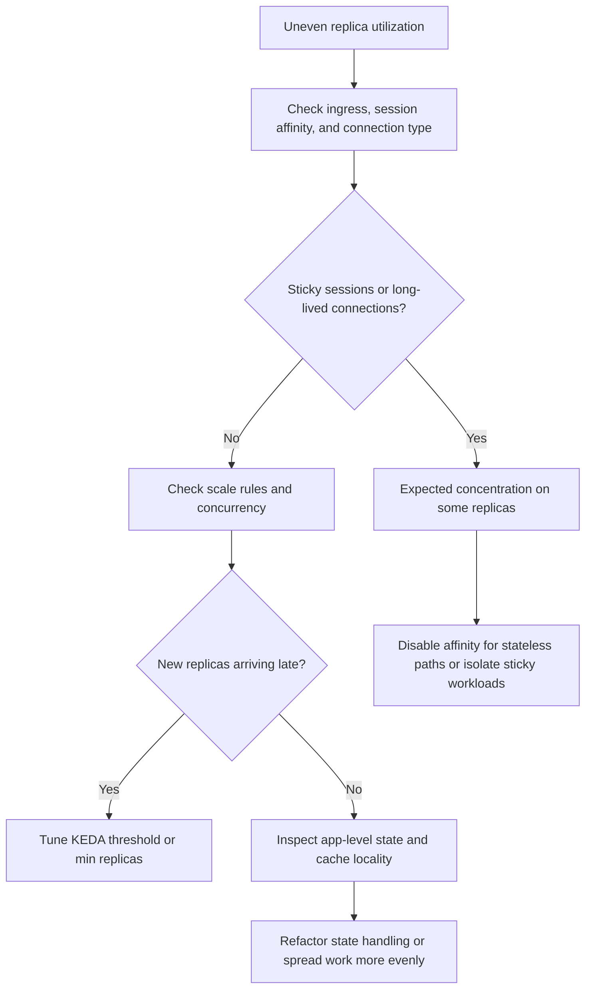

---
content_sources:
  - type: mslearn-adapted
    url: https://learn.microsoft.com/en-us/azure/container-apps/ingress-overview
diagrams:
  - id: replica-load-imbalance-decision-flow
    type: flowchart
    source: mslearn-adapted
    based_on:
      - https://learn.microsoft.com/en-us/azure/container-apps/ingress-overview
      - https://learn.microsoft.com/en-us/azure/container-apps/scale-app
      - https://learn.microsoft.com/en-us/azure/container-apps/traffic-splitting
content_validation:
  status: pending_review
  last_reviewed: 2026-04-29
  reviewer: agent
  core_claims:
    - claim: "Azure Container Apps supports scale rules that determine how replicas scale for an app."
      source: https://learn.microsoft.com/en-us/azure/container-apps/scale-app
      verified: false
    - claim: "Azure Container Apps supports ingress configuration features such as traffic management and sticky sessions."
      source: https://learn.microsoft.com/en-us/azure/container-apps/ingress-overview
      verified: false
---

# Replica Load Imbalance

Use this playbook when one replica becomes hot while others stay underused, or when a steady workload produces uneven latency across otherwise healthy replicas.

## Symptom

- One replica shows higher CPU, memory, or latency than the rest.
- Request throughput does not spread evenly during a steady load test.
- Sticky-session traffic or long-lived connections keep returning to the same replica.
- Scale-out happens, but the new replicas do not meaningfully reduce the hottest replica load.

## Possible Causes

- Session affinity is concentrating user flows on a subset of replicas.
- Long-lived WebSocket, gRPC, or streaming connections pin work to earlier replicas.
- HTTP concurrency is too high, so a hot replica accepts too much work before more replicas are added.
- Revision traffic weights are correct, but the issue is inside a single revision at replica level.
- Downstream caching or state locality causes specific replicas to do disproportionate work.

## Diagnosis Steps

<!-- diagram-id: replica-load-imbalance-decision-flow -->


1. Confirm ingress behavior and whether sticky sessions are enabled.

    ```bash
    az containerapp show \
        --name "$APP_NAME" \
        --resource-group "$RG" \
        --query "properties.configuration.ingress" \
        --output json
    ```

2. Check scale rules and replica limits.

    ```bash
    az containerapp show \
        --name "$APP_NAME" \
        --resource-group "$RG" \
        --query "properties.template.scale" \
        --output json
    ```

3. Compare request timing and replica events.

    ```bash
    az monitor metrics list \
        --resource "/subscriptions/<subscription-id>/resourceGroups/$RG/providers/Microsoft.App/containerApps/$APP_NAME" \
        --metric Requests \
        --aggregation Total \
        --timespan PT1H
    ```

    ```kusto
    let AppName = "ca-myapp";
    ContainerAppSystemLogs_CL
    | where ContainerAppName_s == AppName
    | where TimeGenerated > ago(2h)
    | where Reason_s has_any ("ReplicaStarted", "ReplicaReady")
       or Log_s has_any ("affinity", "session", "connection")
    | project TimeGenerated, RevisionName_s, ReplicaName_s, Reason_s, Log_s
    | order by TimeGenerated desc
    ```

4. If multiple revisions are active, make sure the problem is not mistaken for a traffic-splitting issue.

    ```bash
    az containerapp show \
        --name "$APP_NAME" \
        --resource-group "$RG" \
        --query "properties.configuration.ingress.traffic" \
        --output json
    ```

| Command or Query | Why it is used |
|---|---|
| `az containerapp show --query properties.configuration.ingress` | Reveals session affinity and ingress behavior that can bias request distribution. |
| `az containerapp show --query properties.template.scale` | Shows whether scaling thresholds delay new replica creation. |
| `az monitor metrics list --metric Requests ...` | Establishes the load window that must be correlated with replica behavior. |
| KQL against system logs | Maps request concentration symptoms to replica lifecycle events. |

## Resolution

1. Disable sticky sessions for stateless routes, or isolate stateful endpoints where affinity is required.
2. Lower per-replica concurrency or scale thresholds so new replicas become useful sooner.
3. Increase `minReplicas` during steady high-volume periods.
4. Reduce long-lived connection concentration by separating streaming traffic from normal HTTP traffic.
5. If state locality is deliberate, adjust expectations and monitor by replica cohort instead of assuming perfect balance.

## Prevention

- Decide explicitly whether affinity is required before enabling it.
- Test with both short-lived and long-lived request patterns.
- Validate scale rules using steady-state as well as burst traffic.
- Keep revision traffic-splitting and replica-level load balancing conceptually separate in incident reviews.
- Instrument per-replica behavior in application telemetry where possible.

## See Also

- [CPU Throttling](cpu-throttling.md)
- [Session Affinity Failure](../networking-advanced/session-affinity-failure.md)
- [WebSocket and gRPC Ingress](../networking-advanced/websocket-grpc-ingress.md)

## Sources

- [Ingress in Azure Container Apps](https://learn.microsoft.com/en-us/azure/container-apps/ingress-overview)
- [Scaling in Azure Container Apps](https://learn.microsoft.com/en-us/azure/container-apps/scale-app)
- [Traffic splitting in Azure Container Apps](https://learn.microsoft.com/en-us/azure/container-apps/traffic-splitting)
