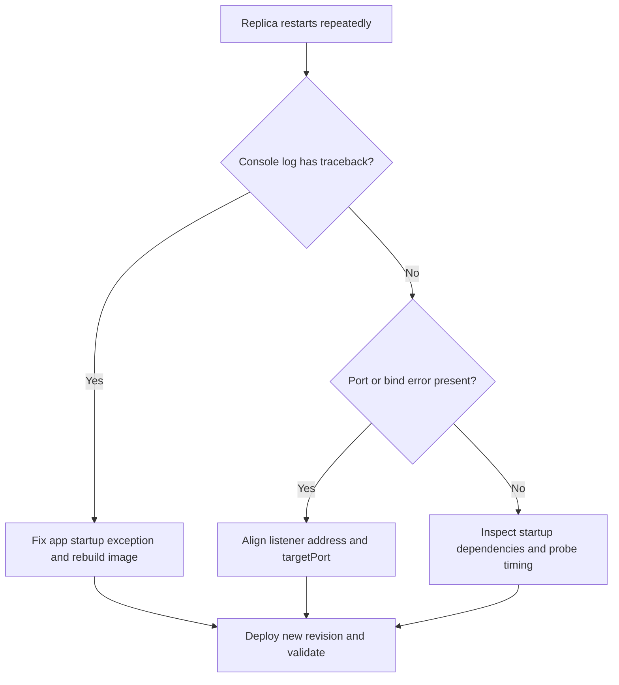

---
hide:
  - toc
---

# Container Start Failure

## 1. Summary

### Symptom

Replicas are created but repeatedly restart, exit, or never pass readiness. Typical signs include replica churn with short lifetimes, console logs showing traceback, bind failures, or process exits, and ingress returning 502/504 because no healthy backend remains.

### Why this scenario is confusing

Startup loops are often misread as platform instability or probe defects. In reality, the most common causes are application startup exceptions, command issues, port and bind mismatches, or slow startup dependencies that keep the app from ever becoming healthy.

### Troubleshooting decision flow



## 2. Common Misreadings

- "Platform instability." Most startup loops are app process, command, or port issues.
- "Probe is broken." Probe failures often reflect a failing app process, not a faulty probe system.

## 3. Competing Hypotheses

| Hypothesis | Typical Evidence For | Typical Evidence Against |
|---|---|---|
| Startup exception in app | Python traceback, import/config errors in console logs | App logs clean and process stays alive |
| Port mismatch | `connection refused`, bind mismatch, wrong `targetPort` | Port values align and health endpoint responds |
| Startup dependency timeout | Logs pause on DB/cache calls then exit | No external dependency calls during boot |

## 4. What to Check First

### Metrics

- Restart count and failed request count during rollout window.

### Logs

```kusto
let AppName = "ca-myapp";
ContainerAppConsoleLogs_CL
| where ContainerAppName_s == AppName
| where Log_s has_any ("traceback", "error", "Address already in use", "connection refused")
| project TimeGenerated, RevisionName_s, ReplicaName_s, Log_s
| order by TimeGenerated desc
```

### Platform Signals

```bash
az containerapp replica list --name "$APP_NAME" --resource-group "$RG" --output table
az containerapp logs show --name "$APP_NAME" --resource-group "$RG" --type console --follow
az containerapp show --name "$APP_NAME" --resource-group "$RG" --query "properties.configuration.ingress.targetPort" --output tsv
```

## 5. Evidence to Collect

### Required Evidence

| Evidence | Command/Query | Purpose |
|---|---|---|
| Replica lifecycle | `az containerapp replica list --name "$APP_NAME" --resource-group "$RG" --output table` | Confirm restart churn |
| Live console output | `az containerapp logs show --name "$APP_NAME" --resource-group "$RG" --type console --follow` | Capture startup exception or bind failure |
| Target port | `az containerapp show --name "$APP_NAME" --resource-group "$RG" --query "properties.configuration.ingress.targetPort" --output tsv` | Compare ingress expectation with app listener |
| Command override | `az containerapp show --name "$APP_NAME" --resource-group "$RG" --query "properties.template.containers[0].command" --output json` | Validate start command |
| Args override | `az containerapp show --name "$APP_NAME" --resource-group "$RG" --query "properties.template.containers[0].args" --output json` | Validate startup arguments |
| Probe configuration | `az containerapp show --name "$APP_NAME" --resource-group "$RG" --query "properties.template.containers[0].probes" --output json` | Check readiness/liveness behavior |
| Effective app port in container | `az containerapp exec --name "$APP_NAME" --resource-group "$RG" --command "python -c 'import os; print(os.environ.get(\"CONTAINER_APP_PORT\", \"8000\"))'"` | Verify container-side port expectation |
| Startup-related console logs | KQL on `ContainerAppConsoleLogs_CL` | Correlate errors across replicas |

### Useful Context

- Whether the image or start command changed recently.
- Whether the app now depends on a slower external service during boot.
- Whether the same image works locally with the same port and command.

Observed healthy console startup pattern:

```text
Starting application...
PORT=8000
Workers=auto
[2026-04-04 11:30:53 +0000] [7] [INFO] Starting gunicorn 25.3.0
[2026-04-04 11:30:53 +0000] [7] [INFO] Listening at: http://0.0.0.0:8000 (7)
[2026-04-04 11:30:53 +0000] [7] [INFO] Using worker: sync
[2026-04-04 11:30:54 +0000] [8] [INFO] Booting worker with pid: 8
```

## 6. Validation and Disproof by Hypothesis

### H1: Startup exception in app

**Signals that support:**

- Python traceback, import errors, or config errors appear in console logs.
- Replicas exit shortly after process start.
- The start command runs but the application never stays alive.

**Signals that weaken:**

- App logs are clean and process stays alive.
- Errors point to port binding or external dependency delays instead.

**What to verify:**

```bash
az containerapp replica list --name "$APP_NAME" --resource-group "$RG" --output table
az containerapp logs show --name "$APP_NAME" --resource-group "$RG" --type console --follow
az containerapp show --name "$APP_NAME" --resource-group "$RG" --query "properties.template.containers[0].command" --output json
az containerapp show --name "$APP_NAME" --resource-group "$RG" --query "properties.template.containers[0].args" --output json
```

```kusto
let AppName = "ca-myapp";
ContainerAppConsoleLogs_CL
| where ContainerAppName_s == AppName
| where Log_s has_any ("traceback", "error", "Address already in use", "connection refused")
| project TimeGenerated, RevisionName_s, ReplicaName_s, Log_s
| order by TimeGenerated desc
```

**Disproof logic:**

If the app process stays alive and logs do not show startup exceptions, look instead at port alignment or slow dependencies.

### H2: Port mismatch

**Signals that support:**

- `connection refused` or bind mismatch appears in logs.
- Ingress `targetPort` differs from the application listener.
- The app is not bound to `0.0.0.0` on the expected port.

**Signals that weaken:**

- Port values align and health endpoint responds.
- Console logs show successful listener startup on the expected port.

**What to verify:**

```bash
az containerapp show --name "$APP_NAME" --resource-group "$RG" --query "properties.configuration.ingress.targetPort" --output tsv
az containerapp show --name "$APP_NAME" --resource-group "$RG" --query "properties.template.containers[0].probes" --output json
az containerapp exec --name "$APP_NAME" --resource-group "$RG" --command "python -c 'import os; print(os.environ.get(\"CONTAINER_APP_PORT\", \"8000\"))'"
```

**Disproof logic:**

If the app is listening on the expected port and ingress plus probe settings match, port mismatch is unlikely.

### H3: Startup dependency timeout

**Signals that support:**

- Logs pause on DB or cache calls and then exit.
- The app starts partially but fails readiness because dependencies are slow.
- Probe configuration is too aggressive for current boot behavior.

**Signals that weaken:**

- No external dependency calls occur during boot.
- The app reaches healthy state quickly when dependencies are reachable.

**What to verify:**

```bash
az containerapp logs show --name "$APP_NAME" --resource-group "$RG" --type console --follow
az containerapp show --name "$APP_NAME" --resource-group "$RG" --query "properties.template.containers[0].probes" --output json
```

**Disproof logic:**

If startup logs show no dependency wait and failure happens immediately for another reason, dependency timeout is not the primary cause.

## 7. Likely Root Cause Patterns

| Pattern | Frequency | First Signal | Typical Resolution |
|---|---|---|---|
| App startup exception or missing dependency | Common | Traceback or error in console logs | Fix code, config, or image contents |
| Listener or ingress port mismatch | Common | `connection refused` or bind error | Align app bind, target port, and probe port |
| Slow startup dependency with aggressive probes | Common | Logs stall on dependency calls | Relax probe timing and reduce boot dependencies |

## 8. Immediate Mitigations

1. Fix startup exceptions and missing dependencies in the image.
2. Ensure app binds `0.0.0.0` on expected port (default `8000`).
3. Align ingress target port and probe port/path with the running app.
4. Redeploy and confirm stable replicas for at least one scale interval.

## 9. Prevention

- Add container startup smoke tests in CI.
- Keep health endpoints lightweight and dependency-safe.
- Fail fast with clear startup logging for config validation.

## See Also

- [Probe Failure and Slow Start](probe-failure-and-slow-start.md)
- [CrashLoop OOM and Resource Pressure](../scaling-and-runtime/crashloop-oom-and-resource-pressure.md)
- [Latest Errors and Exceptions KQL](../../kql/console-and-runtime/latest-errors-and-exceptions.md)

## Sources

- [Health probes in Azure Container Apps](https://learn.microsoft.com/azure/container-apps/health-probes)
- [Ingress in Azure Container Apps](https://learn.microsoft.com/azure/container-apps/ingress-overview)
- [Troubleshoot Azure Container Apps](https://learn.microsoft.com/azure/container-apps/troubleshooting)
