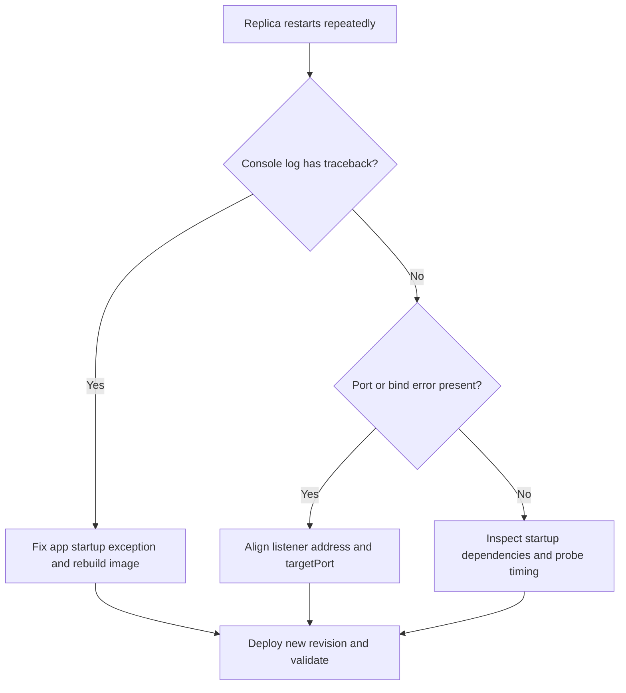

# Container Start Failure

Use this playbook when replicas are created but repeatedly restart, exit, or never pass readiness.

## Symptoms

- Replica churn with short lifetimes.
- Console logs show traceback, bind failures, or process exits.
- Ingress returns 502/504 because no healthy backend remains.

## Common Misreadings

!!! warning "Common Misreadings"
    - Misreading: "Platform instability." Most startup loops are app process, command, or port issues.
    - Misreading: "Probe is broken." Probe failures often reflect a failing app process, not a faulty probe system.

## Competing Hypotheses

| Hypothesis | Evidence For | Evidence Against |
|---|---|---|
| Startup exception in app | Python traceback, import/config errors in console logs | App logs clean and process stays alive |
| Port mismatch | `connection refused`, bind mismatch, wrong `targetPort` | Port values align and health endpoint responds |
| Startup dependency timeout | Logs pause on DB/cache calls then exit | No external dependency calls during boot |

## What to Check First

### Metrics

- Restart count and failed request count during rollout window.

### Logs

```kusto
let AppName = "my-container-app";
ContainerAppConsoleLogs_CL
| where ContainerAppName_s == AppName
| where Log_s has_any ("traceback", "error", "Address already in use", "connection refused")
| project TimeGenerated, RevisionName_s, ReplicaName_s, Log_s
| order by TimeGenerated desc
```

### Platform Signals

```bash
az containerapp replica list --name "$APP_NAME" --resource-group "$RG" --output table
az containerapp logs show --name "$APP_NAME" --resource-group "$RG" --type console --follow
az containerapp show --name "$APP_NAME" --resource-group "$RG" --query "properties.configuration.ingress.targetPort" --output tsv
```

## Evidence Collection

```bash
az containerapp show --name "$APP_NAME" --resource-group "$RG" --query "properties.template.containers[0].command" --output json
az containerapp show --name "$APP_NAME" --resource-group "$RG" --query "properties.template.containers[0].args" --output json
az containerapp show --name "$APP_NAME" --resource-group "$RG" --query "properties.template.containers[0].probes" --output json
az containerapp exec --name "$APP_NAME" --resource-group "$RG" --command "python -c 'import os; print(os.environ.get("CONTAINER_APP_PORT", "8000"))'"
```

## Decision Flow



## Resolution Steps

1. Fix startup exceptions and missing dependencies in the image.
2. Ensure app binds `0.0.0.0` on expected port (default `8000`).
3. Align ingress target port and probe port/path with the running app.
4. Redeploy and confirm stable replicas for at least one scale interval.

## Prevention

- Add container startup smoke tests in CI.
- Keep health endpoints lightweight and dependency-safe.
- Fail fast with clear startup logging for config validation.

## See Also

- [Probe Failure and Slow Start](probe-failure-and-slow-start.md)
- [CrashLoop OOM and Resource Pressure](../scaling-and-runtime/crashloop-oom-and-resource-pressure.md)
- [Latest Errors and Exceptions KQL](../../kql/console-and-runtime/latest-errors-and-exceptions.md)
