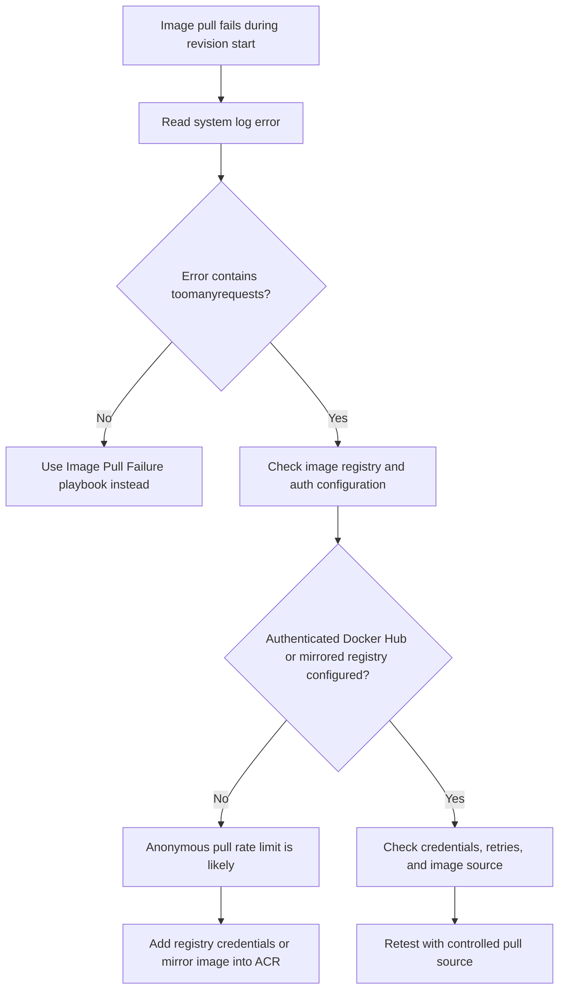

---
content_sources:
  - type: mslearn-adapted
    url: https://learn.microsoft.com/en-us/azure/container-apps/containers#container-registries
diagrams:
  - id: docker-hub-rate-limit-decision-flow
    type: flowchart
    source: mslearn-adapted
    based_on:
      - https://learn.microsoft.com/en-us/azure/container-apps/containers#container-registries
      - https://learn.microsoft.com/en-us/azure/container-apps/troubleshoot-container-start-failures
      - https://learn.microsoft.com/en-us/azure/container-registry/container-registry-authentication
content_validation:
  status: pending_review
  last_reviewed: 2026-04-29
  reviewer: agent
  core_claims:
    - claim: "Azure Container Apps can pull images from public and private container registries."
      source: https://learn.microsoft.com/en-us/azure/container-apps/containers#container-registries
      verified: false
    - claim: "Registry authentication configuration is part of troubleshooting container start failures in Azure Container Apps."
      source: https://learn.microsoft.com/en-us/azure/container-apps/troubleshoot-container-start-failures
      verified: false
---

# Docker Hub Rate Limit

Use this playbook when new revisions fail to start or scale-out events fail intermittently because Docker Hub anonymous pull limits are exhausted.

## Symptom

- System logs show image pull failures with `toomanyrequests` or similar pull-rate messages.
- Revisions fail during provisioning even though the image name and tag are correct.
- The same image may work at low frequency but fail during repeated deployments or burst scale-out.
- Pull failures disappear temporarily after waiting for the registry limit window to reset.

## Possible Causes

- The app pulls from Docker Hub without authenticated registry credentials.
- Multiple revisions or environments share the same anonymous pull budget.
- Scale-out after idle or deployment retries causes repeated image pulls in a short interval.
- The workload depends on public base images that are not mirrored into a controlled registry.

## Diagnosis Steps

<!-- diagram-id: docker-hub-rate-limit-decision-flow -->


1. Confirm the configured image source and capture the system log message.

    ```bash
    az containerapp show \
        --name "$APP_NAME" \
        --resource-group "$RG" \
        --query "properties.template.containers[0].image" \
        --output tsv

    az containerapp logs show \
        --name "$APP_NAME" \
        --resource-group "$RG" \
        --type system
    ```

2. Review registry configuration for the app.

    ```bash
    az containerapp show \
        --name "$APP_NAME" \
        --resource-group "$RG" \
        --query "properties.configuration.registries" \
        --output json
    ```

3. Search for repeated rate-limit errors during deployment or scale-out windows.

    ```kusto
    let AppName = "ca-myapp";
    ContainerAppSystemLogs_CL
    | where ContainerAppName_s == AppName
    | where TimeGenerated > ago(2h)
    | where Log_s has_any ("toomanyrequests", "rate limit", "pull rate limit")
    | project TimeGenerated, RevisionName_s, Reason_s, Log_s
    | order by TimeGenerated desc
    ```

| Command or Query | Why it is used |
|---|---|
| `az containerapp show --query image` | Verifies that the app is actually pulling from Docker Hub rather than another registry. |
| `az containerapp logs show --type system` | Captures the exact image-pull failure signal. |
| `az containerapp show --query registries` | Determines whether authenticated pull configuration exists. |
| KQL for rate-limit text | Shows whether the issue is transient repetition of the same pull-limit error. |

## Resolution

1. Add authenticated registry credentials if you must pull directly from Docker Hub.
2. Prefer mirroring the image into Azure Container Registry so deployments and scale-out use a controlled source.
3. Reduce unnecessary revision churn while validating the fix.
4. Re-deploy only after registry configuration is updated.

    ```bash
    az containerapp registry set \
        --name "$APP_NAME" \
        --resource-group "$RG" \
        --server "index.docker.io" \
        --username "<docker-hub-username>" \
        --password "<docker-hub-access-token>"
    ```

## Prevention

- Treat public Docker Hub pulls as an external dependency with rate risk.
- Mirror production images into ACR before high-frequency deployment or scale testing.
- Use stable image references and avoid repeated failed retries against the same public source.
- Document which apps still depend on public registry pulls.

## See Also

- [Image Pull Failure](image-pull-failure.md)
- [Image Size Startup Delay](image-size-startup-delay.md)
- [Multi-Arch Image Mismatch](multi-arch-image-mismatch.md)

## Sources

- [Container registries in Azure Container Apps](https://learn.microsoft.com/en-us/azure/container-apps/containers#container-registries)
- [Troubleshoot container start failures in Azure Container Apps](https://learn.microsoft.com/en-us/azure/container-apps/troubleshoot-container-start-failures)
- [Authentication with Azure Container Registry](https://learn.microsoft.com/en-us/azure/container-registry/container-registry-authentication)
