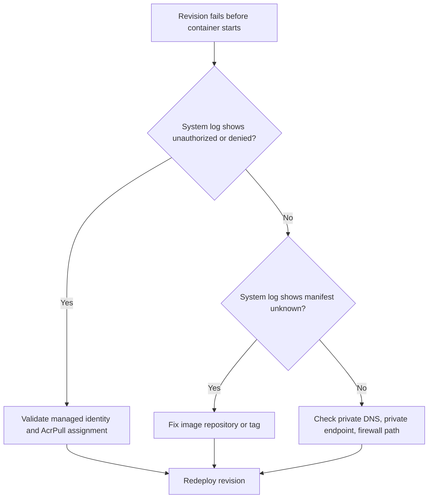

# Image Pull Failure

This playbook isolates failures where a revision never starts because the platform cannot pull the configured container image.

## Symptoms

- Revision remains `Failed` or `Provisioning` and never becomes healthy.
- System logs include `ImagePullBackOff`, `manifest unknown`, `unauthorized`, or `denied`.
- No useful application logs because the container never starts.

## Common Misreadings

!!! warning "Common Misreadings"
    - Misreading: "The app code is crashing." If image pull fails, your app code never executes.
    - Misreading: "ACR is down." Most incidents are identity scope, wrong tag, or registry URL mismatch.

## Competing Hypotheses

| Hypothesis | Evidence For | Evidence Against |
|---|---|---|
| Image tag does not exist | `manifest unknown`, tag missing from ACR | Tag exists and digest is resolvable |
| Registry auth is wrong | `unauthorized`, `denied`, missing `AcrPull` role | Successful pull for same identity on other app |
| Private registry network path blocked | Timeouts to registry endpoint, DNS failures | Same environment can pull same registry image |

## What to Check First

### Metrics

- Failed revision count and provisioning duration in Azure Portal metrics for the Container App.

### Logs

```kusto
let AppName = "my-container-app";
ContainerAppSystemLogs_CL
| where ContainerAppName_s == AppName
| where Log_s has_any ("pull", "manifest", "unauthorized", "denied")
| project TimeGenerated, RevisionName_s, Reason_s, Log_s
| order by TimeGenerated desc
```

### Platform Signals

```bash
az containerapp show --name "$APP_NAME" --resource-group "$RG" --query "properties.template.containers[0].image" --output tsv
az containerapp logs show --name "$APP_NAME" --resource-group "$RG" --type system
az acr repository show-tags --name "$ACR_NAME" --repository "$APP_NAME" --output table
```

## Evidence Collection

```bash
az containerapp revision list --name "$APP_NAME" --resource-group "$RG" --query "[].{name:name,health:properties.healthState,active:properties.active,created:properties.createdTime}" --output table
az containerapp show --name "$APP_NAME" --resource-group "$RG" --query "identity" --output json
az role assignment list --scope "$(az acr show --name "$ACR_NAME" --resource-group "$RG" --query id --output tsv)" --assignee "$(az containerapp show --name "$APP_NAME" --resource-group "$RG" --query identity.principalId --output tsv)" --output table
az containerapp logs show --name "$APP_NAME" --resource-group "$RG" --type system
```

## Decision Flow



## Resolution Steps

1. Correct image reference (`registry/repository:tag`) and verify the tag exists.
2. Assign managed identity and grant `AcrPull` on the exact registry scope.
3. For private ACR, validate DNS and private endpoint routing from the Container Apps environment.
4. Deploy a new revision and confirm it reaches `healthState=Healthy`.

## Prevention

- Use immutable image tags (for example, commit SHA).
- Add CI validation that checks image existence before deployment.
- Keep ACR RBAC in IaC to avoid drift.

## See Also

- [Revision Provisioning Failure](revision-provisioning-failure.md)
- [Managed Identity Auth Failure](../identity-and-configuration/managed-identity-auth-failure.md)
- [Image Pull and Auth Errors KQL](../../kql/system-and-revisions/image-pull-and-auth-errors.md)
