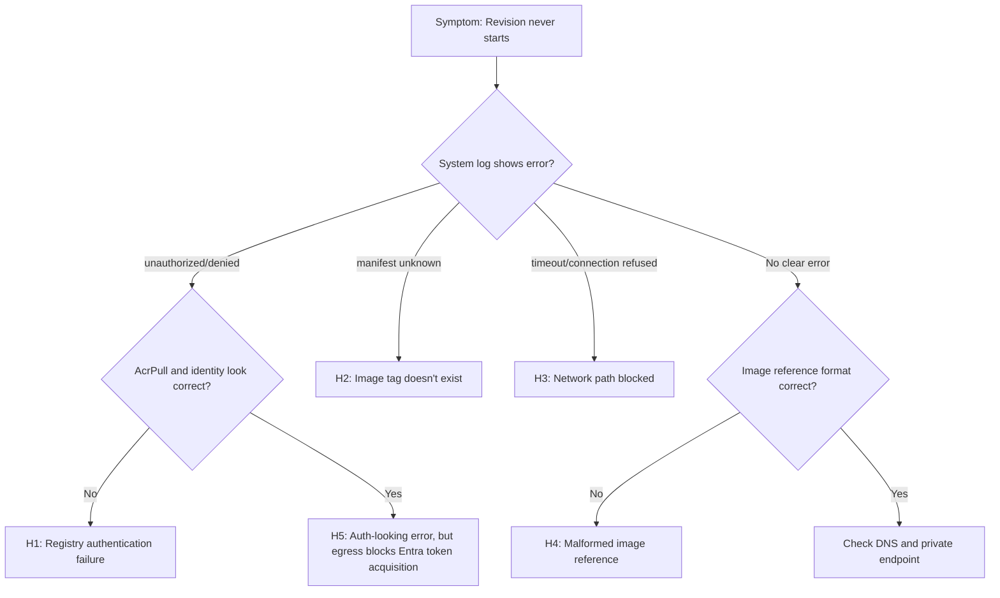

---
content_sources:
diagrams:
  - id: troubleshooting-decision-flow
    type: flowchart
    source: mslearn-adapted
    based_on:
      - https://learn.microsoft.com/azure/container-apps/containers#container-registries
      - https://learn.microsoft.com/azure/container-apps/managed-identity
      - https://learn.microsoft.com/azure/container-apps/managed-identity-image-pull
      - https://learn.microsoft.com/azure/container-apps/firewall-integration
      - https://learn.microsoft.com/azure/container-apps/user-defined-routes
      - https://learn.microsoft.com/azure/container-apps/troubleshooting
      - https://learn.microsoft.com/azure/container-registry/container-registry-authentication
content_validation:
  status: verified
  last_reviewed: "2026-04-12"
  reviewer: ai-agent
  core_claims:
    - claim: "Azure Container Apps can pull container images from public and private registries, including Azure Container Registry."
      source: "https://learn.microsoft.com/azure/container-apps/containers"
      verified: true
    - claim: "Azure Container Apps supports both system-assigned and user-assigned managed identities."
      source: "https://learn.microsoft.com/azure/container-apps/managed-identity"
      verified: true
    - claim: "In workload profiles environments with restricted egress, outbound access to the AzureActiveDirectory service tag on port 443 is required when using managed identity."
      source: "https://learn.microsoft.com/azure/container-apps/firewall-integration"
      verified: true
    - claim: "Azure Container Apps can authenticate Azure Container Registry image pulls with managed identity instead of registry admin credentials."
      source: "https://learn.microsoft.com/azure/container-apps/managed-identity-image-pull"
      verified: true
---

# Image Pull Failure

## 1. Summary

### Symptom

Revision remains stuck in `Failed` or `Provisioning` state and never becomes healthy. The container never starts because the platform cannot pull the configured image. Application logs are empty because no code ever executes.

### Why this scenario is confusing

Image pull failures look similar to app crashes at first glance—both result in unhealthy revisions. However, the root cause is entirely different: networking, authentication, or image reference issues rather than application code. Without checking system logs, you might waste time debugging code that never ran.

### Troubleshooting decision flow

<!-- diagram-id: troubleshooting-decision-flow -->


## 2. Common Misreadings

- "The app code is crashing" — If image pull fails, your app code never executes. No point debugging application logic.
- "ACR is down" — Most incidents are identity scope issues, wrong tag, or registry URL mismatch, not ACR outages.
- "I just pushed the image, it should be there" — Push succeeded to wrong repository, wrong registry, or tag was overwritten.
- "Managed identity is configured" — Identity exists but lacks `AcrPull` role on the specific registry.
- "It worked yesterday" — Image tag was overwritten with broken image, or RBAC was modified.

## 3. Competing Hypotheses

| Hypothesis | Typical Evidence For | Typical Evidence Against |
|---|---|---|
| **H1: Registry authentication failure** | `unauthorized`, `denied`, `403`, missing role assignment | Same identity pulls successfully elsewhere |
| **H2: Image tag doesn't exist** | `manifest unknown`, `not found`, tag missing from ACR | Tag exists and digest is resolvable |
| **H3: Network path blocked** | Timeout, connection refused, DNS resolution failure | Same environment pulls other images successfully |
| **H4: Malformed image reference** | Invalid format errors, empty image field | Image reference parses correctly |
| **H5: Restricted egress blocks managed identity token acquisition, which can surface as `unauthorized`** | `unauthorized` appears even though `AcrPull` is correct, issue starts after UDR/firewall tightening, managed identity image pull depends on `AzureActiveDirectory` egress | Same environment can reach required outbound dependencies and only one app is misconfigured |

## 4. What to Check First

### Metrics

- Failed revision count in Azure Portal
- Provisioning duration (stuck revisions show extended duration)
- No replica metrics (replicas never created)

### Logs

```kusto
let AppName = "ca-myapp";
ContainerAppSystemLogs_CL
| where ContainerAppName_s == AppName
| where TimeGenerated > ago(1h)
| where Reason_s has_any ("ImagePullBackOff", "ErrImagePull", "Failed")
   or Log_s has_any ("pull", "manifest", "unauthorized", "denied", "timeout", "connection refused")
| project TimeGenerated, RevisionName_s, Reason_s, Log_s
| order by TimeGenerated desc
```

### Platform Signals

```bash
# Check configured image
az containerapp show --name "$APP_NAME" --resource-group "$RG" \
  --query "properties.template.containers[0].image" --output tsv

# Check revision status
az containerapp revision list --name "$APP_NAME" --resource-group "$RG" \
  --query "[].{name:name,health:properties.healthState,created:properties.createdTime}" \
  --output table

# Check system logs for pull errors
az containerapp logs show --name "$APP_NAME" --resource-group "$RG" --type system
```

## 5. Evidence to Collect

### Required Evidence

| Evidence | Command/Query | Purpose |
|---|---|---|
| Configured image | `az containerapp show ... --query containers[0].image` | Verify image reference |
| Revision health | `az containerapp revision list` | Confirm stuck/failed state |
| System logs | KQL for pull errors | Find specific error message |
| Identity config | `az containerapp show ... --query identity` | Check managed identity |
| ACR role assignment | `az role assignment list --scope <acr-id>` | Verify AcrPull role |
| ACR tag existence | `az acr repository show-tags` | Confirm tag exists |

### Useful Context

- Registry type (ACR, Docker Hub, private registry)
- Authentication method (managed identity, admin credentials, service principal)
- Network configuration (public ACR, private endpoint, firewall)
- Recent changes (new image push, RBAC modification, network change)

## 6. Validation and Disproof by Hypothesis

### H1: Registry authentication failure

**Signals that support:**

- System logs show `unauthorized`, `denied`, `403`
- Managed identity exists but no `AcrPull` role assignment
- ACR admin credentials disabled but app expects them
- Different registry used than expected

**Signals that weaken:**

- Same identity successfully pulls other images
- Role assignment exists and is correct
- Using public image that doesn't require auth

**What to verify:**

```bash
# Check managed identity
az containerapp show --name "$APP_NAME" --resource-group "$RG" \
  --query "identity" --output json

# Get identity principal ID
PRINCIPAL_ID=$(az containerapp show --name "$APP_NAME" --resource-group "$RG" \
  --query "identity.principalId" --output tsv)

# Check AcrPull role assignment
ACR_ID=$(az acr show --name "$ACR_NAME" --resource-group "$RG" --query "id" --output tsv)
az role assignment list --scope "$ACR_ID" --assignee "$PRINCIPAL_ID" --output table
```

```kusto
// Find auth errors
let AppName = "ca-myapp";
ContainerAppSystemLogs_CL
| where ContainerAppName_s == AppName
| where TimeGenerated > ago(2h)
| where Log_s has_any ("unauthorized", "denied", "403", "authentication", "credential")
| project TimeGenerated, Log_s
| order by TimeGenerated desc
```

**Fix:**

```bash
# Assign AcrPull role
az role assignment create \
  --assignee "$PRINCIPAL_ID" \
  --role "AcrPull" \
  --scope "$ACR_ID"

# Or configure registry credentials
az containerapp registry set \
  --name "$APP_NAME" \
  --resource-group "$RG" \
  --server "$ACR_NAME.azurecr.io" \
  --identity system
```

### H2: Image tag doesn't exist

**Signals that support:**

- System logs show `manifest unknown`, `not found`
- Tag not listed in ACR repository
- Typo in image reference

**Signals that weaken:**

- Tag exists in ACR and digest matches
- Auth errors appear instead of manifest errors

**What to verify:**

```bash
# Check if tag exists
az acr repository show-tags --name "$ACR_NAME" --repository "myapp" --output table

# Check manifest
az acr manifest show --registry "$ACR_NAME" --name "myapp:v1.0.0"

# Verify exact image reference in app
az containerapp show --name "$APP_NAME" --resource-group "$RG" \
  --query "properties.template.containers[0].image" --output tsv
```

```kusto
// Find manifest errors
let AppName = "ca-myapp";
ContainerAppSystemLogs_CL
| where ContainerAppName_s == AppName
| where TimeGenerated > ago(2h)
| where Log_s has_any ("manifest unknown", "not found", "does not exist")
| project TimeGenerated, Log_s
```

**Fix:**

```bash
# Push correct image
az acr build --registry "$ACR_NAME" --image "myapp:v1.0.0" .

# Or update app to use existing tag
az containerapp update --name "$APP_NAME" --resource-group "$RG" \
  --image "$ACR_NAME.azurecr.io/myapp:existing-tag"
```

### H3: Network path blocked

**Signals that support:**

- System logs show timeout, connection refused, DNS failure
- ACR is private but environment not VNet-integrated
- Private endpoint exists but DNS not configured
- Firewall blocking outbound to ACR

**Signals that weaken:**

- Same environment successfully pulls other ACR images
- Public ACR with no network restrictions

**What to verify:**

```bash
# Check if ACR is public or private
az acr show --name "$ACR_NAME" --query "publicNetworkAccess" --output tsv

# Check environment VNet integration
az containerapp env show --name "$ENVIRONMENT_NAME" --resource-group "$RG" \
  --query "properties.vnetConfiguration" --output json

# Check ACR private endpoint (if applicable)
az network private-endpoint list --resource-group "$RG" \
  --query "[?contains(name, 'acr')]" --output table
```

**Fix:**

```bash
# For private ACR, ensure private DNS zone is linked
az network private-dns zone list --resource-group "$RG" --output table

# Or allow Container Apps environment subnet in ACR firewall
az acr network-rule add --name "$ACR_NAME" --subnet "<subnet-id>"
```

### H4: Malformed image reference

**Signals that support:**

- Image field empty or malformed
- Missing registry prefix
- Invalid characters in image name

**Signals that weaken:**

- Image reference parses correctly
- Same reference works in docker pull locally

**What to verify:**

```bash
# Check image format
IMAGE=$(az containerapp show --name "$APP_NAME" --resource-group "$RG" \
  --query "properties.template.containers[0].image" --output tsv)
echo "Configured image: $IMAGE"

# Validate format: registry/repository:tag
# Examples:
# ✅ myacr.azurecr.io/myapp:v1.0.0
# ✅ docker.io/library/nginx:latest
# ❌ myapp:v1.0.0 (missing registry)
# ❌ myacr.azurecr.io/myapp (missing tag)
```

### H5: Auth-looking `unauthorized` that can indicate restricted egress blocking managed identity token acquisition

**Signals that support:**

- System logs show `unauthorized` or `denied`, but the container app identity already has the `AcrPull` role on the correct registry
- The failure starts after adding UDRs, Azure Firewall rules, or restrictive NSG outbound rules
- The environment uses managed identity for image pulls and ACR is behind private networking or other restricted egress controls
- Other evidence points to outbound dependency gaps rather than registry RBAC, especially missing access to `AzureActiveDirectory` on port `443`

**Signals that weaken:**

- `AcrPull` is actually missing or assigned to the wrong principal or wrong registry
- The environment has unrestricted outbound access or explicit allow rules for `AzureActiveDirectory`, `MicrosoftContainerRegistry`, `AzureFrontDoor.FirstParty`, and required ACR dependencies
- The same environment can successfully perform other managed identity-dependent operations after the egress policy change

**What to verify:**

```bash
# Confirm the container app is using managed identity for the registry
az containerapp show --name "$APP_NAME" --resource-group "$RG" \
  --query "properties.configuration.registries" --output json

# Confirm the identity and AcrPull assignment are correct
PRINCIPAL_ID=$(az containerapp show --name "$APP_NAME" --resource-group "$RG" \
  --query "identity.principalId" --output tsv)
ACR_ID=$(az acr show --name "$ACR_NAME" --resource-group "$RG" --query "id" --output tsv)
az role assignment list --scope "$ACR_ID" --assignee "$PRINCIPAL_ID" --output table

# Check whether the environment subnet is attached to an NSG or route table
INFRA_SUBNET_ID=$(az containerapp env show --name "$ENVIRONMENT_NAME" --resource-group "$RG" \
  --query "properties.vnetConfiguration.infrastructureSubnetId" --output tsv)
az network vnet subnet show --ids "$INFRA_SUBNET_ID" \
  --query "{routeTableId:routeTable.id,nsgId:networkSecurityGroup.id}" --output json

# Review the attached NSG and route table definitions if they exist
NSG_ID=$(az network vnet subnet show --ids "$INFRA_SUBNET_ID" \
  --query "networkSecurityGroup.id" --output tsv)
ROUTE_TABLE_ID=$(az network vnet subnet show --ids "$INFRA_SUBNET_ID" \
  --query "routeTable.id" --output tsv)
if [ -n "$NSG_ID" ]; then
  az resource show --ids "$NSG_ID" --output json
fi

if [ -n "$ROUTE_TABLE_ID" ]; then
  az resource show --ids "$ROUTE_TABLE_ID" --output json
fi

# Inspect the NSG or route table resources for outbound controls and verify the allow-list includes:
# AzureActiveDirectory:443
# MicrosoftContainerRegistry:443
# AzureFrontDoor.FirstParty:443
# Storage.<Region>:443
# Your ACR endpoint or AzureContainerRegistry when not using an ACR private endpoint
```

| Command | Purpose |
|---|---|
| `az containerapp show ... --query "properties.configuration.registries"` | Confirm the container app is configured to use managed identity for registry authentication |
| `az containerapp show ... --query "identity.principalId"` | Retrieve the managed identity principal ID for role verification |
| `az acr show ... --query "id"` | Get the ACR resource ID to scope role assignment checks |
| `az role assignment list --scope ... --assignee ...` | Verify that the identity holds the `AcrPull` role on the target registry |
| `az containerapp env show ... --query "properties.vnetConfiguration.infrastructureSubnetId"` | Get the infrastructure subnet to inspect attached NSG and route table |
| `az network vnet subnet show ... --query "{routeTableId:...,nsgId:...}"` | Check whether the subnet has an NSG or route table attached |
| `az resource show --ids "$NSG_ID"` | Inspect the NSG definition for outbound deny rules that block identity dependencies |
| `az resource show --ids "$ROUTE_TABLE_ID"` | Inspect the route table for UDRs that redirect egress through a firewall |

```kusto
// Correlate unauthorized image pull failures with restricted egress investigation
let AppName = "ca-myapp";
ContainerAppSystemLogs_CL
| where ContainerAppName_s == AppName
| where TimeGenerated > ago(4h)
| where Log_s has_any ("unauthorized", "denied", "403", "token")
| project TimeGenerated, RevisionName_s, Reason_s, Log_s
| order by TimeGenerated desc
```

```kusto
// If Azure Firewall logs are enabled, check for denied outbound requests to Entra ID or registry dependencies
AzureDiagnostics
| where TimeGenerated > ago(4h)
| where Category in ("AzureFirewallApplicationRule", "AzureFirewallNetworkRule")
| where msg_s has_any ("login.microsoftonline.com", "mcr.microsoft.com", ".azurecr.io", ".blob.core.windows.net")
| project TimeGenerated, Category, action_s, msg_s
| order by TimeGenerated desc
```

**Fix:**

!!! note "Workload profiles environments only"
    UDR and Azure Firewall egress control applies to **workload profiles** environments. Consumption-only environments do not support user-defined routes.

If outbound traffic is controlled by Azure Firewall through a user-defined route, update the firewall allow-list as well as any NSG rules. These rules supplement your existing baseline Container Apps firewall configuration — they are an incremental patch, not a complete firewall ruleset. The required destinations come from the same Microsoft Learn dependency set: Microsoft Entra ID token acquisition, Microsoft container registry dependencies, your ACR endpoint when not using a private endpoint, and the required storage endpoint for ACR-backed images.

```bash
# If outbound is routed through Azure Firewall, allow the required FQDNs in the firewall policy
az network firewall policy rule-collection-group collection add-filter-collection \
  --policy-name "$FIREWALL_POLICY_NAME" \
  --resource-group "$RG" \
  --rule-collection-group-name "$RULE_COLLECTION_GROUP_NAME" \
  --name "aca-egress-dependencies" \
  --action Allow \
  --collection-priority 100 \
  --rule-type ApplicationRule

az network firewall policy rule-collection-group collection rule add \
  --policy-name "$FIREWALL_POLICY_NAME" \
  --resource-group "$RG" \
  --rule-collection-group-name "$RULE_COLLECTION_GROUP_NAME" \
  --collection-name "aca-egress-dependencies" \
  --name "allow-managed-identity-and-registry-fqdns" \
  --rule-type ApplicationRule \
  --source-addresses "*" \
  --protocols "Http=80" "Https=443" \
  --target-fqdns "login.microsoftonline.com" "*.login.microsoftonline.com" "*.login.microsoft.com" "login.microsoft.com" "*.identity.azure.net" "mcr.microsoft.com" "*.data.mcr.microsoft.com" "$ACR_NAME.azurecr.io" "*.blob.core.windows.net"

# Allow managed identity token acquisition through the environment NSG
az network nsg rule create \
  --resource-group "$RG" \
  --nsg-name "$NSG_NAME" \
  --name "allow-azure-active-directory-443" \
  --priority 200 \
  --direction Outbound \
  --access Allow \
  --protocol Tcp \
  --source-address-prefixes "*" \
  --source-port-ranges "*" \
  --destination-address-prefixes AzureActiveDirectory \
  --destination-port-ranges 443

# Allow registry platform dependencies required by Azure Container Apps
az network nsg rule create \
  --resource-group "$RG" \
  --nsg-name "$NSG_NAME" \
  --name "allow-microsoft-container-registry-443" \
  --priority 210 \
  --direction Outbound \
  --access Allow \
  --protocol Tcp \
  --source-address-prefixes "*" \
  --source-port-ranges "*" \
  --destination-address-prefixes MicrosoftContainerRegistry \
  --destination-port-ranges 443

az network nsg rule create \
  --resource-group "$RG" \
  --nsg-name "$NSG_NAME" \
  --name "allow-azure-front-door-first-party-443" \
  --priority 220 \
  --direction Outbound \
  --access Allow \
  --protocol Tcp \
  --source-address-prefixes "*" \
  --source-port-ranges "*" \
  --destination-address-prefixes AzureFrontDoor.FirstParty \
  --destination-port-ranges 443

az network nsg rule create \
  --resource-group "$RG" \
  --nsg-name "$NSG_NAME" \
  --name "allow-azure-container-registry-443" \
  --priority 225 \
  --direction Outbound \
  --access Allow \
  --protocol Tcp \
  --source-address-prefixes "*" \
  --source-port-ranges "*" \
  --destination-address-prefixes AzureContainerRegistry \
  --destination-port-ranges 443

az network nsg rule create \
  --resource-group "$RG" \
  --nsg-name "$NSG_NAME" \
  --name "allow-storage-region-443" \
  --priority 230 \
  --direction Outbound \
  --access Allow \
  --protocol Tcp \
  --source-address-prefixes "*" \
  --source-port-ranges "*" \
  --destination-address-prefixes "Storage.<Region>" \
  --destination-port-ranges 443

# After restoring outbound access, trigger a new revision
az containerapp update --name "$APP_NAME" --resource-group "$RG" \
  --revision-suffix "egress-fix-$(date +%s)"
```

| Command | Purpose |
|---|---|
| `az network firewall policy rule-collection-group collection add-filter-collection ...` | Create a new application rule collection in the firewall policy for Container Apps egress dependencies |
| `az network firewall policy rule-collection-group collection rule add ... --target-fqdns ...` | Allow outbound HTTPS to Entra ID, MCR, ACR, and storage FQDNs required for managed identity image pulls |
| `az network nsg rule create ... AzureActiveDirectory` | Allow the NSG to pass outbound traffic to Microsoft Entra ID for managed identity token acquisition |
| `az network nsg rule create ... MicrosoftContainerRegistry` | Allow outbound to Microsoft Container Registry for platform system container dependencies |
| `az network nsg rule create ... AzureFrontDoor.FirstParty` | Allow outbound to Azure Front Door, a dependency of Microsoft Container Registry |
| `az network nsg rule create ... AzureContainerRegistry` | Allow outbound to Azure Container Registry when not using a private endpoint |
| `az network nsg rule create ... Storage.<Region>` | Allow outbound to regional Azure Storage for ACR image layer downloads |
| `az containerapp update ... --revision-suffix ...` | Trigger a new revision to retry image pull after restoring outbound access |

## 7. Likely Root Cause Patterns

| Pattern | Frequency | First Signal | Typical Resolution |
|---|---|---|---|
| Missing AcrPull role | Very common | `unauthorized` in logs | Add role assignment |
| Wrong image tag | Common | `manifest unknown` | Fix tag or push image |
| System identity not enabled | Common | `unauthorized` | Enable system identity |
| Private ACR without VNet | Occasional | Timeout | Configure VNet or private endpoint |
| Typo in registry name | Occasional | DNS failure | Fix registry URL |
| Restricted egress blocks Entra token acquisition | Occasional | `unauthorized` even though RBAC is correct | Allow `AzureActiveDirectory` and other required outbound dependencies |

## 8. Immediate Mitigations

1. **If auth failure:** Assign AcrPull role
   ```bash
   az role assignment create --assignee "$PRINCIPAL_ID" --role "AcrPull" --scope "$ACR_ID"
   ```

2. **If tag missing:** Use known good tag
   ```bash
   az containerapp update --name "$APP_NAME" --resource-group "$RG" \
     --image "$ACR_NAME.azurecr.io/myapp:known-good-tag"
   ```

3. **If private ACR issues:** Temporarily enable public access (for debugging only)
   ```bash
   az acr update --name "$ACR_NAME" --public-network-enabled true
   ```

4. **If `unauthorized` persists after RBAC checks:** Temporarily allow required managed identity egress dependencies
   ```bash
   az network nsg rule create --resource-group "$RG" --nsg-name "$NSG_NAME" \
     --name "allow-azure-active-directory-443" --priority 200 --direction Outbound \
     --access Allow --protocol Tcp --source-address-prefixes "*" --source-port-ranges "*" \
     --destination-address-prefixes AzureActiveDirectory --destination-port-ranges 443
   ```

    | Command | Purpose |
    |---|---|
    | `az network nsg rule create ... AzureActiveDirectory` | Temporarily allow outbound access to Microsoft Entra ID so managed identity can acquire a token for ACR authentication |

5. **Force new revision after fix:**
   ```bash
   az containerapp update --name "$APP_NAME" --resource-group "$RG" \
      --revision-suffix "fix-$(date +%s)"
   ```

## 9. Prevention

- Use immutable image tags (commit SHA) to prevent tag overwrites
- Add CI validation that checks image existence before deployment
- Keep ACR RBAC in Infrastructure as Code to avoid drift
- Maintain firewall and NSG allow-lists for managed identity image pulls, including `AzureActiveDirectory`, `MicrosoftContainerRegistry`, `AzureFrontDoor.FirstParty`, `Storage.<Region>`, and your registry endpoint when required
- Use digest references for critical deployments: `image@sha256:...`
- Automate image build + deploy in single pipeline to ensure consistency
- Set up ACR webhook to trigger deployment only after successful push

## See Also

- [Revision Provisioning Failure](revision-provisioning-failure.md)
- [Container Start Failure](container-start-failure.md)
- [Managed Identity Auth Failure](../identity-and-configuration/managed-identity-auth-failure.md)
- [Image Pull and Auth Errors KQL](../../kql/system-and-revisions/image-pull-and-auth-errors.md)
- [ACR Pull Failure Lab](../../lab-guides/acr-pull-failure.md)
- [Egress Control — Required Outbound Dependencies](../../../platform/networking/egress-control.md#required-outbound-dependencies)

## Sources

- [Manage container registries in Azure Container Apps](https://learn.microsoft.com/azure/container-apps/containers#container-registries)
- [Managed identities in Azure Container Apps](https://learn.microsoft.com/azure/container-apps/managed-identity)
- [Azure Container Apps image pull from Azure Container Registry with managed identity](https://learn.microsoft.com/azure/container-apps/managed-identity-image-pull)
- [Securing a virtual network in Azure Container Apps](https://learn.microsoft.com/azure/container-apps/firewall-integration)
- [Use Azure Firewall with Azure Container Apps — outbound FQDN requirements](https://learn.microsoft.com/azure/container-apps/use-azure-firewall)
- [Container Apps outbound traffic control with Azure Firewall](https://learn.microsoft.com/azure/container-apps/user-defined-routes)
- [Troubleshoot Azure Container Apps](https://learn.microsoft.com/azure/container-apps/troubleshooting)
- [Azure Container Registry authentication](https://learn.microsoft.com/azure/container-registry/container-registry-authentication)
