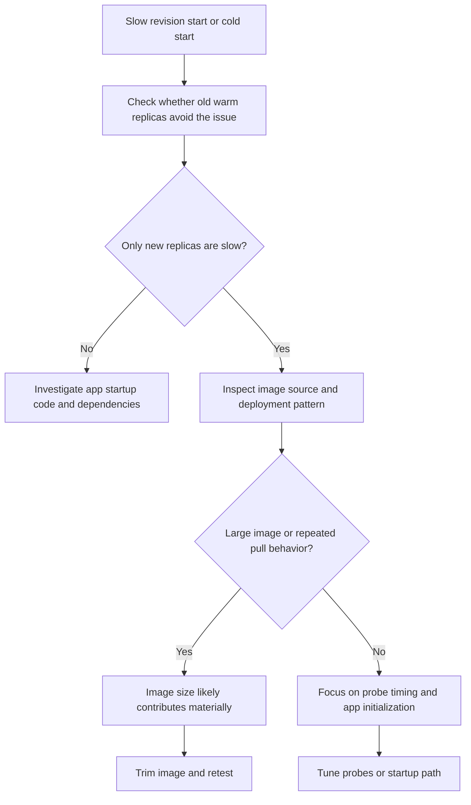

---
content_sources:
  - type: mslearn-adapted
    url: https://learn.microsoft.com/en-us/azure/container-apps/troubleshoot-container-start-failures
diagrams:
  - id: image-size-startup-delay-decision-flow
    type: flowchart
    source: mslearn-adapted
    based_on:
      - https://learn.microsoft.com/en-us/azure/container-apps/troubleshoot-container-start-failures
      - https://learn.microsoft.com/en-us/azure/container-apps/containers
      - https://learn.microsoft.com/en-us/azure/container-apps/scale-app
content_validation:
  status: pending_review
  last_reviewed: 2026-04-29
  reviewer: agent
  core_claims:
    - claim: "A revision can fail or start slowly when container startup conditions are not met in Azure Container Apps."
      source: https://learn.microsoft.com/en-us/azure/container-apps/troubleshoot-container-start-failures
      verified: false
    - claim: "Azure Container Apps revisions run the container image configured in the app template."
      source: https://learn.microsoft.com/en-us/azure/container-apps/containers
      verified: false
---

# Image Size Startup Delay

Use this playbook when new revisions eventually succeed but take far too long to become ready, especially after scale-from-zero or after an image update.

## Symptom

- New revisions remain in provisioning longer than expected.
- First requests after scale-out or scale-from-zero show large latency spikes.
- Startup probes fail only on fresh revisions or freshly pulled images.
- No single application exception explains the slow start window.

## Possible Causes

- The image is large, so pull and extraction time dominate startup.
- The image contains unnecessary build tools, package caches, or debug artifacts.
- Startup initialization does too much work after the image is pulled.
- Scale-to-zero exposes image pull latency more visibly than always-ready replicas do.

## Diagnosis Steps

<!-- diagram-id: image-size-startup-delay-decision-flow -->


1. Capture the configured image and revision timeline.

    ```bash
    az containerapp show \
        --name "$APP_NAME" \
        --resource-group "$RG" \
        --query "properties.template.containers[0].image" \
        --output tsv

    az containerapp revision list \
        --name "$APP_NAME" \
        --resource-group "$RG" \
        --output table
    ```

2. Review system logs for slow provisioning or repeated startup attempts.

    ```bash
    az containerapp logs show \
        --name "$APP_NAME" \
        --resource-group "$RG" \
        --type system
    ```

3. Correlate revision creation and startup signals.

    ```kusto
    let AppName = "ca-myapp";
    ContainerAppSystemLogs_CL
    | where ContainerAppName_s == AppName
    | where TimeGenerated > ago(2h)
    | where Reason_s has_any ("RevisionProvisioning", "RevisionProvisioned", "ReplicaStarted", "ProbeFailed")
       or Log_s has_any ("pull", "start", "ready")
    | project TimeGenerated, RevisionName_s, ReplicaName_s, Reason_s, Log_s
    | order by TimeGenerated asc
    ```

4. Compare the behavior with scale-to-zero settings to see whether image pull cost is only visible on fresh replicas.

    ```bash
    az containerapp show \
        --name "$APP_NAME" \
        --resource-group "$RG" \
        --query "properties.template.scale" \
        --output json
    ```

| Command or Query | Why it is used |
|---|---|
| `az containerapp show --query image` | Confirms the exact image reference used by the slow revision. |
| `az containerapp revision list` | Shows whether startup delay is revision-specific or persistent. |
| `az containerapp logs show --type system` | Captures provisioning and startup events around the delay window. |
| KQL timeline query | Correlates the gap between revision provisioning and replica readiness. |

## Resolution

1. Reduce image size with multi-stage builds and by removing build-time tooling from the runtime image.
2. Keep language package caches, test assets, and debug binaries out of the production image.
3. Move expensive initialization out of the startup path where possible.
4. Keep one ready replica for user-facing apps if cold-start latency is unacceptable.

## Prevention

- Treat image size as a production SLO input, not just a build concern.
- Review image contents after dependency or base-image changes.
- Measure revision-ready time before and after image changes.
- Keep scale-to-zero decisions aligned with acceptable startup latency.

## See Also

- [Probe Failure and Slow Start](probe-failure-and-slow-start.md)
- [Docker Hub Rate Limit](docker-hub-rate-limit.md)
- [Cold Start and Scale-to-Zero Lab](../../lab-guides/cold-start-scale-to-zero.md)

## Sources

- [Troubleshoot container start failures in Azure Container Apps](https://learn.microsoft.com/en-us/azure/container-apps/troubleshoot-container-start-failures)
- [Containers in Azure Container Apps](https://learn.microsoft.com/en-us/azure/container-apps/containers)
- [Scaling in Azure Container Apps](https://learn.microsoft.com/en-us/azure/container-apps/scale-app)
