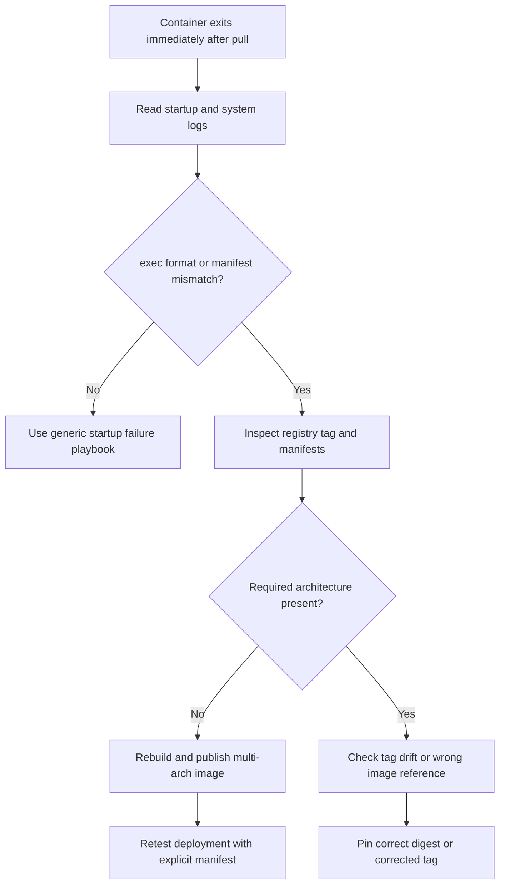

---
content_sources:
  - type: mslearn-adapted
    url: https://learn.microsoft.com/en-us/azure/container-registry/push-multi-architecture-images
diagrams:
  - id: multi-arch-image-mismatch-decision-flow
    type: flowchart
    source: mslearn-adapted
    based_on:
      - https://learn.microsoft.com/en-us/azure/container-registry/push-multi-architecture-images
      - https://learn.microsoft.com/en-us/azure/container-apps/containers#container-registries
      - https://learn.microsoft.com/en-us/azure/container-apps/troubleshoot-container-start-failures
content_validation:
  status: pending_review
  last_reviewed: 2026-04-29
  reviewer: agent
  core_claims:
    - claim: "Azure Container Registry supports publishing multi-architecture images by using manifest lists."
      source: https://learn.microsoft.com/en-us/azure/container-registry/push-multi-architecture-images
      verified: false
    - claim: "Azure Container Apps uses the configured container image reference when creating revisions."
      source: https://learn.microsoft.com/en-us/azure/container-apps/containers#container-registries
      verified: false
---

# Multi-Arch Image Mismatch

Use this playbook when a revision pulls successfully but the container fails immediately with architecture errors such as `exec format error` or `no matching manifest`.

## Symptom

- Image pull succeeds, but the container exits immediately.
- System or console logs show `exec format error`, `no matching manifest`, or similar architecture mismatch text.
- The same tag works on one platform but fails in Azure Container Apps.
- A single-architecture image tag was pushed where a multi-architecture manifest was expected.

## Possible Causes

- The tag points only to an `arm64` image while the target expects `amd64`.
- The manifest list is missing one of the required architectures.
- A previous multi-arch tag was overwritten with a single-arch image.
- The base image supports fewer architectures than the build pipeline assumed.

## Diagnosis Steps

<!-- diagram-id: multi-arch-image-mismatch-decision-flow -->


1. Capture the configured image and the observed startup error.

    ```bash
    az containerapp show \
        --name "$APP_NAME" \
        --resource-group "$RG" \
        --query "properties.template.containers[0].image" \
        --output tsv

    az containerapp logs show \
        --name "$APP_NAME" \
        --resource-group "$RG" \
        --type system
    ```

2. Inspect the registry tag and available manifests.

    ```bash
    az acr repository show-tags \
        --name "$ACR_NAME" \
        --repository "myapp" \
        --output table

    az acr manifest list-metadata \
        --name "myapp" \
        --registry "$ACR_NAME" \
        --output json
    ```

3. Query logs for architecture-specific failure text.

    ```kusto
    let AppName = "ca-myapp";
    ContainerAppSystemLogs_CL
    | where ContainerAppName_s == AppName
    | where TimeGenerated > ago(2h)
    | where Log_s has_any ("exec format error", "no matching manifest", "manifest unknown")
    | project TimeGenerated, RevisionName_s, Reason_s, Log_s
    | order by TimeGenerated desc
    ```

| Command or Query | Why it is used |
|---|---|
| `az containerapp show --query image` | Confirms the exact tag or digest being deployed. |
| `az containerapp logs show --type system` | Shows whether the image pulled but failed due to platform incompatibility. |
| `az acr repository show-tags ...` | Verifies the repository tag history visible to Azure Container Apps. |
| `az acr manifest list-metadata ...` | Checks whether the published image includes the expected architecture variants. |

## Resolution

1. Rebuild and publish the image as a multi-architecture manifest.

    ```bash
    docker buildx build \
        --platform linux/amd64,linux/arm64 \
        --push \
        --tag "$ACR_NAME.azurecr.io/myapp:stable" \
        .
    ```

2. If only one architecture is supported intentionally, publish a clearly named tag and deploy only where it matches.
3. Pin a corrected digest or tag after confirming manifest contents.
4. Prevent tag drift in CI so a multi-arch tag is not accidentally replaced by a single-arch push.

## Prevention

- Standardize on `docker buildx` for production image publishing.
- Validate manifest contents in CI before deployment.
- Avoid reusing critical tags without architecture checks.
- Keep base-image architecture support documented for each workload.

## See Also

- [Image Pull Failure](image-pull-failure.md)
- [Docker Hub Rate Limit](docker-hub-rate-limit.md)
- [Image Size Startup Delay](image-size-startup-delay.md)

## Sources

- [Push multi-architecture images to Azure Container Registry](https://learn.microsoft.com/en-us/azure/container-registry/push-multi-architecture-images)
- [Container registries in Azure Container Apps](https://learn.microsoft.com/en-us/azure/container-apps/containers#container-registries)
- [Troubleshoot container start failures in Azure Container Apps](https://learn.microsoft.com/en-us/azure/container-apps/troubleshoot-container-start-failures)
