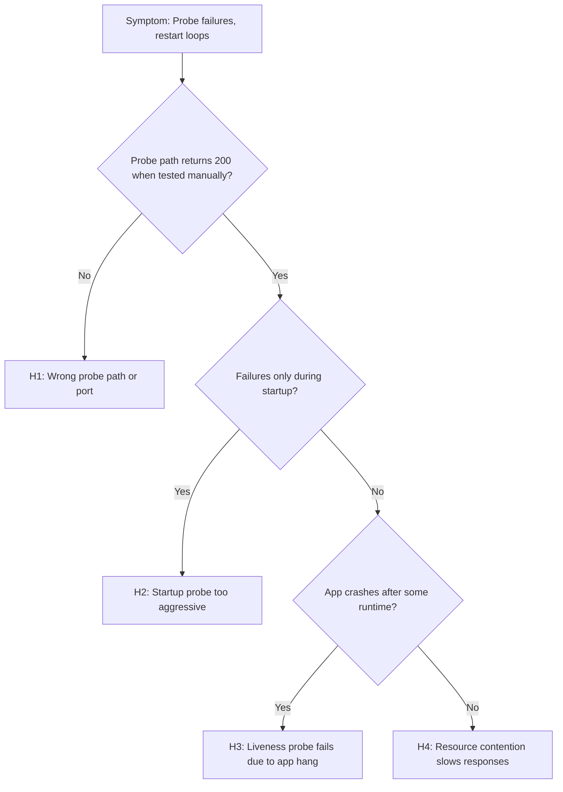

---
hide:
  - toc
content_sources:
  diagrams:
    - id: troubleshooting-decision-flow
      type: flowchart
      source: mslearn-adapted
      based_on:
        - https://learn.microsoft.com/azure/container-apps/health-probes
        - https://learn.microsoft.com/azure/container-apps/troubleshooting
---

# Probe Failure and Slow Start

## 1. Summary

### Symptom

Application eventually works when given enough time, but health probes mark replicas unhealthy before startup completes. Revisions oscillate between starting and failing, never reaching stable healthy state. This is especially common with boot-heavy applications during cold start or after scale-out events.

### Why this scenario is confusing

The application code is correct and the container runs fine locally. The problem is a timing mismatch between how long the app needs to start and how quickly probes expect a response. System logs show probe failures, but the root cause is configuration, not code.

### Troubleshooting decision flow

<!-- diagram-id: troubleshooting-decision-flow -->


## 2. Common Misreadings

- "The endpoint is broken forever" — It may be healthy after warm-up but outside the probe window.
- "Increase replicas first" — Scaling replicas does not fix probe timing mismatches.
- "The app crashes randomly" — Consistent probe timeout pattern indicates configuration issue, not random crashes.
- "Liveness and readiness are the same" — They serve different purposes; misconfiguring either causes different symptoms.
- "Connection refused means app bug" — Often means probe runs before app binds to port.

## 3. Competing Hypotheses

| Hypothesis | Typical Evidence For | Typical Evidence Against |
|---|---|---|
| **H1: Wrong probe path or port** | Consistent 404, connection refused on probe | Probe path returns 200 when tested in container |
| **H2: Startup probe too aggressive** | Failures only during cold start, then healthy | Failures continue long after startup |
| **H3: Liveness probe fails due to app hang** | Failures after running period, app becomes unresponsive | Failures only at startup |
| **H4: Resource contention slows responses** | Probe timeout with high CPU/memory usage | Resources well within limits |

## 4. What to Check First

### Metrics

- Restart count spikes during deployment or scale-out
- Replica count oscillations
- CPU/memory usage during startup

### Logs

```kusto
let AppName = "ca-myapp";
ContainerAppSystemLogs_CL
| where ContainerAppName_s == AppName
| where TimeGenerated > ago(1h)
| where Reason_s == "ProbeFailed" 
   or Log_s has_any ("probe", "readiness", "liveness", "startup", "timeout", "connection refused")
| project TimeGenerated, RevisionName_s, ReplicaName_s, Reason_s, Log_s
| order by TimeGenerated desc
```

### Platform Signals

```bash
# Check probe configuration
az containerapp show --name "$APP_NAME" --resource-group "$RG" \
  --query "properties.template.containers[0].probes" --output json

# Check replica status
az containerapp replica list --name "$APP_NAME" --resource-group "$RG" --output table

# Check system logs for probe events
az containerapp logs show --name "$APP_NAME" --resource-group "$RG" --type system
```

## 5. Evidence to Collect

### Required Evidence

| Evidence | Command/Query | Purpose |
|---|---|---|
| Probe config | `az containerapp show ... --query probes` | Verify path, port, timing |
| System logs | KQL for ProbeFailed events | Find failure pattern |
| Replica status | `az containerapp replica list` | Check restart count |
| Resource config | `az containerapp show ... --query resources` | Verify CPU/memory |
| Console logs | `az containerapp logs --type console` | App startup timing |

### Useful Context

- Application startup time (measured locally)
- Dependencies loaded at startup (DB connections, ML models, caches)
- Recent changes to probe configuration or app code
- Scale event history

## 6. Validation and Disproof by Hypothesis

### H1: Wrong probe path or port

**Signals that support:**

- Consistent 404 Not Found on probe
- Connection refused (probe port doesn't match app port)
- Probe path doesn't exist in application
- Ingress targetPort doesn't match probe port

**Signals that weaken:**

- Probe path returns 200 when tested manually inside container
- Same path works when accessed via ingress

**What to verify:**

```bash
# Check configured probe path and port
az containerapp show --name "$APP_NAME" --resource-group "$RG" \
  --query "properties.template.containers[0].probes" --output json

# Check target port
az containerapp show --name "$APP_NAME" --resource-group "$RG" \
  --query "properties.configuration.ingress.targetPort" --output tsv

# Test probe path manually (if replica is running)
az containerapp exec --name "$APP_NAME" --resource-group "$RG" \
  --command "curl -s -o /dev/null -w '%{http_code}' http://localhost:8000/health"
```

```kusto
// Find specific probe errors
let AppName = "ca-myapp";
ContainerAppSystemLogs_CL
| where ContainerAppName_s == AppName
| where TimeGenerated > ago(2h)
| where Log_s has_any ("404", "connection refused", "no route to host")
| project TimeGenerated, Log_s
```

**Fix:**

```bash
# Update probe path (example YAML)
cat <<EOF > probe-config.yaml
properties:
  template:
    containers:
      - name: myapp
        probes:
          - type: Readiness
            httpGet:
              path: /healthz  # Correct path
              port: 8000      # Correct port
            initialDelaySeconds: 5
            periodSeconds: 10
EOF

az containerapp update --name "$APP_NAME" --resource-group "$RG" --yaml probe-config.yaml
```

### H2: Startup probe too aggressive

**Signals that support:**

- ProbeFailed events only during first 30-60 seconds
- Revision eventually becomes healthy if given more time
- App logs show slow initialization (loading models, warming caches)
- Failures correlate with cold start or scale-out

**Signals that weaken:**

- Failures continue long after startup completes
- App starts quickly but still fails probes

**What to verify:**

```bash
# Check probe timing configuration
az containerapp show --name "$APP_NAME" --resource-group "$RG" \
  --query "properties.template.containers[0].probes[?type=='Startup' || type=='Readiness']" \
  --output json

# Calculate effective probe budget
# Budget = initialDelaySeconds + (periodSeconds × failureThreshold)
```

```kusto
// Check probe failure timing relative to container start
let AppName = "ca-myapp";
let StartEvents = ContainerAppSystemLogs_CL
| where ContainerAppName_s == AppName
| where TimeGenerated > ago(2h)
| where Reason_s == "Started" or Log_s has "Started container"
| project StartTime=TimeGenerated, ReplicaName_s;
let ProbeFailures = ContainerAppSystemLogs_CL
| where ContainerAppName_s == AppName
| where TimeGenerated > ago(2h)
| where Reason_s == "ProbeFailed"
| project FailTime=TimeGenerated, ReplicaName_s;
ProbeFailures
| join kind=inner StartEvents on ReplicaName_s
| extend SecondsSinceStart = datetime_diff('second', FailTime, StartTime)
| where SecondsSinceStart >= 0
| summarize count() by bin(SecondsSinceStart, 10)
| order by SecondsSinceStart asc
```

**Fix:**

```bash
# Increase startup probe tolerance
cat <<EOF > startup-probe.yaml
properties:
  template:
    containers:
      - name: myapp
        probes:
          - type: Startup
            httpGet:
              path: /health
              port: 8000
            initialDelaySeconds: 10    # Wait before first probe
            periodSeconds: 10          # Check every 10s
            failureThreshold: 30       # Allow 30 failures (5 minutes total)
            timeoutSeconds: 5
          - type: Readiness
            httpGet:
              path: /health
              port: 8000
            periodSeconds: 10
            failureThreshold: 3
          - type: Liveness
            httpGet:
              path: /health
              port: 8000
            periodSeconds: 30
            failureThreshold: 3
EOF

az containerapp update --name "$APP_NAME" --resource-group "$RG" --yaml startup-probe.yaml
```

### H3: Liveness probe fails due to app hang

**Signals that support:**

- Probe failures after stable running period (not at startup)
- App logs show blocking operations or deadlocks
- Memory or CPU approaching limits before failure
- Restarts "fix" the issue temporarily

**Signals that weaken:**

- Failures only at startup
- App remains responsive under normal load

**What to verify:**

```kusto
// Correlate liveness failures with runtime
let AppName = "ca-myapp";
ContainerAppSystemLogs_CL
| where ContainerAppName_s == AppName
| where TimeGenerated > ago(6h)
| where Reason_s == "ProbeFailed" and Log_s has "Liveness"
| summarize count() by bin(TimeGenerated, 30m)
| render timechart
```

```bash
# Check if liveness probe is too strict
az containerapp show --name "$APP_NAME" --resource-group "$RG" \
  --query "properties.template.containers[0].probes[?type=='Liveness']" --output json

# Check resource limits
az containerapp show --name "$APP_NAME" --resource-group "$RG" \
  --query "properties.template.containers[0].resources" --output json
```

**Fix:**

```bash
# Make liveness probe more tolerant
# - Increase timeoutSeconds for slow responses
# - Increase failureThreshold to allow temporary blips
# - Use simple endpoint that doesn't depend on external services
```

### H4: Resource contention slows responses

**Signals that support:**

- Probe timeouts (not connection refused or 404)
- High CPU utilization during probe failures
- Memory near limit
- Other containers competing for resources

**Signals that weaken:**

- Resources well within limits
- Fast probe response when tested manually

**What to verify:**

```bash
# Check resource allocation
az containerapp show --name "$APP_NAME" --resource-group "$RG" \
  --query "properties.template.containers[0].resources" --output json

# Check if multiple containers share resources
az containerapp show --name "$APP_NAME" --resource-group "$RG" \
  --query "properties.template.containers | length(@)" --output tsv
```

**Fix:**

```bash
# Increase resource allocation
az containerapp update --name "$APP_NAME" --resource-group "$RG" \
  --cpu 1.0 --memory 2.0Gi

# Or increase probe timeout
# timeoutSeconds: 10  (instead of default 1)
```

## 7. Likely Root Cause Patterns

| Pattern | Frequency | First Signal | Typical Resolution |
|---|---|---|---|
| Startup too slow for default probes | Very common | ProbeFailed at startup only | Increase startup probe tolerance |
| Wrong probe path | Common | 404 in probe logs | Fix probe httpGet.path |
| Port mismatch | Common | Connection refused | Align probe port with app |
| Heavy initialization | Common | Slow apps fail, fast apps succeed | Add startup probe with long window |
| Liveness too strict | Occasional | Restarts after running | Increase liveness tolerance |

## 8. Immediate Mitigations

1. **Quick fix - disable probes temporarily:**
   ```bash
   # Remove probes to let app start (not recommended for production)
   az containerapp update --name "$APP_NAME" --resource-group "$RG" \
     --yaml no-probes.yaml
   ```

2. **Increase startup tolerance:**
   ```bash
   # Give app 5 minutes to start
   # initialDelaySeconds=30 + (periodSeconds=10 × failureThreshold=27) = 300s
   ```

3. **Roll back to previous revision:**
   ```bash
   az containerapp ingress traffic set --name "$APP_NAME" --resource-group "$RG" \
     --revision-weight "<previous-healthy-revision>=100"
   ```

4. **Scale to 0 and back (force fresh start):**
   ```bash
   az containerapp update --name "$APP_NAME" --resource-group "$RG" --min-replicas 0
   # Wait, then:
   az containerapp update --name "$APP_NAME" --resource-group "$RG" --min-replicas 1
   ```

## 9. Prevention

- Model expected cold-start budget per service before deployment
- Run startup timing tests in staging environment
- Use startup probes for boot-heavy applications (separate from liveness)
- Avoid heavy dependency checks inside liveness probes (keep it simple: "am I alive?")
- Document probe configuration in IaC with comments explaining timing choices
- Set up alerts on restart count spikes

## Probe Configuration Best Practices

| Probe Type | Purpose | Path | Timing |
|---|---|---|---|
| Startup | Wait for app to initialize | `/health` or `/ready` | Long timeout (2-5 min) |
| Readiness | Accept traffic when ready | `/ready` (checks deps) | Medium (10-30s intervals) |
| Liveness | Restart if hung | `/health` (simple check) | Long intervals (30s+), tolerant |

```yaml
# Example well-tuned probe configuration
probes:
  - type: Startup
    httpGet:
      path: /health
      port: 8000
    initialDelaySeconds: 10
    periodSeconds: 10
    failureThreshold: 30    # 5 minutes total startup budget
    timeoutSeconds: 5

  - type: Readiness
    httpGet:
      path: /ready
      port: 8000
    periodSeconds: 10
    failureThreshold: 3
    successThreshold: 1

  - type: Liveness
    httpGet:
      path: /health
      port: 8000
    periodSeconds: 30
    failureThreshold: 3
    timeoutSeconds: 10
```

## See Also

- [Container Start Failure](container-start-failure.md)
- [CrashLoop OOM and Resource Pressure](../scaling-and-runtime/crashloop-oom-and-resource-pressure.md)
- [Image Pull Failure](image-pull-failure.md)
- [Revision Failures and Startup KQL](../../kql/system-and-revisions/revision-failures-and-startup.md)
- [Restart Timing Correlation KQL](../../kql/restarts/restart-timing-correlation.md)
- [Probe and Port Mismatch Lab](../../lab-guides/probe-and-port-mismatch.md)

## Sources

- [Health probes in Azure Container Apps](https://learn.microsoft.com/azure/container-apps/health-probes)
- [Troubleshoot Azure Container Apps](https://learn.microsoft.com/azure/container-apps/troubleshooting)
- [Configure liveness, readiness, and startup probes](https://kubernetes.io/docs/tasks/configure-pod-container/configure-liveness-readiness-startup-probes/)
