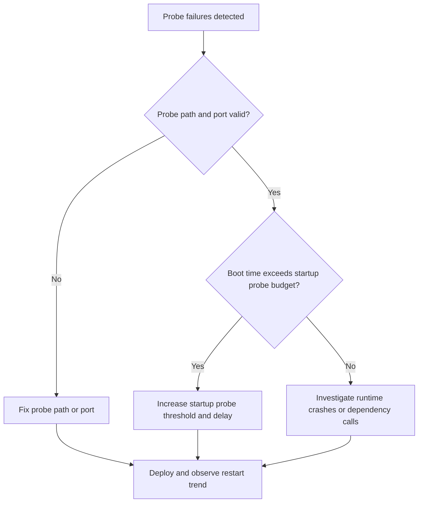

# Probe Failure and Slow Start

This playbook covers cases where the app eventually works, but health probes mark replicas unhealthy before startup completes.

## Symptoms

- Revisions oscillate between starting and failing readiness.
- System logs show probe timeout, connection refused, or non-200 responses.
- Boot-heavy apps fail only on cold start or after scale-out.

## Common Misreadings

!!! warning "Common Misreadings"
    - Misreading: "The endpoint is broken forever." It may be healthy after warm-up but outside startup probe window.
    - Misreading: "Increase replicas first." Scaling replicas does not fix probe timing mismatches.

## Competing Hypotheses

| Hypothesis | Evidence For | Evidence Against |
|---|---|---|
| Startup probe too aggressive | Failures near startup window only | Failures continue long after startup |
| Wrong probe path or port | Consistent 404/connection refused on probe path | Probe path returns 200 when tested in container |
| App boot work too heavy | Failures with migrations/model load then success on retry | Startup is lightweight and deterministic |

## What to Check First

### Metrics

- Restart count spikes during deployment or scale-out.

### Logs

```kusto
let AppName = "my-container-app";
ContainerAppSystemLogs_CL
| where ContainerAppName_s == AppName
| where Log_s has_any ("probe", "readiness", "liveness", "timeout")
| project TimeGenerated, RevisionName_s, ReplicaName_s, Log_s
| order by TimeGenerated desc
```

### Platform Signals

```bash
az containerapp show --name "$APP_NAME" --resource-group "$RG" --query "properties.template.containers[0].probes" --output json
az containerapp logs show --name "$APP_NAME" --resource-group "$RG" --type system
```

## Evidence Collection

```bash
az containerapp exec --name "$APP_NAME" --resource-group "$RG" --command "python -c 'import urllib.request; print(urllib.request.urlopen("http://127.0.0.1:8000/health").status)'"
az containerapp show --name "$APP_NAME" --resource-group "$RG" --query "properties.template.containers[0].resources" --output json
az containerapp replica list --name "$APP_NAME" --resource-group "$RG" --output table
```

## Decision Flow



## Resolution Steps

1. Ensure probe path exists and returns `200` without external dependency blocking.
2. Increase startup probe window (`initialDelaySeconds`, `failureThreshold`, `periodSeconds`) for slow boot workloads.
3. Keep readiness separate from liveness when startup sequence is long.
4. Re-test rollout and validate reduced restarts.

## Prevention

- Model expected cold-start budget per service.
- Run startup/load tests before production rollout.
- Avoid heavy dependency checks inside liveness probes.

## See Also

- [Container Start Failure](container-start-failure.md)
- [CrashLoop OOM and Resource Pressure](../scaling-and-runtime/crashloop-oom-and-resource-pressure.md)
- [Revision Failures and Startup KQL](../../kql/system-and-revisions/revision-failures-and-startup.md)
