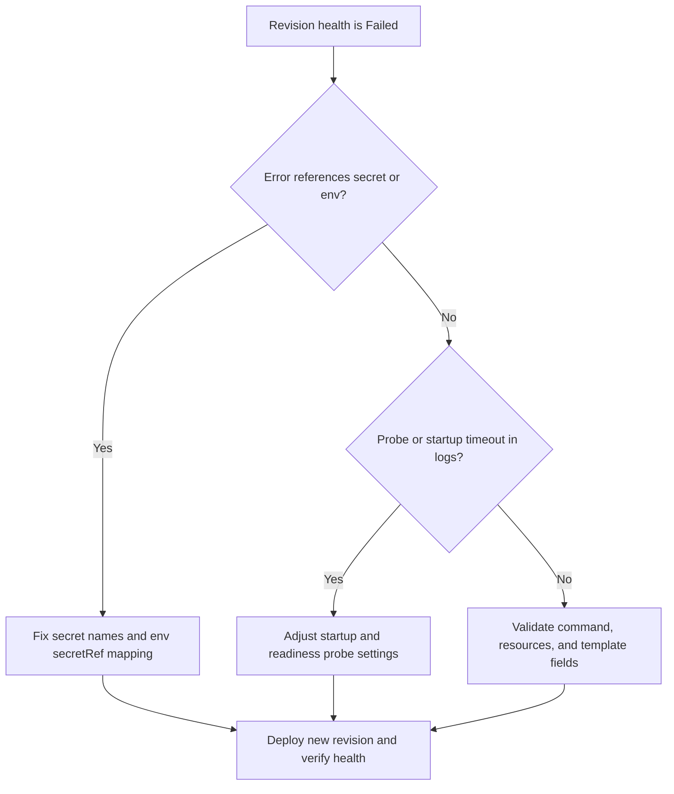

# Revision Provisioning Failure

Use this playbook when a new revision is created but never progresses to healthy, active state.

## Symptoms

- Latest revision shows `healthState=Failed`.
- Deployment command returns success, but no healthy replicas appear.
- System logs show validation, secret, probe, or template errors.

## Common Misreadings

!!! warning "Common Misreadings"
    - Misreading: "Deployment succeeded, so runtime must be fine." Control-plane acceptance does not guarantee runtime readiness.
    - Misreading: "It is always image pull." Provisioning can fail due to invalid template or missing secret reference.

## Competing Hypotheses

| Hypothesis | Evidence For | Evidence Against |
|---|---|---|
| Invalid template settings | Immediate `Failed`, no long startup timeline | Same template works in another revision |
| Missing or mismatched secret reference | Errors mention `secretRef` or env unresolved | All referenced secrets resolve correctly |
| Probe/startup mismatch | Health probe failures before app ready | No probe errors in system logs |

## What to Check First

### Metrics

- Revision failure count and failed deployment events in the Container App overview.

### Logs

```kusto
let AppName = "my-container-app";
ContainerAppSystemLogs_CL
| where ContainerAppName_s == AppName
| where Log_s has_any ("Failed", "provision", "secret", "probe", "invalid")
| project TimeGenerated, RevisionName_s, Reason_s, Log_s
| order by TimeGenerated desc
```

### Platform Signals

```bash
az containerapp revision list --name "$APP_NAME" --resource-group "$RG" --output table
az containerapp show --name "$APP_NAME" --resource-group "$RG" --query "properties.template" --output json
az containerapp secret list --name "$APP_NAME" --resource-group "$RG"
```

## Evidence Collection

```bash
az containerapp logs show --name "$APP_NAME" --resource-group "$RG" --type system
az containerapp show --name "$APP_NAME" --resource-group "$RG" --query "properties.template.containers[0].probes" --output json
az containerapp show --name "$APP_NAME" --resource-group "$RG" --query "properties.template.containers[0].resources" --output json
az containerapp show --name "$APP_NAME" --resource-group "$RG" --query "properties.template.containers[0].env" --output json
```

## Decision Flow



## Resolution Steps

1. Validate secret names and ensure every `secretRef` exists.
2. Confirm resource requests/limits and probe settings are realistic for startup behavior.
3. Fix any invalid template fields and deploy a new revision.
4. Confirm the new revision becomes active and healthy.

## Prevention

- Enforce template validation checks in CI.
- Keep a known-good baseline revision for rollback.
- Standardize probes and env naming conventions across services.

## See Also

- [Probe Failure and Slow Start](probe-failure-and-slow-start.md)
- [Secret and Key Vault Reference Failure](../identity-and-configuration/secret-and-key-vault-reference-failure.md)
- [Revision Failures and Startup KQL](../../kql/system-and-revisions/revision-failures-and-startup.md)
