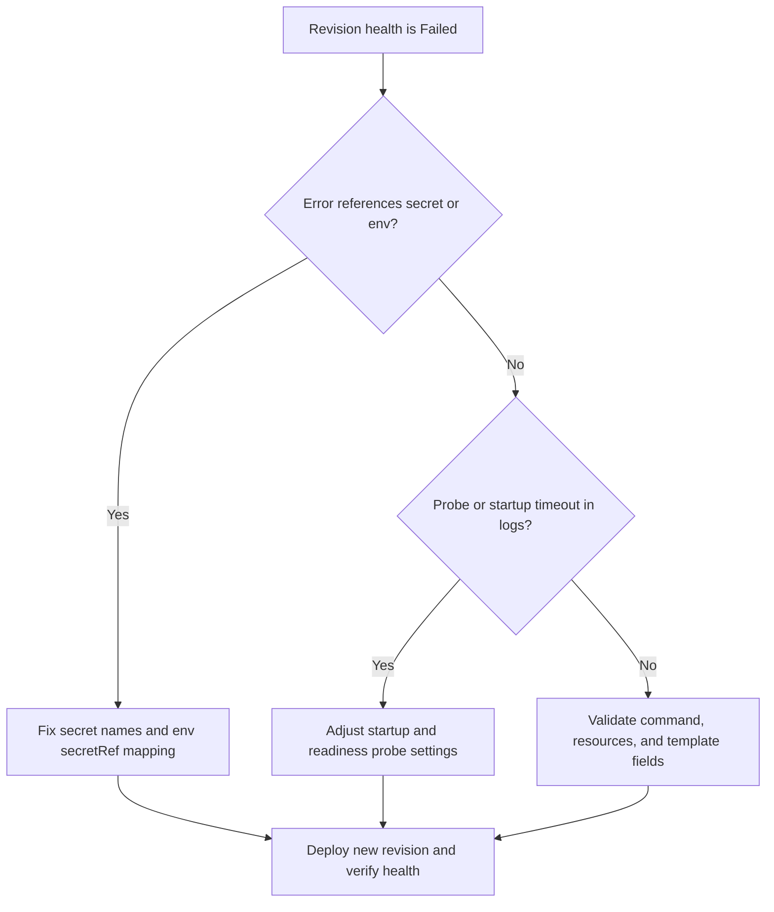

---
content_sources:
diagrams:
  - id: troubleshooting-decision-flow
    type: flowchart
    source: mslearn-adapted
    based_on:
      - https://learn.microsoft.com/azure/container-apps/revisions
      - https://learn.microsoft.com/azure/container-apps/health-probes
      - https://learn.microsoft.com/azure/container-apps/troubleshooting
content_validation:
  status: verified
  last_reviewed: "2026-04-12"
  reviewer: ai-agent
  core_claims:
    - claim: "Each revision in Azure Container Apps is an immutable snapshot of a container app version."
      source: "https://learn.microsoft.com/azure/container-apps/revisions"
      verified: true
    - claim: "Azure Container Apps supports startup, readiness, and liveness probes."
      source: "https://learn.microsoft.com/azure/container-apps/health-probes"
      verified: true
---

# Revision Provisioning Failure

## 1. Summary

### Symptom

A new revision is created but never progresses to a healthy, active state. Typical signs are `healthState=Failed`, deployment commands that return success while no healthy replicas appear, and system logs that show validation, secret, probe, or template errors.

### Why this scenario is confusing

Control-plane success is easy to misread as workload success. A deployment command can succeed while the new revision still fails during provisioning because of invalid template settings, unresolved secrets, or startup and probe mismatches.

### Troubleshooting decision flow

<!-- diagram-id: troubleshooting-decision-flow -->


## 2. Common Misreadings

- "Deployment succeeded, so runtime must be fine." Control-plane acceptance does not guarantee runtime readiness.
- "It is always image pull." Provisioning can fail due to invalid template or missing secret reference.

## 3. Competing Hypotheses

| Hypothesis | Typical Evidence For | Typical Evidence Against |
|---|---|---|
| Invalid template settings | Immediate `Failed`, no long startup timeline | Same template works in another revision |
| Missing or mismatched secret reference | Errors mention `secretRef` or env unresolved | All referenced secrets resolve correctly |
| Probe/startup mismatch | Health probe failures before app ready | No probe errors in system logs |

## 4. What to Check First

### Metrics

- Revision failure count and failed deployment events in the Container App overview.

### Logs

```kusto
let AppName = "ca-myapp";
ContainerAppSystemLogs_CL
| where ContainerAppName_s == AppName
| where Log_s has_any ("Failed", "provision", "secret", "probe", "invalid")
| project TimeGenerated, RevisionName_s, Reason_s, Log_s
| order by TimeGenerated desc
```

### Platform Signals

```bash
az containerapp revision list --name "$APP_NAME" --resource-group "$RG" --output table
az containerapp show --name "$APP_NAME" --resource-group "$RG" --query "properties.template" --output json
az containerapp secret list --name "$APP_NAME" --resource-group "$RG"
```

## 5. Evidence to Collect

### Required Evidence

| Evidence | Command/Query | Purpose |
|---|---|---|
| Revision state | `az containerapp revision list --name "$APP_NAME" --resource-group "$RG" --output table` | Confirm the new revision never becomes healthy |
| Full template | `az containerapp show --name "$APP_NAME" --resource-group "$RG" --query "properties.template" --output json` | Validate container configuration fields |
| Secret inventory | `az containerapp secret list --name "$APP_NAME" --resource-group "$RG"` | Check unresolved `secretRef` candidates |
| System provisioning logs | `az containerapp logs show --name "$APP_NAME" --resource-group "$RG" --type system` | Identify immediate provisioning failures |
| Probe configuration | `az containerapp show --name "$APP_NAME" --resource-group "$RG" --query "properties.template.containers[0].probes" --output json` | Validate startup/readiness behavior |
| Resource configuration | `az containerapp show --name "$APP_NAME" --resource-group "$RG" --query "properties.template.containers[0].resources" --output json` | Check resource-related misconfiguration |
| Environment mapping | `az containerapp show --name "$APP_NAME" --resource-group "$RG" --query "properties.template.containers[0].env" --output json` | Confirm env and secret references |
| Provisioning-related system logs | KQL on `ContainerAppSystemLogs_CL` | Correlate failure reason over time |

### Useful Context

- Whether the failure started after a template or secret change.
- Whether an older revision with the same image is healthy.
- Whether startup behavior changed enough to require different probe timing.

Observed healthy revision lifecycle (use as comparison timeline):

```text
ContainerAppUpdate  → Updating containerApp: ca-myapp
RevisionCreation    → Creating new revision
ContainerCreated    → Created container 'ca-myapp'
ContainerStarted    → Started container 'ca-myapp'
RevisionReady       → Revision ready
ContainerAppReady   → Running state reached
```

## 6. Validation and Disproof by Hypothesis

### H1: Invalid template settings

**Signals that support:**

- Revision fails immediately.
- No long startup timeline appears.
- System logs show `invalid` or other template-related failures.
- Full template output contains suspect command, resource, or container fields.

**Signals that weaken:**

- Same template works in another revision.
- Logs show the container starts and then fails later instead of failing during provisioning validation.

**What to verify:**

```bash
az containerapp revision list --name "$APP_NAME" --resource-group "$RG" --output table
az containerapp show --name "$APP_NAME" --resource-group "$RG" --query "properties.template" --output json
az containerapp logs show --name "$APP_NAME" --resource-group "$RG" --type system
az containerapp show --name "$APP_NAME" --resource-group "$RG" --query "properties.template.containers[0].resources" --output json
```

**Disproof logic:**

If the template matches a known-good revision and logs instead show later-stage probe or startup issues, template invalidity is less likely.

### H2: Missing or mismatched secret reference

**Signals that support:**

- Errors mention `secretRef` or env unresolved.
- Secret inventory does not contain a referenced secret.
- Environment mapping points to a missing or wrong secret name.

**Signals that weaken:**

- All referenced secrets resolve correctly.
- System logs do not mention secret resolution problems.

**What to verify:**

```bash
az containerapp secret list --name "$APP_NAME" --resource-group "$RG"
az containerapp show --name "$APP_NAME" --resource-group "$RG" --query "properties.template.containers[0].env" --output json
az containerapp logs show --name "$APP_NAME" --resource-group "$RG" --type system
```

**Disproof logic:**

If every `secretRef` maps cleanly to an existing secret and system logs do not mention secret failures, this hypothesis is weakened.

### H3: Probe/startup mismatch

**Signals that support:**

- Health probe failures occur before the app is ready.
- System logs show probe-related failures.
- The container starts but never reaches `RevisionReady`.

**Signals that weaken:**

- No probe errors in system logs.
- The app becomes ready when tested with relaxed startup timing.

**What to verify:**

```bash
az containerapp logs show --name "$APP_NAME" --resource-group "$RG" --type system
az containerapp show --name "$APP_NAME" --resource-group "$RG" --query "properties.template.containers[0].probes" --output json
```

```kusto
let AppName = "ca-myapp";
ContainerAppSystemLogs_CL
| where ContainerAppName_s == AppName
| where Log_s has_any ("Failed", "provision", "secret", "probe", "invalid")
| project TimeGenerated, RevisionName_s, Reason_s, Log_s
| order by TimeGenerated desc
```

**Disproof logic:**

If no probe failures appear and the container never even reaches the probe stage, startup timing is not the main cause.

## 7. Likely Root Cause Patterns

| Pattern | Frequency | First Signal | Typical Resolution |
|---|---|---|---|
| Invalid template field or command | Common | Immediate `Failed` state | Fix template settings and redeploy |
| Missing secret or wrong `secretRef` | Common | Secret-related provisioning errors | Correct secret inventory and env mapping |
| Probe too aggressive for startup time | Common | Probe failures before readiness | Adjust startup and readiness probes |

## 8. Immediate Mitigations

1. Validate secret names and ensure every `secretRef` exists.
2. Confirm resource requests/limits and probe settings are realistic for startup behavior.
3. Fix any invalid template fields and deploy a new revision.
4. Confirm the new revision becomes active and healthy.

## 9. Prevention

- Enforce template validation checks in CI.
- Keep a known-good baseline revision for rollback.
- Standardize probes and env naming conventions across services.

## See Also

- [Probe Failure and Slow Start](probe-failure-and-slow-start.md)
- [Secret and Key Vault Reference Failure](../identity-and-configuration/secret-and-key-vault-reference-failure.md)
- [Revision Failures and Startup KQL](../../kql/system-and-revisions/revision-failures-and-startup.md)

## Sources

- [Revisions in Azure Container Apps](https://learn.microsoft.com/azure/container-apps/revisions)
- [Health probes in Azure Container Apps](https://learn.microsoft.com/azure/container-apps/health-probes)
- [Troubleshoot Azure Container Apps](https://learn.microsoft.com/azure/container-apps/troubleshooting)
