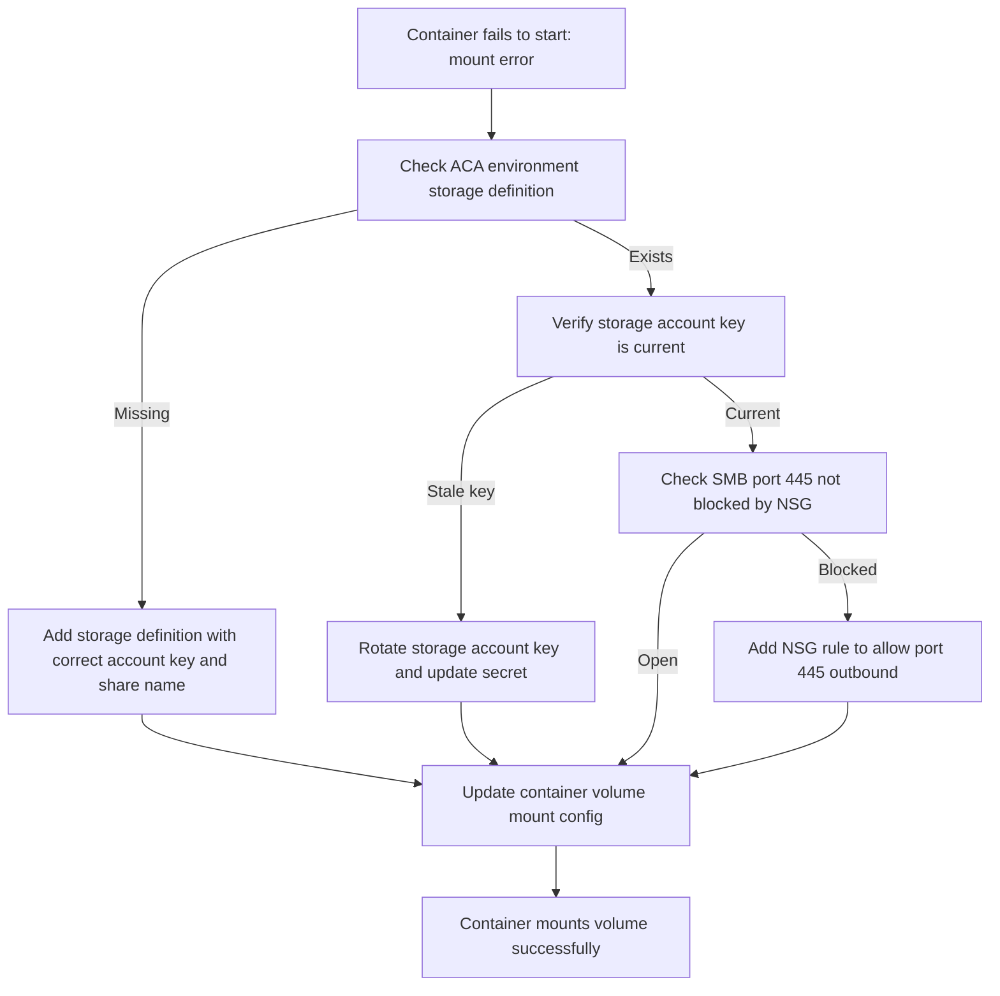

---
content_sources:
  - type: mslearn-adapted
    url: https://learn.microsoft.com/en-us/azure/container-apps/troubleshoot-storage-mount-failures
content_validation:
  status: pending_review
  last_reviewed: 2026-04-29
  reviewer: agent
  core_claims:
    - claim: "Azure Container Apps requires environment storage definitions before a revision can mount an Azure file share."
      source: https://learn.microsoft.com/en-us/azure/container-apps/storage-mounts-azure-files
      verified: false
    - claim: "Azure Container Apps does not support identity-based access to Azure file shares for storage mounts."
      source: https://learn.microsoft.com/en-us/azure/container-apps/storage-mounts-azure-files
      verified: false
    - claim: "The Azure portal Diagnose and solve problems experience includes storage mount diagnostics for Container Apps."
      source: https://learn.microsoft.com/en-us/azure/container-apps/troubleshoot-storage-mount-failures
      verified: false
diagrams:
  - id: azure-files-mount-failure-flow
    type: flowchart
    source: self-generated
    justification: "Troubleshooting flow synthesized from MSLearn ACA networking and storage documentation"

---

# Azure Files Mount Failure

<!-- diagram-id: azure-files-mount-failure-flow -->


## Symptom

The revision fails to start or stays unhealthy after a deployment that adds an Azure Files volume. System logs commonly show `Error mounting volume <VOLUME_NAME>.` The app may never reach a ready state even though the image and ingress configuration are otherwise valid.

## Possible Causes

- The Container Apps environment does not have a valid Azure Files storage definition.
- The storage account name, account key, or file share name is incorrect.
- The app revision references a `storageName` or volume name that does not match the environment storage object.
- The mount path is valid YAML but incorrect for the containerized workload.
- Network or platform access to the storage account or file share is blocked.
- The share was created for a different protocol expectation than the app configuration.

## Diagnosis Steps

1. Confirm the symptom in system logs and identify the failing revision.
2. Inspect the app template to verify `volumes`, `storageName`, and `volumeMounts` values.
3. Confirm that the Container Apps environment has an Azure Files storage definition with the expected account and share.
4. Compare the environment storage object with the revision YAML for exact name alignment.
5. If the CLI configuration looks correct, use the Azure portal **Diagnose and solve problems** experience for storage-mount analysis.

```bash
az containerapp show \
    --name "$APP_NAME" \
    --resource-group "$RG" \
    --output yaml

az containerapp env storage list \
    --name "$CONTAINER_ENV" \
    --resource-group "$RG" \
    --output table
```

| Command | Why it is used |
|---|---|
| `az containerapp show --name "$APP_NAME" --resource-group "$RG" --output yaml` | Exports the live revision template so you can verify `volumes`, `storageName`, and `volumeMounts`. |
| `az containerapp env storage list --name "$CONTAINER_ENV" --resource-group "$RG" --output table` | Lists all storage definitions on the environment to confirm whether the expected entry exists and has the correct share name. |

If you need to compare and correct the YAML, capture it first and then review the storage section:

```bash
az containerapp show \
    --name "$APP_NAME" \
    --resource-group "$RG" \
    --output yaml > app.yaml
```

Verify that the template contains matching values similar to the following pattern:

```yaml
template:
  volumes:
    - name: content-volume
      storageName: azurefilesdocs
      storageType: AzureFile
  containers:
    - image: mcr.microsoft.com/azuredocs/containerapps-helloworld:latest
      name: main
      volumeMounts:
        - volumeName: content-volume
          mountPath: /mnt/content
```

## Resolution

1. Recreate or fix the environment storage definition with the correct storage account name, key, share name, and `AzureFile` type.
2. Update the app YAML so the volume `storageName` matches the environment storage object exactly.
3. Ensure the container `volumeMounts.volumeName` matches the volume `name` exactly.
4. Redeploy the corrected YAML to create a new revision.
5. Re-check system logs and revision status after deployment.

```bash
az containerapp update \
    --name "$APP_NAME" \
    --resource-group "$RG" \
    --yaml app.yaml \
    --output table
```

| Command | Why it is used |
|---|---|
| `az containerapp update --name "$APP_NAME" --resource-group "$RG" --yaml app.yaml --output table` | Applies the corrected volume definition and creates a new revision for validation. |

If the issue persists after configuration repair, inspect the **Storage Mount Failures** detector in the Azure portal. That detector is useful when the YAML looks correct but the platform still cannot mount the share for a specific revision.

## Prevention

- Standardize one naming convention for `storageName`, volume `name`, and `volumeMounts.volumeName`.
- Validate environment storage objects before adding mounts to production revisions.
- Keep Azure Files credentials in a controlled operational runbook because Container Apps storage mounts do not use identity-based share access.
- Prefer a pre-deployment YAML review for volume sections whenever a new share or new mount path is introduced.
- Record the expected mount path for each workload so application teams do not mount the same share at inconsistent paths.

## See Also

- [Azure Files Mount Failure Lab](../../lab-guides/azure-files-mount-failure.md)
- [Volume Permission Denied](volume-permission-denied.md)
- [Container Start Failure](../startup-and-provisioning/container-start-failure.md)
- [Revision Provisioning Failure](../startup-and-provisioning/revision-provisioning-failure.md)

## Sources

- [Troubleshoot storage mount failures in Azure Container Apps](https://learn.microsoft.com/en-us/azure/container-apps/troubleshoot-storage-mount-failures)
- [Use storage mounts in Azure Container Apps](https://learn.microsoft.com/en-us/azure/container-apps/storage-mounts)
- [Mount Azure Files in Azure Container Apps](https://learn.microsoft.com/en-us/azure/container-apps/storage-mounts-azure-files)
