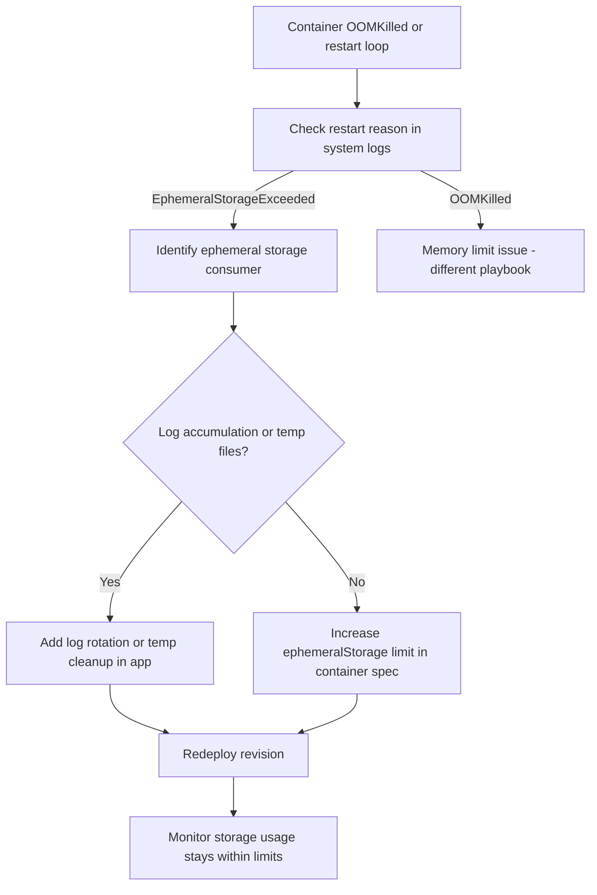

---
content_sources:
  - type: mslearn-adapted
    url: https://learn.microsoft.com/en-us/azure/container-apps/storage-mounts
content_validation:
  status: pending_review
  last_reviewed: 2026-04-29
  reviewer: agent
  core_claims:
    - claim: "Azure Container Apps supports temporary `EmptyDir` storage mounts for replica-scoped temporary storage."
      source: https://learn.microsoft.com/en-us/azure/container-apps/storage-mounts
      verified: false
    - claim: "Temporary storage in Azure Container Apps is ephemeral and should not be used for persistent data."
      source: https://learn.microsoft.com/en-us/azure/container-apps/storage-mounts
      verified: false
    - claim: "When persistent data is required, Azure Files is the supported storage-mount option for Azure Container Apps."
      source: https://learn.microsoft.com/en-us/azure/container-apps/storage-mounts
      verified: false
diagrams:
  - id: emptydir-disk-full-flow
    type: flowchart
    source: self-generated
    justification: "Troubleshooting flow synthesized from MSLearn ACA networking and storage documentation"

---

# EmptyDir Disk Full

<!-- diagram-id: emptydir-disk-full-flow -->


## Symptom

The application starts, writes to a temporary path, and later fails with disk-full behavior such as write errors, temporary-file creation failures, or crash loops after log or cache growth. The failure often appears only after the workload has processed enough data to exhaust ephemeral storage.

## Possible Causes

- The workload writes too much data into an `EmptyDir` mount.
- Temporary files are never rotated or cleaned up.
- The app uses ephemeral storage for persistent artifacts, uploads, or caches.
- The replica has insufficient ephemeral storage for the workload profile.
- A log-heavy or batch process generates more scratch data than expected.

## Diagnosis Steps

1. Confirm that the failing path is backed by `EmptyDir` rather than Azure Files.
2. Review the revision YAML to locate temporary volume definitions and the configured `ephemeralStorage` value.
3. Correlate application failures with bursty writes, exports, caches, or large intermediate files.
4. Determine whether the workload really needs persistent storage instead of temporary scratch space.

```bash
az containerapp show \
    --name "$APP_NAME" \
    --resource-group "$RG" \
    --output yaml > app.yaml
```

Inspect the exported YAML for patterns similar to the following:

```yaml
template:
  containers:
    - name: main
      resources:
        cpu: 0.5
        memory: 1Gi
        ephemeralStorage: 2Gi
      volumeMounts:
        - volumeName: scratch
          mountPath: /tmp/data
  volumes:
    - name: scratch
      storageType: EmptyDir
```

| Command | Why it is used |
|---|---|
| `az containerapp show --name "$APP_NAME" --resource-group "$RG" --output yaml > app.yaml` | Captures the live revision definition so you can verify `EmptyDir` usage and current ephemeral storage allocation. |

Signals that support this diagnosis include rapid failure after large uploads, export jobs, decompression steps, or application logs written into a temporary path inside the container.

## Resolution

Choose the smallest fix that matches the workload:

1. Reduce temporary-file usage and clean up scratch data earlier in the execution path.
2. Increase `ephemeralStorage` if the workload is expected to use more temporary storage for each replica.
3. Move persistent or shared data to Azure Files instead of `EmptyDir`.
4. Redeploy the new revision and validate that the failure no longer appears under the same workload.

Example YAML change:

```yaml
template:
  containers:
    - name: main
      resources:
        cpu: 0.5
        memory: 1Gi
        ephemeralStorage: 4Gi
```

Apply the updated YAML:

```bash
az containerapp update \
    --name "$APP_NAME" \
    --resource-group "$RG" \
    --yaml app.yaml \
    --output table
```

| Command | Why it is used |
|---|---|
| `az containerapp update --name "$APP_NAME" --resource-group "$RG" --yaml app.yaml --output table` | Deploys the revised ephemeral storage setting or alternative volume configuration. |

If the workload requires data durability across restarts or across replicas, replace `EmptyDir` with Azure Files instead of only increasing scratch capacity.

## Prevention

- Treat `EmptyDir` as replica-scoped scratch space only, not as a persistence layer.
- Estimate temporary-file growth during design reviews for export, media, ETL, and cache-heavy paths.
- Add application cleanup logic for transient artifacts.
- Store shared or durable data on Azure Files or another external persistence service.
- Re-test worst-case write volume before promoting revisions that change archive, cache, or upload behavior.

## See Also

- [EmptyDir Disk Full Lab](../../lab-guides/emptydir-disk-full.md)
- [Azure Files Mount Failure](azure-files-mount-failure.md)
- [CrashLoop OOM and Resource Pressure](../scaling-and-runtime/crashloop-oom-and-resource-pressure.md)

## Sources

- [Use storage mounts in Azure Container Apps](https://learn.microsoft.com/en-us/azure/container-apps/storage-mounts)
- [Troubleshoot storage mount failures in Azure Container Apps](https://learn.microsoft.com/en-us/azure/container-apps/troubleshoot-storage-mount-failures)
