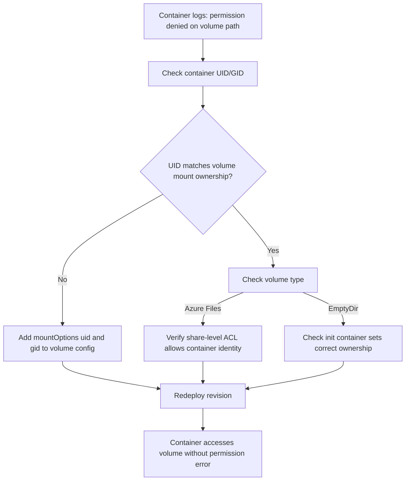

---
content_sources:
  - type: mslearn-adapted
    url: https://learn.microsoft.com/en-us/azure/container-apps/storage-mounts-azure-files
content_validation:
  status: pending_review
  last_reviewed: 2026-04-29
  reviewer: agent
  core_claims:
    - claim: "Azure Container Apps supports mount options on Azure Files volume definitions."
      source: https://learn.microsoft.com/en-us/azure/container-apps/storage-mounts-azure-files
      verified: false
    - claim: "Linux CIFS mount options such as `dir_mode`, `file_mode`, `uid`, and `gid` control file-access behavior for Azure Files SMB mounts."
      source: https://learn.microsoft.com/en-us/troubleshoot/azure/azure-kubernetes/storage/mountoptions-settings-azure-files
      verified: false
    - claim: "Azure Container Apps storage troubleshooting includes Azure Files mount-failure workflows."
      source: https://learn.microsoft.com/en-us/azure/container-apps/troubleshoot-storage-mount-failures
      verified: false
diagrams:
  - id: volume-permission-denied-flow
    type: flowchart
    source: self-generated
    justification: "Troubleshooting flow synthesized from MSLearn ACA networking and storage documentation"

---

# Volume Permission Denied

<!-- diagram-id: volume-permission-denied-flow -->


## Symptom

The revision fails during startup or the container cannot read or write the mounted share even though the storage account and share name are correct. A common error pattern is `mount error(13): Permission denied`, often accompanied by Linux CIFS mount details in system logs.

## Possible Causes

- The Azure Files share mounts successfully only with different Linux permission or ownership settings.
- The workload runs as a user that cannot access the mounted path with the current default mode bits.
- `mountOptions` are missing or incompatible with the workload's file access expectations.
- The app references the right share but the wrong volume or mount path.
- The share configuration is correct, but the revision needs a new deployment with updated mount options.

## Diagnosis Steps

1. Confirm the exact error string in system logs, especially `mount error(13): Permission denied`.
2. Export the app YAML and inspect the Azure Files volume definition.
3. Check whether `mountOptions` are absent or clearly mismatched with the process user.
4. Compare the intended runtime user with the mounted directory ownership and mode expectations.

```bash
az containerapp show \
    --name "$APP_NAME" \
    --resource-group "$RG" \
    --output yaml > app.yaml
```

Look for an Azure Files volume similar to this pattern:

```yaml
template:
  volumes:
    - name: web-configuration
      storageName: azurefilesdocs
      storageType: AzureFile
      mountOptions: dir_mode=0777,file_mode=0777,uid=1000,gid=1000,mfsymlinks,nosharesock,cache=none
```

| Command | Why it is used |
|---|---|
| `az containerapp show --name "$APP_NAME" --resource-group "$RG" --output yaml > app.yaml` | Exports the live revision so you can inspect the Azure Files mount definition and current `mountOptions`. |

If logs show the correct share path but permission errors continue, treat `mountOptions` as the first fix candidate rather than re-creating the entire app.

## Resolution

1. Add or update `mountOptions` with values appropriate for the workload, such as `dir_mode`, `file_mode`, `uid`, and `gid`.
2. Ensure the volume definition still uses the correct `storageName` and `storageType: AzureFile`.
3. Redeploy the YAML to create a new revision.
4. Validate that the mounted path is now readable and writable by the container process.

Example volume definition:

```yaml
template:
  volumes:
    - name: web-configuration
      storageName: azurefilesdocs
      storageType: AzureFile
      mountOptions: dir_mode=0777,file_mode=0777,uid=1000,gid=1000,mfsymlinks,nosharesock,cache=none
```

Use broad `0777` values only as a short-lived diagnostic step. After you confirm the root cause, reduce `dir_mode`, `file_mode`, `uid`, and `gid` to the least permissive values that still satisfy the workload.

```bash
az containerapp update \
    --name "$APP_NAME" \
    --resource-group "$RG" \
    --yaml app.yaml \
    --output table
```

| Command | Why it is used |
|---|---|
| `az containerapp update --name "$APP_NAME" --resource-group "$RG" --yaml app.yaml --output table` | Applies corrected mount options and creates a new revision for permission validation. |

When you adjust `mountOptions`, keep the change minimal and aligned to workload requirements. Broad `0777` examples can be useful for diagnosis, but production workloads should move toward the least permissive settings that still satisfy application behavior.

## Prevention

- Document the expected container user ID and group ID for workloads that mount Azure Files.
- Keep a tested `mountOptions` baseline for each workload family.
- Validate file-write and file-read behavior in pre-production after changing container users or base images.
- Avoid introducing ambiguous mount paths that make permission issues harder to isolate.
- Reuse known-good Azure Files mount templates instead of hand-editing each revision from scratch.

## See Also

- [Volume Permission Denied Lab](../../lab-guides/volume-permission-denied.md)
- [Azure Files Mount Failure](azure-files-mount-failure.md)
- [Container Start Failure](../startup-and-provisioning/container-start-failure.md)

## Sources

- [Mount Azure Files in Azure Container Apps](https://learn.microsoft.com/en-us/azure/container-apps/storage-mounts-azure-files)
- [Troubleshoot storage mount failures in Azure Container Apps](https://learn.microsoft.com/en-us/azure/container-apps/troubleshoot-storage-mount-failures)
- [Use mountOptions settings in Azure Files](https://learn.microsoft.com/en-us/troubleshoot/azure/azure-kubernetes/storage/mountoptions-settings-azure-files)
