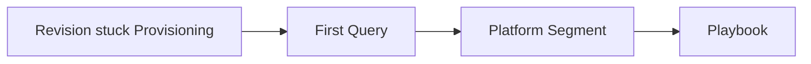

---
hide:
  - toc
---

# Quick Diagnosis Cards

One-page reference cards for rapid incident triage. Each card maps: **Symptom → First Query → Platform Segment → Playbook**.

Use these when you have 60 seconds to identify the failure category.

---

## Card 1: Image Pull Failure



| Step | Action |
|---|---|
| **Symptom** | New revision stuck in "Provisioning" state, never becomes "Running" |
| **First Query** | `ContainerAppSystemLogs \| where TimeGenerated > ago(15m) \| where Log_s has_any ("pull", "image", "auth", "401", "403", "manifest") \| take 50` |
| **What to Look For** | `unauthorized`, `manifest unknown`, `connection refused`. Check ACR name and credentials. |
| **Platform Segment** | Startup / Provisioning |
| **Playbook** | [Image Pull Failure](playbooks/startup-and-provisioning/image-pull-failure.md) |

**Quick CLI Check:**

```bash
az containerapp revision list --resource-group $RG --name $APP_NAME --query "[].{name:name, status:properties.runningState}" --output table
```

---

## Card 2: Container Start Failure (CrashLoopBackOff)

| Step | Action |
|---|---|
| **Symptom** | Container starts but crashes repeatedly, revision never healthy |
| **First Query** | `ContainerAppConsoleLogs \| where TimeGenerated > ago(30m) \| where Log_s has_any ("error", "exception", "traceback", "failed", "exit") \| take 100` |
| **What to Look For** | Application exceptions, missing environment variables, port binding issues (`EADDRINUSE`). |
| **Platform Segment** | Startup / Provisioning |
| **Playbook** | [Container Start Failure](playbooks/startup-and-provisioning/container-start-failure.md) |

**Quick CLI Check:**

```bash
az containerapp logs show --resource-group $RG --name $APP_NAME --type console --tail 100
```

---

## Card 3: Health Probe Failure / Slow Start

| Step | Action |
|---|---|
| **Symptom** | Container starts but probe times out, revision marked unhealthy |
| **First Query** | `ContainerAppSystemLogs \| where TimeGenerated > ago(30m) \| where Log_s has_any ("probe", "health", "liveness", "readiness", "unhealthy") \| take 50` |
| **What to Look For** | Probe timeout, wrong port, path returning non-2xx. Check `targetPort` vs actual listening port. |
| **Platform Segment** | Startup / Provisioning |
| **Playbook** | [Probe Failure and Slow Start](playbooks/startup-and-provisioning/probe-failure-and-slow-start.md) |

**Quick CLI Check:**

```bash
az containerapp show --resource-group $RG --name $APP_NAME --query "properties.template.containers[0].probes"
```

---

## Card 4: Ingress Not Reachable (502/503)

| Step | Action |
|---|---|
| **Symptom** | External requests return 502/503, app appears running |
| **First Query** | `ContainerAppSystemLogs \| where TimeGenerated > ago(1h) \| where Log_s has_any ("ingress", "upstream", "502", "503", "connection refused") \| take 50` |
| **What to Look For** | No healthy replicas, ingress disabled, port mismatch between ingress and container. |
| **Platform Segment** | Ingress / Networking |
| **Playbook** | [Ingress Not Reachable](playbooks/ingress-and-networking/ingress-not-reachable.md) |

**Quick CLI Check:**

```bash
az containerapp ingress show --resource-group $RG --name $APP_NAME
az containerapp replica list --resource-group $RG --name $APP_NAME --query "[].{name:name, status:properties.runningState}"
```

---

## Card 5: DNS / Private Endpoint Resolution Failure

| Step | Action |
|---|---|
| **Symptom** | App cannot reach private resources, DNS errors in logs |
| **First Query** | `ContainerAppConsoleLogs \| where TimeGenerated > ago(1h) \| where Log_s has_any ("getaddrinfo", "Name or service not known", "NXDOMAIN", "DNS", "resolve") \| take 50` |
| **What to Look For** | Private DNS zone not linked to VNet, incorrect custom DNS server, missing Private Endpoint. |
| **Platform Segment** | Ingress / Networking |
| **Playbook** | [Internal DNS and Private Endpoint Failure](playbooks/ingress-and-networking/internal-dns-and-private-endpoint-failure.md) |

**Quick CLI Check:**

```bash
# Check environment VNet configuration
az containerapp env show --resource-group $RG --name $ENVIRONMENT_NAME --query "properties.vnetConfiguration"
```

---

## Card 6: HTTP Scaling Not Triggering

| Step | Action |
|---|---|
| **Symptom** | Traffic increases but replica count stays at minimum |
| **First Query** | `ContainerAppSystemLogs \| where TimeGenerated > ago(2h) \| where Log_s has_any ("scale", "replica", "KEDA", "concurrency") \| summarize count() by bin(TimeGenerated, 5m)` |
| **What to Look For** | Scale rule misconfiguration, concurrency threshold too high, minReplicas = maxReplicas. |
| **Platform Segment** | Scaling / Runtime |
| **Playbook** | [HTTP Scaling Not Triggering](playbooks/scaling-and-runtime/http-scaling-not-triggering.md) |

**Quick CLI Check:**

```bash
az containerapp show --resource-group $RG --name $APP_NAME --query "properties.template.scale"
```

---

## Card 7: Event Scaler Mismatch (Queue/Kafka/etc.)

| Step | Action |
|---|---|
| **Symptom** | Event-driven scaling not responding to queue depth or event rate |
| **First Query** | `ContainerAppSystemLogs \| where TimeGenerated > ago(2h) \| where Log_s has_any ("scaler", "queue", "kafka", "servicebus", "trigger", "metric") \| take 50` |
| **What to Look For** | Wrong connection string, permission denied, scaler metadata mismatch. |
| **Platform Segment** | Scaling / Runtime |
| **Playbook** | [Event Scaler Mismatch](playbooks/scaling-and-runtime/event-scaler-mismatch.md) |

**Quick CLI Check:**

```bash
az containerapp show --resource-group $RG --name $APP_NAME --query "properties.template.scale.rules"
```

---

## Card 8: OOM / CrashLoop / Resource Pressure

| Step | Action |
|---|---|
| **Symptom** | Container restarts repeatedly, often under load |
| **First Query** | `ContainerAppSystemLogs \| where TimeGenerated > ago(6h) \| where Log_s has_any ("OOM", "killed", "memory", "evicted", "resource") \| take 50` |
| **What to Look For** | Memory limit too low, memory leak in application, CPU throttling. |
| **Platform Segment** | Scaling / Runtime |
| **Playbook** | [CrashLoop OOM and Resource Pressure](playbooks/scaling-and-runtime/crashloop-oom-and-resource-pressure.md) |

**Quick CLI Check:**

```bash
az containerapp show --resource-group $RG --name $APP_NAME --query "properties.template.containers[0].resources"
```

---

## Card 9: Managed Identity Auth Failure

| Step | Action |
|---|---|
| **Symptom** | App cannot authenticate to Azure services (Key Vault, Storage, SQL) |
| **First Query** | `ContainerAppConsoleLogs \| where TimeGenerated > ago(1h) \| where Log_s has_any ("401", "403", "Unauthorized", "AADSTS", "ManagedIdentity", "DefaultAzureCredential") \| take 50` |
| **What to Look For** | Identity not assigned, missing RBAC role, wrong resource scope. |
| **Platform Segment** | Identity / Configuration |
| **Playbook** | [Managed Identity Auth Failure](playbooks/identity-and-configuration/managed-identity-auth-failure.md) |

**Quick CLI Check:**

```bash
az containerapp identity show --resource-group $RG --name $APP_NAME
```

---

## Card 10: Secret / Key Vault Reference Failure

| Step | Action |
|---|---|
| **Symptom** | Revision fails to provision, secrets not populated |
| **First Query** | `ContainerAppSystemLogs \| where TimeGenerated > ago(1h) \| where Log_s has_any ("secret", "keyvault", "reference", "403", "not found") \| take 50` |
| **What to Look For** | Key Vault access policy missing, secret name typo, managed identity not authorized. |
| **Platform Segment** | Identity / Configuration |
| **Playbook** | [Secret and Key Vault Reference Failure](playbooks/identity-and-configuration/secret-and-key-vault-reference-failure.md) |

**Quick CLI Check:**

```bash
az containerapp show --resource-group $RG --name $APP_NAME --query "properties.configuration.secrets"
```

---

## Universal First 3 Queries

When you don't know where to start, run these three queries to establish baseline:

### Query 1: System Events (Provisioning, Scaling, Health)

```kusto
ContainerAppSystemLogs
| where TimeGenerated > ago(2h)
| where Log_s has_any ("provision", "scale", "replica", "health", "probe", "ingress", "pull")
| project TimeGenerated, Log_s
| order by TimeGenerated desc
| take 100
```

### Query 2: Application Errors

```kusto
ContainerAppConsoleLogs
| where TimeGenerated > ago(2h)
| where Log_s has_any ("error", "exception", "failed", "timeout", "refused", "denied")
| project TimeGenerated, RevisionName_s, Log_s
| order by TimeGenerated desc
| take 100
```

### Query 3: Revision Status Timeline

```kusto
ContainerAppSystemLogs
| where TimeGenerated > ago(24h)
| where Log_s has_any ("revision", "running", "failed", "degraded", "provisioning")
| summarize count() by bin(TimeGenerated, 15m), tostring(extract("revision[^\\s]*", 0, Log_s))
| order by TimeGenerated desc
```

---

## Decision Matrix

| Observation | Most Likely Card | Confidence |
|---|---|---|
| Revision stuck "Provisioning" | Card 1 (Image Pull) | High |
| Container crashes on start | Card 2 (Start Failure) | High |
| Probe timeout, unhealthy | Card 3 (Probe) | High |
| 502/503 from ingress | Card 4 (Ingress) | Medium-High |
| DNS/resolve errors | Card 5 (DNS) | High |
| No scaling despite traffic | Card 6 (HTTP Scale) | High |
| Queue not draining | Card 7 (Event Scaler) | High |
| Repeated OOM restarts | Card 8 (Resource) | High |
| 401/403 to Azure services | Card 9 (Identity) | High |
| Secret not found errors | Card 10 (Key Vault) | High |

## See Also

- [Decision Tree](decision-tree.md)
- [Evidence Map](evidence-map.md)
- [First 10 Minutes Checklists](first-10-minutes/index.md)
- [KQL Query Library](kql/index.md)

## Sources

- [Azure Container Apps monitoring overview](https://learn.microsoft.com/en-us/azure/container-apps/observability)
- [Azure Container Apps troubleshooting](https://learn.microsoft.com/en-us/azure/container-apps/troubleshooting)
- [Container Apps logging](https://learn.microsoft.com/en-us/azure/container-apps/logging)
