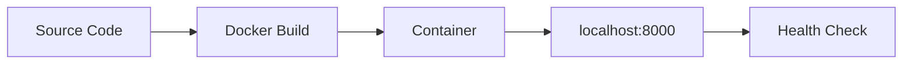

# 01 - Run Locally with Docker

Before deploying to Azure Container Apps, validate your Python app in a container locally. This catches image, dependency, and port issues early.

## Local Development Workflow



## Prerequisites

- Docker Engine or Docker Desktop
- Source code with a Dockerfile

## Step-by-step

1. **Build the container image**

   ```bash
   cd app
   docker build --tag aca-python-guide .
   ```

2. **Run the container locally**

   ```bash
   # Copy and customize the environment file
   cp .env.example .env

   docker run --publish 8000:8000 --env-file .env aca-python-guide
   ```

3. **Verify health endpoint**

   ```bash
   curl http://localhost:8000/health
   ```

4. **Inspect application logs**

   ```bash
   docker logs <container-id>
   ```

   To find the container ID: `docker ps`

## Local parity checklist

- Application listens on port `8000` (or your configured container port)
- Required environment variables are present
- `/health` returns HTTP 200
- No startup exceptions in container logs

## Advanced Topics

- Add local Redis or PostgreSQL via `docker network` and separate containers to mimic service dependencies.
- Use OpenTelemetry locally to validate logs and traces before cloud deployment.
- Add a Dapr sidecar for local service invocation testing.

## See Also
- [02 - First Deploy to Azure Container Apps](02-first-deploy.md)
- [03 - Configuration, Secrets, and Dapr](03-configuration.md)
- [Dapr Integration Recipe](../recipes/dapr-integration.md)

## References
- [Quickstart: Code to Cloud (Microsoft Learn)](https://learn.microsoft.com/azure/container-apps/quickstart-code-to-cloud)
- [Dockerfile requirements for Azure Container Apps (Microsoft Learn)](https://learn.microsoft.com/azure/container-apps/containers#configuration)
