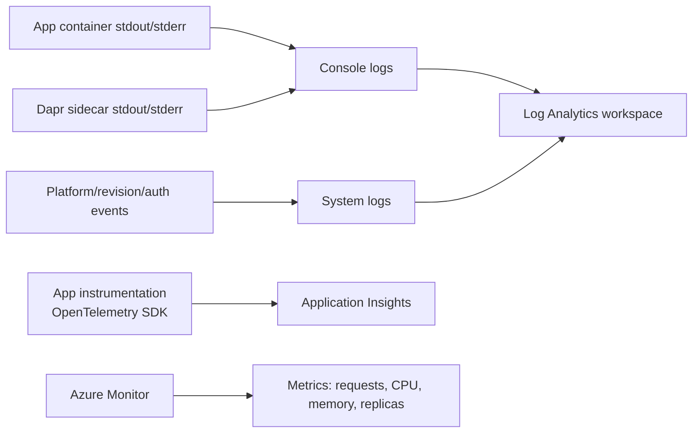
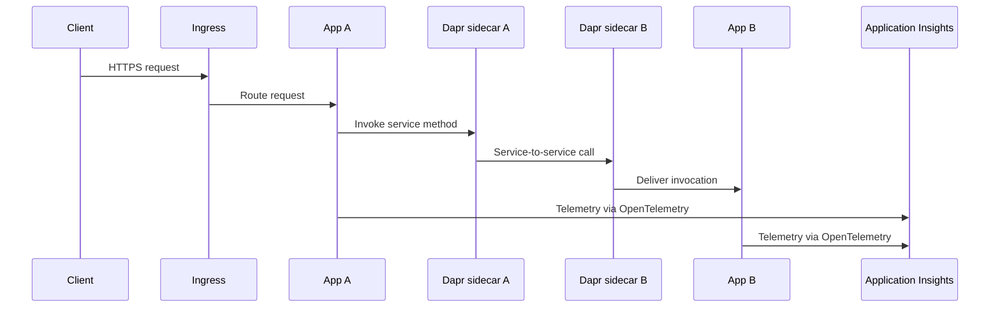

# 04 - Logging, Monitoring, and Observability

This tutorial step shows how to inspect console logs, query Log Analytics, and add OpenTelemetry-based observability for production operations.

## How Observability Works in Container Apps



## Distributed Tracing with Dapr



## Prerequisites

- Completed [03 - Configuration, Secrets, and Dapr](03-configuration.md)
- Log Analytics connected to your Container Apps environment

## Step-by-step

1. **Set standard variables**

   ```bash
   RG="rg-aca-python-demo"
   APP_NAME="app-aca-python-demo"
   ENVIRONMENT_NAME="aca-env-python-demo"
   ACR_NAME="acrpythondemo12345"
   ```

2. **Stream console logs**

   ```bash
   az containerapp logs show \
     --name "$APP_NAME" \
     --resource-group "$RG" \
     --follow
   ```

3. **Check system logs for startup or image issues**

   ```bash
   az containerapp logs show \
     --name "$APP_NAME" \
     --resource-group "$RG" \
     --type system
   ```

4. **Run a Log Analytics query for errors**

   ```kusto
   ContainerAppConsoleLogs
   | where Log has_any ("error", "exception", "traceback")
   | project TimeGenerated, ContainerAppName, RevisionName, Log
   | order by TimeGenerated desc
   ```

5. **Add OpenTelemetry for traces and metrics**

   ```bash
   pip install azure-monitor-opentelemetry
   ```

   ```python
   from azure.monitor.opentelemetry import configure_azure_monitor

   configure_azure_monitor(
       connection_string="InstrumentationKey=<instrumentation-key>;IngestionEndpoint=https://<region>.in.applicationinsights.azure.com/"
   )
   ```

6. **Correlate scaling behavior with telemetry**

   - Watch request bursts and KEDA scale-out events.
   - Verify reduced replica count during idle periods.
   - Compare latency before and after scale events.

## Observability practices

- Emit structured JSON logs with correlation IDs.
- Capture dependency traces for outbound HTTP and database calls.
- Monitor revision-specific failures during rollout windows.

## Advanced Topics

- Deploy an OpenTelemetry Collector sidecar to route telemetry to multiple backends.
- Add custom business metrics (for example, `orders_total`, `queue_depth`).
- Use Dapr tracing to follow service-to-service calls across apps.

## See Also

- [Log monitoring (Microsoft Learn)](https://learn.microsoft.com/azure/container-apps/log-monitoring)
- [Observability in Azure Container Apps (Microsoft Learn)](https://learn.microsoft.com/azure/container-apps/observability)
- [03 - Configuration, Secrets, and Dapr](03-configuration.md)
- [06 - CI/CD with GitHub Actions](06-ci-cd.md)
- [Dapr Integration Recipe](../recipes/dapr-integration.md)
