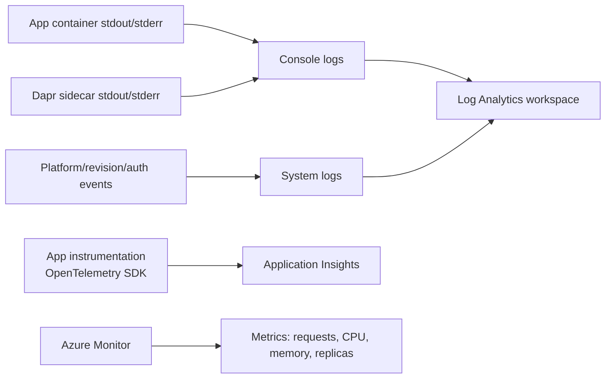
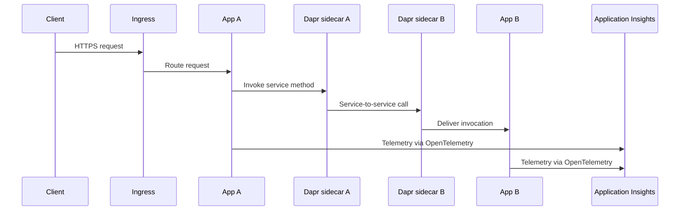

# 04 - Logging, Monitoring, and Observability

This tutorial step shows how to inspect console logs, query Log Analytics, and add OpenTelemetry-based observability for production operations.

## How Observability Works in Container Apps



## Distributed Tracing with Dapr



## Prerequisites

- Completed [03 - Configuration, Secrets, and Dapr](03-configuration.md)
- Log Analytics connected to your Container Apps environment

## Step-by-step

1. **Set standard variables (reuse Bicep outputs from Step 02)**

   ```bash
   RG="rg-aca-python-demo"
   BASE_NAME="pycontainer"
   DEPLOYMENT_NAME="main"

   APP_NAME=$(az deployment group show \
     --name "$DEPLOYMENT_NAME" \
     --resource-group "$RG" \
     --query "properties.outputs.containerAppName.value" \
     --output tsv)

   ENVIRONMENT_NAME=$(az deployment group show \
     --name "$DEPLOYMENT_NAME" \
     --resource-group "$RG" \
     --query "properties.outputs.containerAppEnvName.value" \
     --output tsv)

   ACR_NAME=$(az deployment group show \
     --name "$DEPLOYMENT_NAME" \
     --resource-group "$RG" \
     --query "properties.outputs.containerRegistryName.value" \
     --output tsv)
   ```

2. **Stream console logs**

   ```bash
   az containerapp logs show \
     --name "$APP_NAME" \
     --resource-group "$RG" \
     --follow
   ```

   ???+ example "Expected output"
       ```json
       {"TimeStamp":"2024-01-15T10:30:01","Log":"Connecting to the container 'app'..."}
       {"TimeStamp":"2024-01-15T10:30:01","Log":"Successfully Connected to container: 'app' [Revision: 'ca-pycontainer-<unique-suffix>--<revision>', Replica: 'ca-pycontainer-<unique-suffix>--<revision>-<replica-id>']"}
       {"TimeStamp":"2024-01-15T10:30:00+00:00","Log":"[2024-01-15 10:30:00 +0000] [1] [INFO] Starting gunicorn 21.2.0"}
       {"TimeStamp":"2024-01-15T10:30:00+00:00","Log":"[2024-01-15 10:30:00 +0000] [1] [INFO] Listening at: http://0.0.0.0:8000 (1)"}
       {"TimeStamp":"2024-01-15T10:30:00+00:00","Log":"[2024-01-15 10:30:00 +0000] [7] [INFO] Booting worker with pid: 7"}
       {"TimeStamp":"2024-01-15T10:30:00+00:00","Log":"[2024-01-15 10:30:00 +0000] [8] [INFO] Booting worker with pid: 8"}
       ```

   !!! note
       Use Ctrl+C to stop following logs.

3. **Check system logs for startup or image issues**

   ```bash
   az containerapp logs show \
     --name "$APP_NAME" \
     --resource-group "$RG" \
     --type system
   ```

   ???+ example "Expected output"
       ```json
       {"TimeStamp":"2024-01-15T10:30:00Z","Type":"Normal","ContainerAppName":"ca-pycontainer-<unique-suffix>","RevisionName":"ca-pycontainer-<unique-suffix>--<revision>","ReplicaName":null,"Msg":"Successfully connected to events server","Reason":"ConnectedToEventsServer","EventSource":"ContainerAppController","Count":1}
       ```

4. **Run a Log Analytics query for errors**

   ```kusto
    ContainerAppConsoleLogs_CL
    | where Log_s has_any ("error", "exception", "traceback")
    | project TimeGenerated, ContainerAppName_s, RevisionName_s, Log_s
    | order by TimeGenerated desc
    ```

    !!! note "KQL Table Names"
        Some Log Analytics workspaces use `ContainerAppConsoleLogs_CL` (custom log schema), while newer workspaces may use `ContainerAppConsoleLogs`. If queries return no results, try the alternate table name. See [KQL Queries Reference](../reference/kql-queries.md#schema-note) for details.

   ???+ example "Expected output"
       The query results in the Azure Portal will display a table with the following columns:

       | Column | Description |
       |--------|-------------|
       | `TimeGenerated` | UTC timestamp when the log entry was created |
       | `ContainerAppName_s` | Name of your Container App (e.g., `ca-pycontainer-<unique-suffix>`) |
       | `RevisionName_s` | The specific revision that generated the log |
       | `Log_s` | The actual log message content containing the error or exception |

5. **Add OpenTelemetry for traces and metrics**

   ```bash
   pip install azure-monitor-opentelemetry
   ```

   ```python
   from azure.monitor.opentelemetry import configure_azure_monitor

   configure_azure_monitor(
       connection_string="InstrumentationKey=<instrumentation-key>;IngestionEndpoint=https://<region>.in.applicationinsights.azure.com/"
   )
   ```

6. **Correlate scaling behavior with telemetry**

   - Watch request bursts and KEDA scale-out events.
   - Verify reduced replica count during idle periods.
   - Compare latency before and after scale events.

## Observability practices

- Emit structured JSON logs with correlation IDs.
- Capture dependency traces for outbound HTTP and database calls.
- Monitor revision-specific failures during rollout windows.

## Advanced Topics

- Deploy an OpenTelemetry Collector sidecar to route telemetry to multiple backends.
- Add custom business metrics (for example, `orders_total`, `queue_depth`).
- Use Dapr tracing to follow service-to-service calls across apps.

## See Also
- [03 - Configuration, Secrets, and Dapr](03-configuration.md)
- [06 - CI/CD with GitHub Actions](06-ci-cd.md)
- [Dapr Integration Recipe](../recipes/dapr-integration.md)

## References
- [Log monitoring (Microsoft Learn)](https://learn.microsoft.com/azure/container-apps/log-monitoring)
- [Observability in Azure Container Apps (Microsoft Learn)](https://learn.microsoft.com/azure/container-apps/observability)
