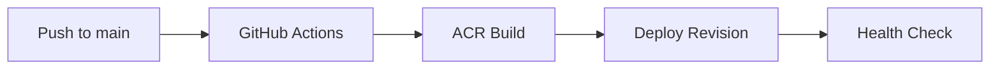

# 06 - CI/CD with GitHub Actions

Automate build and deployment so every commit can produce a new Container App revision. This tutorial uses GitHub Actions, ACR, and Azure Container Apps deploy actions.

## CI/CD Pipeline Flow



## Prerequisites

- Completed [05 - Infrastructure as Code with Bicep](05-infrastructure-as-code.md)
- GitHub repository with Actions enabled
- Azure service principal stored as GitHub secret

## Step-by-step

1. **Configure repository variables and secrets**

   - Variables: `RESOURCE_GROUP`, `APP_NAME`, `ACR_NAME`
   - Secrets: `AZURE_CREDENTIALS`, `REGISTRY_USERNAME`, `REGISTRY_PASSWORD`

   Example `AZURE_CREDENTIALS` JSON (masked):

   ```json
   {
     "clientId": "xxxxxxxx-xxxx-xxxx-xxxx-xxxxxxxxxxxx",
     "clientSecret": "<client-secret>",
     "subscriptionId": "<subscription-id>",
     "tenantId": "<tenant-id>"
   }
   ```

2. **Create workflow file**

   ```yaml
   name: Deploy to Azure Container Apps

   on:
     push:
       branches: [ main ]

   jobs:
     build-and-deploy:
       runs-on: ubuntu-latest
       steps:
         - name: Checkout
           uses: actions/checkout@v4

         - name: Azure Login
           uses: azure/login@v2
           with:
             creds: ${{ secrets.AZURE_CREDENTIALS }}

         - name: ACR Login
           uses: azure/docker-login@v2
           with:
             login-server: ${{ vars.ACR_NAME }}.azurecr.io
             username: ${{ secrets.REGISTRY_USERNAME }}
             password: ${{ secrets.REGISTRY_PASSWORD }}

         - name: Build and push image
           run: |
             docker build --tag ${{ vars.ACR_NAME }}.azurecr.io/${{ vars.APP_NAME }}:${{ github.sha }} .
             docker push ${{ vars.ACR_NAME }}.azurecr.io/${{ vars.APP_NAME }}:${{ github.sha }}

         - name: Deploy Container App
           uses: azure/container-apps-deploy-action@v1
           with:
             imageToDeploy: ${{ vars.ACR_NAME }}.azurecr.io/${{ vars.APP_NAME }}:${{ github.sha }}
             resourceGroup: ${{ vars.RESOURCE_GROUP }}
             containerAppName: ${{ vars.APP_NAME }}
   ```

3. **Add infrastructure deployment (optional but recommended)**

   ```yaml
         - name: Deploy Infrastructure
           uses: azure/arm-deploy@v2
           with:
             resourceGroupName: ${{ vars.RESOURCE_GROUP }}
             template: ./infra/main.bicep
             parameters: appName=${{ vars.APP_NAME }} acrName=${{ vars.ACR_NAME }}
   ```

4. **Validate rollout behavior**

   - Trigger workflow from a commit to `main`.
   - Confirm a new revision was created.
   - Confirm traffic moved to healthy revision.

## Advanced Topics

- Add pre-deploy tests and security scanning gates.
- Implement staged deployment with manual approval.
- Use multiple active revisions for canary rollout in pipeline.

## See Also
- [07 - Revisions and Traffic Splitting](07-revisions-traffic.md)
- [05 - Infrastructure as Code with Bicep](05-infrastructure-as-code.md)
- [Managed Identity Recipe](../recipes/managed-identity.md)

## References
- [GitHub Actions (Microsoft Learn)](https://learn.microsoft.com/azure/container-apps/github-actions)
- [Connect GitHub Actions to Azure (Microsoft Learn)](https://learn.microsoft.com/azure/developer/github/connect-from-azure)
