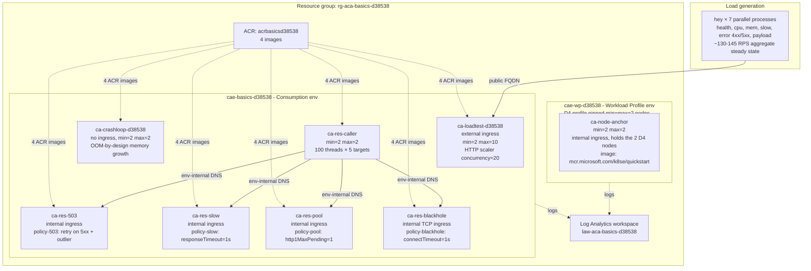

# Lab: Container Apps metrics load test

Reproducible Azure deployment that drives every metric documented in
[`docs/reference/metrics/index.md`](../../docs/reference/metrics/index.md) to a non-zero,
observable shape so the 45 Portal screenshots in that reference can be
re-captured against a live environment.

This is **not** a falsifiable troubleshooting lab. It is the data source for
the metrics reference: 8 Container Apps split across 2 Container Apps
environments, sized so each metric in the catalog has at least one app that
produces a non-trivial signal under sustained load.

## Topology



**Why two environments?** Container Apps consumption-only environments do
not surface `NodeCount`, and the four `Ingress*` (Preview) metrics are only
non-zero when the env runs the workload-profile data plane. `cae-wp-d38538`
exists solely to populate those 5 environment-level metrics; all
load-driven apps live in the cheaper `cae-basics-d38538` consumption env.

## Metric → app mapping

| Metric | Driven by | Why this app drives it |
|---|---|---|
| `UsageNanoCores` | `ca-loadtest-d38538` | `/cpu?ms=400` burns CPU under sustained HTTP load |
| `WorkingSetBytes` | `ca-loadtest-d38538` | `/mem?mb=8` allocates and touches page-resident memory |
| `CpuPercentage` | `ca-loadtest-d38538` | CPU burn against `--cpu 0.5` limit drives Avg/Max close to 100% |
| `MemoryPercentage` | `ca-loadtest-d38538` | Memory growth against `--memory 1Gi` limit drives Avg into the 60-80% range |
| `RxBytes`, `TxBytes` | `ca-loadtest-d38538` | `/payload?kb=512` produces non-trivial response bodies |
| `Requests` | `ca-loadtest-d38538` | Split by `statusCodeCategory` via `/error?code=500` and `/error?code=404` |
| `ResponseTime` | `ca-loadtest-d38538` | `/slow?ms=1500` produces a measurable tail |
| `Replicas` | `ca-loadtest-d38538` | HTTP scaler @ 20 concurrency walks min=2 toward max=10 under load |
| `RestartCount` | `ca-crashloop-d38538` | 16 MiB / 200 ms allocation loop OOM-kills the container at `--memory 0.5Gi` |
| `CoresQuotaUsed` | `ca-loadtest-d38538` | Reflects per-app reservation: 2 replicas × 0.5 vCPU = 1.0 floor, scaling raises it |
| `TotalCoresQuotaUsed` | `ca-loadtest-d38538` | Per-container-app metric: cores reserved by this app summed across its active revisions and replicas. HTTP scaler walking min=2 → max=10 with `cpu=0.5` per replica drives it through the 1.0-5.0 vCPU range. |
| `ResiliencyRequestRetries`, `ResiliencyEjectedHosts`, `ResiliencyEjectionsAborted` | `ca-res-503` ← `ca-res-caller` | Constant 503 responses trip retry + outlier detection rules in `policy-503` |
| `ResiliencyRequestTimeouts` | `ca-res-slow` ← `ca-res-caller` | 4 s response vs 1 s budget in `policy-slow` |
| `ResiliencyRequestsPendingConnectionPool` | `ca-res-pool` ← `ca-res-caller` | `http1MaxPendingRequests=1` against 100 concurrent callers |
| `ResiliencyConnectTimeouts` | (baseline zero — see limitations) | `ca-res-blackhole` triggers `RequestsPendingConnectionPool` instead of connect timeouts |
| `NodeCount` | `cae-wp-d38538` | D4 workload-profile env pinned at 2 nodes |
| `IngressUsageNanoCores`, `IngressUsageBytes`, `IngressCpuPercentage`, `IngressMemoryPercentage` (Preview) | `cae-wp-d38538` baseline | Ingress controller pods publish even without app traffic; `ca-node-anchor` exists only to hold the 2-node fleet |
| `GpuUtilizationPercentage` | (no live data — see limitations) | This lab uses CPU-only Consumption + D4 profiles |

The Consumption env (`cae-basics-d38538`) cannot publish `NodeCount` or any
`Ingress*` Preview metric. The workload-profile env (`cae-wp-d38538`) is
held entirely separate to keep its baseline ingress traffic distinct from
the load-driven app traffic.

## Prerequisites

| Requirement | Notes |
|---|---|
| Azure CLI | `az --version >= 2.83.0`. `az login` and select a subscription with quota for ~10 Container Apps + 1 ACR + 1 Log Analytics workspace + a D4 workload profile (2 nodes). |
| `containerapp` extension | Installed automatically on first `az containerapp create`. |
| Region | `koreacentral` by default — change `LOCATION` in `rebuild.sh` to match your quota. Workload-profile D4 must be available in the target region. |
| `hey` | Install via Homebrew (`brew install hey`) or Go (`go install github.com/rakyll/hey@latest`). Required only for `run-load.sh`; `rebuild.sh` does not need it. |
| Local Docker | Not required. Images are built remotely with `az acr build`. |
| Approximate cost | Workload-profile D4 nodes dominate the bill (~2 × D4 × region rate); Consumption apps are pay-per-second. Allow $5-15 USD per full reproduction (~1-2 hours including the 30-minute load run). Always run the clean-up step. |
| Approximate time | `rebuild.sh` ~10-12 minutes (ACR builds + 8 app deploys). `run-load.sh` 30 minutes. Wait an additional 30-60 minutes for Azure Monitor to backfill 1-minute buckets before capturing screenshots. |

## Procedure

```bash
# 1. Provision everything (resource group, 2 envs, ACR, 4 images, 8 apps).
./rebuild.sh
```

| Step in `rebuild.sh` | What it does |
|---|---|
| Steps 1-3 | Creates resource group, Log Analytics workspace, both Container Apps environments (Consumption + Workload Profile with D4 pinned at 2 nodes). |
| Step 4 | Creates the ACR (`Basic` SKU, admin-enabled for simple credential pass-through). |
| Step 5 | Builds 4 images via `az acr build` so the lab has no local Docker dependency. |
| Steps 6-8 | Deploys the 7 Consumption apps. `ca-loadtest-d38538` carries public ingress and the HTTP scaler; the four `ca-res-*` apps and `ca-res-caller` form the resiliency-policy subsystem. |
| Step 9 | Attaches the four resiliency policies (`res-503.yaml`, `res-slow.yaml`, `res-pool.yaml`, `res-blackhole.yaml`) to their respective targets. |
| Final | Deploys `ca-node-anchor` to the workload-profile env. Prints the `ca-loadtest-d38538` public FQDN. |

```bash
# 2. Copy the printed FQDN into run-load.sh.
# Open run-load.sh and replace the BASE= line with the printed
# "https://ca-loadtest-...azurecontainerapps.io" URL.

# 3. Start the 30-minute sustained load.
./run-load.sh
```

| Generator in `run-load.sh` | Drives |
|---|---|
| `hey /health -c 30 -q 5` | `Requests`, baseline `ResponseTime` |
| `hey /cpu?ms=400 -c 25 -q 4` | `CpuPercentage`, `UsageNanoCores`, `Replicas` (via HTTP scaler), `CoresQuotaUsed` |
| `hey /mem?mb=8 -c 2 -q 1` | `MemoryPercentage`, `WorkingSetBytes` |
| `hey /error?code=500 -c 5 -q 2` | `Requests` split by `statusCodeCategory=ServerError` |
| `hey /error?code=404 -c 3 -q 1` | `Requests` split by `statusCodeCategory=ClientError` |
| `hey /slow?ms=1500 -c 4 -q 1` | `ResponseTime` p95/p99 tail |
| `hey /payload?kb=512 -c 4 -q 2` | `TxBytes` |
| `ca-res-caller` (already running) | All four `Resiliency*` metrics via intra-env calls |

`hey -q` is requests-per-second **per worker**, not aggregate, so the
actual sustained RPS depends on backpressure. Observed steady-state on the
docs environment was ~130-145 RPS into `ca-loadtest-d38538`, which is
enough to walk the HTTP scaler toward `max-replicas=10`.

```bash
# 4. Wait for Azure Monitor 1-minute buckets to fill.
# The first 30 minutes of load is the data; an additional 30-60 minutes
# is recommended before screenshot capture so the Portal Metrics blade
# settles into its smoothed view. Resiliency* metrics in particular show
# bursty 1-minute spikes followed by zero-buckets; longer windows show
# the steady-state better.

# 5. Capture screenshots per the file list in docs/reference/metrics/index.md.
# See "Capture refresh checklist" below.

# 6. Clean up. ALWAYS run this.
az group delete --name rg-aca-basics-d38538 --yes --no-wait
```

| Clean-up flag | What it does |
|---|---|
| `--name rg-aca-basics-d38538` | Deletes the single resource group that contains every resource the lab created. |
| `--yes` | Skips the interactive "Are you sure?" prompt. |
| `--no-wait` | Returns immediately; the deletion runs asynchronously server-side (typically 5-15 minutes). |

## What success looks like

Before opening the Portal Metrics blade, verify the lab is actually generating
the signals you expect to capture. All four of the following should be true
60+ minutes after `run-load.sh` starts:

| Check | Command | Expected |
|---|---|---|
| HTTP scaler engaged on the load target | `az containerapp replica list --resource-group rg-aca-basics-d38538 --name ca-loadtest-d38538 --query 'length(@)'` | `>= 3` (started at min=2, scaled out under sustained 130-145 RPS) |
| Crashloop app is actually restarting | `az containerapp revision list --resource-group rg-aca-basics-d38538 --name ca-crashloop-d38538 --query '[].properties.runningState' --output tsv` | Mix of `Running` and `Failed` over multiple polls; not stuck `Provisioning` |
| Caller is generating intra-env traffic | `az containerapp logs show --resource-group rg-aca-basics-d38538 --name ca-res-caller --tail 5 --type console` | Contains `caller: launched 100 threads across 5 targets` |
| WP env is configured for the D4 node fleet | `az containerapp env show --resource-group rg-aca-basics-d38538 --name cae-wp-d38538 --query 'properties.workloadProfiles[?name==\`d4-profile\`].{min:minimumCount,max:maximumCount}' --output table` | `min=2, max=2` (proves the env is pinned; confirm the live `NodeCount` metric on the Portal blade) |

If any check fails, the corresponding metric capture(s) will be misleading or
flat. Fix the failing condition before capturing.

## Capture refresh checklist

When re-capturing the 45 PNGs referenced by `docs/reference/metrics/index.md`:

1. **Confirm steady-state load is generating real RPS, not just running.**
   `hey` buffers stdout, so `/tmp/metrics-load/*.log` may stay quiet until
   the 30-minute window completes. Verify load is actually landing on the
   target instead:
   `az containerapp replica list --resource-group rg-aca-basics-d38538
   --name ca-loadtest-d38538 --query 'length(@)'` should return >= 3 (HTTP
   scaler has engaged from min=2 baseline). If it returns 2 after 5+
   minutes of load, `hey` is failing — re-check the FQDN in
   `run-load.sh`.
2. **Confirm `ca-crashloop-d38538` is actually restarting.** Use
   `az containerapp revision list --resource-group rg-aca-basics-d38538
   --name ca-crashloop-d38538 --query '[].properties.runningState'`. Empty
   output or `Provisioning` means the OOM loop has not started yet — wait
   2-3 minutes.
3. **Confirm `ca-res-caller` is generating intra-env traffic.** Use
   `az containerapp logs show --resource-group rg-aca-basics-d38538
   --name ca-res-caller --tail 10` — you should see the `caller: launched
   100 threads across 5 targets` startup line.
4. **Wait the full 30-60 minutes** after load starts before opening the
   Portal Metrics blade. 1-minute buckets backfill late.
5. **Capture in the order** declared in `docs/reference/metrics/index.md`:
   per-metric baseline (no split) first, then each `??? note "Split by X"`
   admonition's screenshot. **Reuse the existing filenames** under
   `docs/assets/reference/` — the convention is
   `metrics-<metric-kebab>-<state>.png` (for example
   `metrics-usage-nano-cores-baseline.png`,
   `metrics-replicas-split-revision.png`,
   `metrics-resiliency-pending-pool-split-revision.png`). The 45 PNGs
   already in the repo are the authoritative list; do not invent new
   names.
6. **Apply PII redaction.** See [AGENTS.md → Portal Screenshot Capture (PII
   Replacement Rules)](../../AGENTS.md#portal-screenshot-capture-pii-replacement-rules)
   and the helper at [`scripts/portal-capture-helpers.js`](../../scripts/portal-capture-helpers.js).
7. **Verify against the existing PNG.** Diff metric ID, aggregation, split
   dimension, and time range before replacing the file.

## Known limitations

| Metric | Limitation | What to do |
|---|---|---|
| `GpuUtilizationPercentage` | This lab uses CPU-only SKUs. No GPU-attached app is deployed. | Skip GPU live captures. The definition is documented in `metrics.md` without a live screenshot. |
| `ResiliencyConnectTimeouts` | `ca-res-blackhole` calls `listen()` without `accept()`. The kernel completes the TCP handshake; Envoy's connect succeeds; the subsequent HTTP hang surfaces as `ResiliencyRequestsPendingConnectionPool` and `ResiliencyRequestTimeouts`. Triggering a true connect-phase timeout would require dropping SYN packets at L3 (a firewall rule a Container Apps replica cannot install). | Expected baseline-zero capture. The metric definition and the why-not explanation are documented in `metrics.md` under "Why `ResiliencyConnectTimeouts` did not move". |
| `Ingress*` (Preview) | `cae-wp-d38538` runs only `ca-node-anchor` with internal ingress and no load generator. Captures show baseline ingress-controller activity, not app load. | Document this in the per-metric admonition rather than driving artificial load through the WP env. |
| `NodeCount` floor = 2 | D4 profile is pinned at `min-nodes=2, max-nodes=2`. The capture cannot show 1-node or scale-out behavior. | If a future revision needs to show scaling, edit `rebuild.sh` step 3 to set `--min-nodes 1 --max-nodes 5` and add a load source against `ca-node-anchor`. |
| `CoresQuotaUsed` floor = 1.0 | `ca-loadtest-d38538` has `min-replicas=2` × `--cpu 0.5` = 1.0 vCPU floor. The Min aggregation will never show 0.5. | Expected. Set `--min-replicas 1` only if you need to demonstrate the half-vCPU floor; this also weakens the HTTP scaler captures. |
| Replicas in res-* targets | All four `ca-res-*` apps are pinned at `min=max=2` to keep the resiliency-metric shapes stable. They do **not** scale with caller load. | Expected. Increase `max-replicas` only if you want to demonstrate resiliency-rule behavior under scale, which is out of scope for `metrics.md`. |

## Tuning knobs

- **Caller intensity** — `ca-res-caller` reads `CONCURRENCY_PER_TARGET`
  from env vars; default `20` produces 100 total threads (5 targets × 20).
  Lower this if the caller itself triggers OOM or if Resiliency metrics
  saturate too fast to capture cleanly.
- **Load duration** — Each `hey -z 30m` runs for 30 minutes. Increase
  with `-z 1h` if you want longer steady-state windows; the
  `ResponseTime` and `Requests` shapes benefit most from longer captures.
- **Per-app CPU/memory** — Documented in `rebuild.sh`. Change with care:
  `CpuPercentage` and `MemoryPercentage` denominators move when these
  change, and the existing captures in `metrics.md` cite specific
  observed values.

## Clean up

Always delete the resource group when done. The D4 workload-profile env
holds 2 dedicated nodes that bill continuously even when idle.

```bash
az group delete --name rg-aca-basics-d38538 --yes --no-wait
```

```bash
# Confirm deletion progress (state: Deleting → eventually NotFound).
az group show --name rg-aca-basics-d38538 --query properties.provisioningState --output tsv
```

## See also

- [Container Apps metrics reference](../../docs/reference/metrics/index.md) — the
  Portal screenshots this lab reproduces
- [Memory percentage vs KEDA utilization (playbook)](../../docs/troubleshooting/playbooks/scaling-and-runtime/memory-percentage-vs-keda-utilization.md)
- [HTTP scaling not triggering (playbook)](../../docs/troubleshooting/playbooks/scaling-and-runtime/http-scaling-not-triggering.md)
- [CPU throttling (playbook)](../../docs/troubleshooting/playbooks/scaling-and-runtime/cpu-throttling.md)
- [Memory leak OOMKilled (playbook)](../../docs/troubleshooting/playbooks/scaling-and-runtime/memory-leak-oomkilled.md)
- [Crashloop OOM and resource pressure (playbook)](../../docs/troubleshooting/playbooks/scaling-and-runtime/crashloop-oom-and-resource-pressure.md)
- [Probe failure and slow start (playbook)](../../docs/troubleshooting/playbooks/startup-and-provisioning/probe-failure-and-slow-start.md)
- [KEDA scaler metrics (KQL pack)](../../docs/troubleshooting/kql/scaling-and-replicas/keda-scaler-metrics.md)
- [Scaling events (KQL pack)](../../docs/troubleshooting/kql/scaling-and-replicas/scaling-events.md)
- [Portal screenshot PII rules](../../AGENTS.md#portal-screenshot-capture-pii-replacement-rules)
