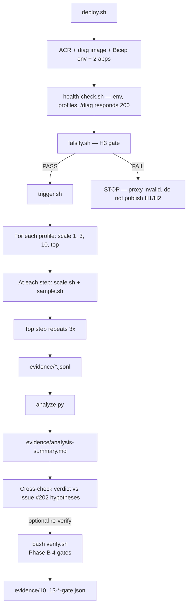

# Lab: Replica node-spread

This lab provides the runnable infrastructure and scripts for the
[Replica node-spread on Consumption vs Dedicated D8](../../docs/troubleshooting/lab-guides/replica-node-spread.md)
experimental lab. The lab tests the operator claim that Container Apps
distributes replicas across multiple nodes on the Consumption profile
while a Dedicated D8 workload profile may concentrate all replicas on
a single node.

Evidence-ceiling reminder: this lab uses kernel-context proxies
(`boot_id`, `uptime_seconds`, `boot_time_estimate_ms`) instead of the
underlying `Microsoft.Compute` node id, which Container Apps does not
expose. The highest claim allowed for node placement is
`[Strongly Suggested]`.

## Structure

```text
labs/replica-node-spread/
├── infra/
│   ├── main.bicep                # Workload-profile env + 2 subject apps
│   └── main.parameters.json
├── diag/
│   ├── Dockerfile                # python:3.12-slim + gunicorn
│   ├── app.py                    # Flask /diag returns kernel signals
│   └── requirements.txt
├── deploy.sh                     # Phase A — RG + ACR + Bicep deployment wrapper
├── health-check.sh               # Phase A — Health checks on env + 2 apps + /diag (formerly verify.sh)
├── falsify.sh                    # Phase A — H3 proxy validation (gates H1/H2)
├── scale.sh                      # Phase A — Scale a named app to N and wait stable
├── sample.sh                     # Phase A — Poll /diag, append per-sample JSONL
├── trigger.sh                    # Phase A — Master orchestrator
├── analyze.py                    # Phase A — Counts + cluster verdict
├── cleanup.sh                    # Phase A — Destructive teardown with confirmation
├── verify.sh                     # Phase B — Evidence-pack verifier (4 gates / 16 sub-gates, no Azure calls)
├── evidence/                     # Committed canonical cohort + gate JSONs + README.md
└── README.md
```

## Phase A vs Phase B

This lab is delivered in two phases that share the same `labs/replica-node-spread/` directory but have distinct purposes:

- **Phase A — Live-Azure reproduction.** The original lab that deploys real infrastructure to Azure, runs the H3 proxy gate, walks both profiles through scale sequences with top-scale repeats, and analyzes the resulting JSONL. Phase A produced the canonical cohort that lives under `evidence/` (anchored on `h3-20260614-143432`). Scripts: `deploy.sh`, `health-check.sh`, `falsify.sh`, `scale.sh`, `sample.sh`, `trigger.sh`, `analyze.py`, `cleanup.sh`. Cost: <$2.50 USD per full run (Dedicated D8 node is the dominant cost driver).
- **Phase B — Evidence-pack verification.** A pure file processor (`verify.sh`, no Azure calls) that reads the committed canonical cohort from `evidence/` and emits four falsifiable gate JSONs (`10-cohort-integrity-gate.json` through `13-packaging-gate.json`). Phase B exists so a reviewer or future maintainer can re-verify the published claims without re-deploying — running `bash verify.sh` on the committed evidence reproduces the four-gate verdict on disk. See [`evidence/README.md`](evidence/README.md) for the full provenance + capture timeline + counterexample disclosure + per-file integrity table.

The historical pre-Phase-B `verify.sh` was a 5-check Phase A health-check script (RG + env + workload profiles + apps + `/diag`); the Phase B refactor renamed it to `health-check.sh` and assigned `verify.sh` to the new gate-emission role. The Phase A workflow below still runs the health check, just under its new name.

## Prerequisites

- Azure subscription with quota for:
    - One workload-profile Container Apps environment
    - One Consumption workload profile (no minimum count)
    - One Dedicated D8 workload profile (8 vCPU / 32 GiB, 1 node)
    - Two Container Apps, each scaled up to 24-30 replicas of
      0.25 vCPU / 0.5 GiB
    - One Azure Container Registry (Basic SKU)
- Region must support Container Apps **workload profiles** AND the
  **D8** SKU (for example `koreacentral`, `eastus`, `westeurope`).
- Azure CLI `2.60+` with the `containerapp` extension and `az acr build`
  (requires `az acr` ACR Tasks support).
- Local `bash`, `curl`, and `jq`.
- Python 3.10+ for `analyze.py`.

## Quick start

```bash
export RG="rg-aca-rns-lab"
export LOCATION="koreacentral"

# Phase A — live-Azure reproduction (incurs Azure charges)
./deploy.sh
./health-check.sh

# Master orchestrator — includes the H3 falsification gate and runs the
# Consumption + Dedicated D8 scale sequences with 3 repeats at top.
./trigger.sh

python3 ./analyze.py
cat evidence/analysis-summary.md

./cleanup.sh

# Phase B — replayable evidence-pack verification (no Azure calls, no cost)
# Re-runs the four falsifiable gates against the committed canonical cohort
# under evidence/. Useful for reviewers who want to re-classify the gate
# verdicts without re-deploying the lab.
bash verify.sh
ls evidence/{10,11,12,13}-*-gate.json
```

## Experiment shape



## Data shape

Each line in `evidence/*.jsonl` is one /diag sample wrapped with
run metadata:

| Field                | Source                                              | Notes                                       |
|----------------------|-----------------------------------------------------|---------------------------------------------|
| boot_id              | /proc/sys/kernel/random/boot_id                     | Primary kernel-context signal               |
| uptime_seconds       | /proc/uptime field 0                                | Monotonicity check                          |
| boot_time_estimate_ms| sample_timestamp - uptime                           | Cluster key for node identity inference     |
| machine_id           | /etc/machine-id (often missing)                     | Secondary signal                            |
| kernel_release       | uname -r                                            | Host-shared                                 |
| microcode            | /proc/cpuinfo microcode                             | Host-shared                                 |
| cpu_model            | /proc/cpuinfo model name                            | Host-shared                                 |
| replica_name         | $CONTAINER_APP_REPLICA_NAME / hostname fallback     | Replica identity                            |
| revision             | $CONTAINER_APP_REVISION                             | Revision identity                           |
| app                  | sample.sh arg                                       | app-consumption \| app-dedicated-d8         |
| profile              | sample.sh arg                                       | Consumption \| Dedicated-D8                 |
| scale_target         | sample.sh arg                                       | 1, 3, 10, top                               |
| run_id               | trigger.sh                                          | <profile>-n<N>-r<R>-<timestamp>             |
| sample_index         | sample.sh loop counter                              | 1..samples                                  |
| client_sample_at     | sample.sh wall clock                                | ISO-8601 UTC                                |

## Building the diag image manually

`deploy.sh` builds the image with `az acr build` and wires it into the
Bicep deployment automatically. To rebuild the image without redeploying
the environment, run:

```bash
ACR_NAME="rnslabacrXXXXXX"   # find with: az acr list -g $RG -o table
az acr build --registry "$ACR_NAME" \
  --image "rns-lab/diag:latest" \
  ./diag
```

The apps re-pull `:latest` on the next revision update; trigger a
revision rollover with `az containerapp update --revision-suffix
$(date +%s)` if you need to force a refresh without changing scale.

## Cleanup

`cleanup.sh` issues `az group delete --yes --no-wait` after explicit
confirmation. Resources soft-delete may persist for up to 24 hours;
charges stop once the delete completes.

## Related documentation

- Lab guide: `docs/troubleshooting/lab-guides/replica-node-spread.md`
- Platform: `docs/platform/environments/plans-and-workload-profiles.md`
- Platform: `docs/platform/environments/consumption-plan.md`
- Issue: <https://github.com/yeongseon/azure-container-apps-practical-guide/issues/202>
