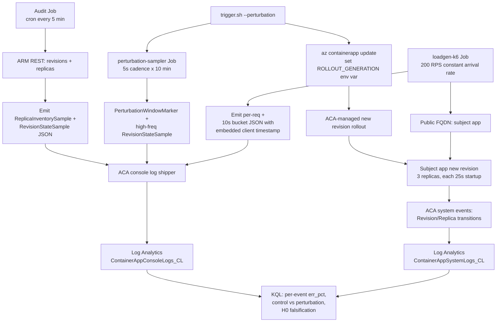

# Lab: Startup-degraded transient failure (issue #205)

This lab provides the runnable infrastructure and scripts for the
[Startup-degraded transient failure during rolling rollout](../../docs/troubleshooting/lab-guides/startup-degraded-transient-failure.md)
experimental lab. The lab tests the operator assumption that ACA
masks all transient unavailability behind health probes during a
rolling rollout, even when the subject app has a deterministic
25-second startup delay.

## Hybrid A binding (Oracle review)

This lab follows the same Hybrid A standard as
`labs/zone-redundancy-best-effort/`. The design was reviewed by
Oracle as REVISE_AND_RESUBMIT (`ses_14429826cffeXthi0x6tgTdLOW`); the
revised plan documented in
[`evidence/oracle-stage-b-design-review-20260612.md`](evidence/oracle-stage-b-design-review-20260612.md)
is the binding plan.

Key bindings:

1. The **primary perturbation** is an ACA-managed new revision rollout
    triggered by a `ROLLOUT_GENERATION` env-var change. `revision restart`
    is supplemental only.
2. The subject app is a **deterministic custom Python image** with
    `STARTUP_DELAY_SECONDS=25` and a dedicated **`/healthz`** endpoint;
    all three probes target `/healthz`, not `/`.
3. The k6 loadgen runs as a **manual Container Apps Job** in the same
    environment, targets the **public FQDN**, and emits client-side
    **10s buckets** with embedded timestamps.
4. A **high-frequency perturbation sampler** (5-second cadence) is
    mandatory; the 5-minute audit cron is supplemental.
5. The falsification rule from issue #205 is: ANY sustained window of
    ≥3 consecutive 10s buckets above 0.5% `err_pct` during an event
    is sufficient to falsify the "ACA masks all transients" claim.
6. Conclusions about "**platform-initiated** cause" are capped at
    **[Strongly Suggested]**; the client-visible 5xx outcome is
    **[Measured]**.

## Structure

```text
labs/startup-degraded-transient-failure/
├── infra/
│   ├── main.bicep                # Env + subject + 3 Jobs (audit, sampler, k6)
│   └── main.parameters.json
├── subject/
│   ├── Dockerfile                # Python 3.12 slim, deterministic 25s startup
│   └── server.py                 # /healthz + / endpoints, stdlib only
├── loadgen/
│   ├── Dockerfile                # grafana/k6 + baked k6-script.js
│   └── k6-script.js              # constant-arrival-rate 200 RPS, 10s buckets
├── audit/
│   ├── Dockerfile                # Mariner + bash + curl + jq
│   └── sample.sh                 # 30s cadence, ReplicaInventory + RevisionState
├── perturbation-sampler/
│   ├── Dockerfile                # Mariner + bash + curl + jq
│   └── sample.sh                 # 5s cadence, bounded duration, manual trigger
├── deploy.sh                     # Resource group + Bicep deployment wrapper
├── verify.sh                     # 9 health checks
├── trigger.sh                    # Preflight / baseline / perturbation / supplemental modes
├── cleanup.sh                    # Destructive teardown with confirmation
└── README.md
```

## Prerequisites

- Azure subscription with quota for:
    - One workload-profile Container Apps environment (zone-redundant)
    - One subject app consuming 0.5 vCPU / 1 GiB at min=max=3 (3 replicas)
    - Three Container Apps Jobs (audit-sampler, perturbation-sampler, loadgen-k6)
- Region must support Container Apps **workload profiles**.
- Azure CLI `2.60+` with the `containerapp` extension.
- (Strongly recommended) Container registry to host the four custom
  images: `subject`, `audit`, `perturbation-sampler`, `loadgen`. The
  default `*Image` parameters fall back to public placeholders that
  emit a single notice line, so the deployment succeeds before custom
  images are built, but the lab produces no real signal until they
  are.

## Quick start

```bash
export RG="rg-aca-startup-degraded"
export LOCATION="koreacentral"
export ACR_NAME="<your-acr-without-azurecrio>"

./deploy.sh

az acr build --registry "$ACR_NAME" --image startup-degraded/subject:latest               ./subject
az acr build --registry "$ACR_NAME" --image startup-degraded/audit:latest                 ./audit
az acr build --registry "$ACR_NAME" --image startup-degraded/perturbation-sampler:latest  ./perturbation-sampler
az acr build --registry "$ACR_NAME" --image startup-degraded/loadgen:latest               ./loadgen

export SUBJECT_IMAGE="${ACR_NAME}.azurecr.io/startup-degraded/subject:latest"
export AUDIT_IMAGE="${ACR_NAME}.azurecr.io/startup-degraded/audit:latest"
export PERTURBATION_SAMPLER_IMAGE="${ACR_NAME}.azurecr.io/startup-degraded/perturbation-sampler:latest"
export LOADGEN_IMAGE="${ACR_NAME}.azurecr.io/startup-degraded/loadgen:latest"
./deploy.sh   # redeploys with the custom images

./verify.sh

./trigger.sh --preflight
./trigger.sh --baseline --duration 1800
./trigger.sh --perturbation --events 12 --interval 600
./trigger.sh --supplemental-restart --events 3 --interval 600
```

## Data flow



## Cleanup

The deployment tags every resource with `expires-at` set to deploy time +
`expiryHours` (default 48). The `cleanup.sh` script issues
`az group delete --yes --no-wait` after explicit confirmation. The Log
Analytics workspace is destroyed too; export raw KQL results into
`evidence/` BEFORE running cleanup if you want them preserved beyond
the workspace's 90-day retention.

## Related documentation

- Lab guide: `docs/troubleshooting/lab-guides/startup-degraded-transient-failure.md`
- KQL pack: `docs/troubleshooting/kql/scaling-and-replicas/startup-degraded-bucketed-5xx.md`
- Operations: `docs/operations/deployment/revision-management.md`
- Best practices: `docs/best-practices/reliability.md`
- Integration page (Stage C, issue #206): `docs/best-practices/availability-and-non-guarantees.md`
