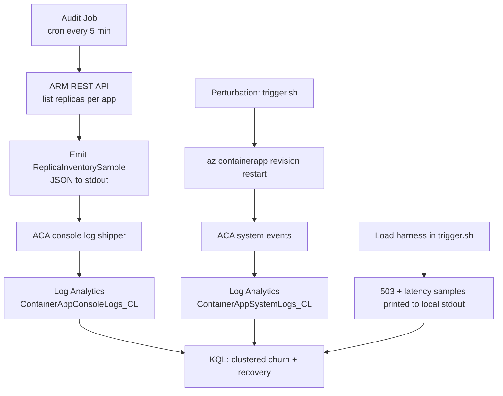

# Lab: Zone-redundancy best-effort

This lab provides the runnable infrastructure and scripts for the
[Zone redundancy is best-effort](../../docs/troubleshooting/lab-guides/zone-redundancy-best-effort.md)
experimental lab. The lab tests the operator assumption that
`zoneRedundant=true` + `minReplicas=N` prevents concentrated availability
loss during platform-driven replica reschedule events.

## Structure

```text
labs/zone-redundancy-best-effort/
├── infra/
│   ├── main.bicep                # Zone-redundant env + 3 subject apps + audit Job
│   └── main.parameters.json
├── audit/
│   ├── Dockerfile                # Mariner-base image with bash + curl + jq
│   └── sample.sh                 # ARM REST poller, emits ReplicaInventorySample JSON
├── deploy.sh                     # Resource group + Bicep deployment wrapper
├── verify.sh                     # Health checks on env + 3 apps + audit Job
├── trigger.sh                    # Perturbation harness (restart / load / combined)
├── cleanup.sh                    # Destructive teardown with confirmation
└── README.md
```

## Prerequisites

- Azure subscription with quota for:
    - Three workload-profile Container Apps consuming 0.5 vCPU / 1 GiB each at
      `min=max=2, 3, 6` (total 11 replicas)
    - One zone-redundant Container Apps environment
    - One Container Apps Job (audit-sampler)
- Region must support Container Apps **workload profiles** AND **availability
  zones** (for example `koreacentral`, `eastus`, `westeurope`, `japaneast`).
- Azure CLI `2.60+` with the `containerapp` extension.
- (Optional) Container registry to host a custom audit image. The default
  `auditImage` parameter falls back to `mcr.microsoft.com/azure-cli:2.83.0`
  and prints a placeholder line so the deployment succeeds before the
  custom image is built.

## Quick start

```bash
export RG="rg-aca-zr-lab"
export LOCATION="koreacentral"

./deploy.sh
./verify.sh

./trigger.sh --combined --client no-retry --duration 180
./trigger.sh --combined --client retry-backoff --duration 180

./cleanup.sh
```

## Building the audit image

The lab can run without a custom audit image (the placeholder Job will emit
a single notice JSON), but to produce real `ReplicaInventorySample` events
you must build and push the audit image and pass it as `auditImage`:

```bash
ACR="<your-acr>.azurecr.io"
az acr build --registry "$(basename "$ACR" .azurecr.io)" \
  --image "zr-lab/audit:latest" \
  ./audit

az deployment group create \
  --resource-group "$RG" \
  --template-file ./infra/main.bicep \
  --parameters ./infra/main.parameters.json \
  --parameters auditImage="${ACR}/zr-lab/audit:latest"
```

The audit Job runs every 5 minutes and writes one JSON line per subject app
to stdout. The Container Apps Environment ships stdout to Log Analytics
under `ContainerAppConsoleLogs_CL`, where the
[KQL pack](../../docs/troubleshooting/kql/scaling-and-replicas/zone-redundancy-mass-reschedule.md)
queries it.

## Data flow



## Cleanup

The deployment tags every resource with `expires-at` set to deploy time +
`expiryHours` (default 48). The `cleanup.sh` script issues
`az group delete` with explicit confirmation. Azure may keep delete-pending
resources for up to 24 hours; charges stop once the deletion completes.

## Related documentation

- Lab guide: `docs/troubleshooting/lab-guides/zone-redundancy-best-effort.md`
- Playbook: `docs/troubleshooting/playbooks/platform-features/zone-redundancy-best-effort.md`
- KQL pack: `docs/troubleshooting/kql/scaling-and-replicas/zone-redundancy-mass-reschedule.md`
- Operations: `docs/operations/disaster-recovery/zone-redundancy.md`
- Best practices: `docs/best-practices/reliability.md`
